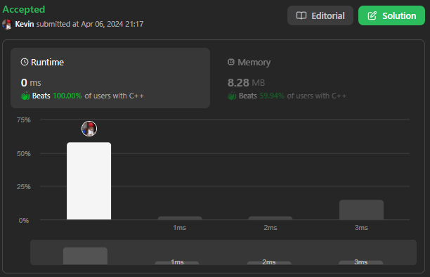
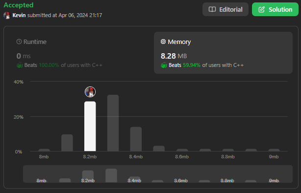

# 289. Game of Life

## Énoncé

D'après [l'article de Wikipédia](https://en.wikipedia.org/wiki/Conway%27s_Game_of_Life): "Le **Jeu de la Vie**, est un automate cellulaire conçu par le mathématicien britannique John Horton Conway en 1970."

Le tableau est constitué d'une grille `m x n` de cellules, où chaque cellule a un état initial : **vivant** (représenté par un `1`) ou **mort** (représenté par un `0`). Chaque cellule interagit avec ses huit voisines (horizontales, verticales, diagonales) en utilisant les quatre règles suivantes:

- Toute cellule vivante ayant moins de deux voisins vivants meurt.
- Toute cellule vivante ayant deux ou trois voisins vivants perdure jusqu'à la génération suivante.
- Toute cellule vivante ayant plus de trois voisines vivantes meurt.
- Toute cellule morte ayant exactement trois voisines vivantes devient une cellule vivante.

L'état suivant est créé en appliquant simultanément les règles ci-dessus à chaque cellule de l'état actuel, où les naissances et les décès se produisent simultanément. Étant donné l'état actuel du `board` de la grille `m x n`, renvoie l'état suivant.

**Suivie:**  
Pouvez-vous le résoudre avec une complexité spatiale de `O(1)` ? Rappelez-vous que le tableau doit être mis à jour simultanément : vous ne pouvez pas mettre à jour des cellules et ensuite utiliser leurs valeurs mises à jour pour mettre à jour d'autres cellules.

## Exemple

**Exemple 1:**

**Input:** board = [[0,1,0],[0,0,1],[1,1,1],[0,0,0]]  
**Output:** [[0,0,0],[1,0,1],[0,1,1],[0,1,0]]

**Exemple 2:**

**Input:** board = [[1,1],[1,0]]  
**Output:** [[1,1],[1,1]]

## Contraintes

`m == board.length`  
`n == board[i].length`  
`1 <= m, n <= 25`  
`board[i][j]` vaut `0` ou `1`.

## Note personnelle

Il existe plusieurs approches pour résoudre ce problème :

- Par exemple, on peut créer une copie de la grille pour récupérer les valeurs d'origine avant modification.
- On peut aussi utiliser une HashMap où l'on stocke uniquement les valeurs d'origine des cellules modifiées.
- Ou bien, on peut modifier la grille d'origine avec des valeurs qui nous permettent de revenir en arrière.

Étant donné la contrainte exigeant une complexité spatiale constante, j'ai choisi la troisième option.

L'idée est d'utiliser le fait qu'une cellule ne peut avoir que deux états possibles : vivante ou morte.

- Si une cellule est vivante à l'origine et qu'elle doit mourir, alors je lui affecte la valeur `3`
- Si une cellule est morte et qu'elle doit vivre, alors je lui affecte la valeur `2`.

En faisant cela, je peux pendant que je compte le nombre de cellules vivantes pour une cellule `[x, y]`, simplement faire `value - 2` dans le cas où ma valeur est supérieure à `1` pour obtenir la valeur d'origine.

Une fois l'état des cellules mis à jour, je peux parcourir une dernière fois la grille et affecter les bonnes valeurs aux cellules.

Cette approche présente une complexité temporelle de `O(n * m)` et une complexité spatiale de `O(1)`.

