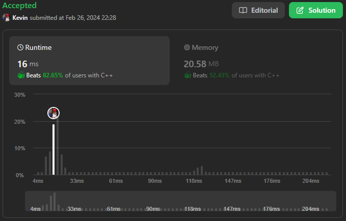
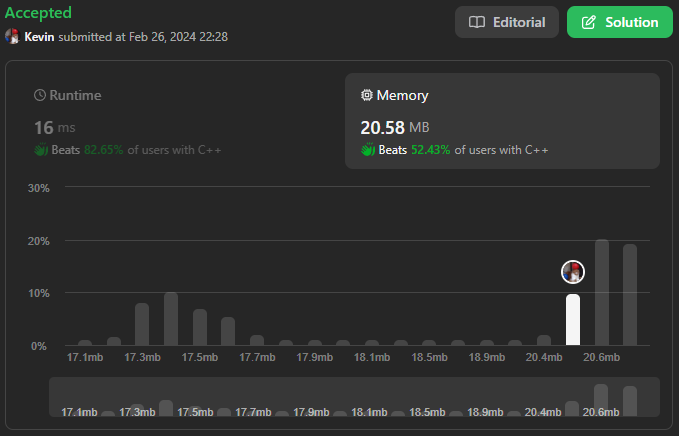

# 303. Range Sum Query - Immutable

## Énoncé

Étant donné un tableau d'entiers `nums`, gérez plusieurs requêtes du type suivant :

Calculez la **somme** des éléments de `nums` entre les indices `left` et `right` **inclus** où `left <= right`.

Implémentez la classe `NumArray` :

- `NumArray(int[] nums)` Initialise l'objet avec le tableau d'entiers `nums`.
- `int sumRange(int left, int right)` Renvoie la **somme** des éléments de `nums` entre les indices `left` et `right` **inclus** (c'est-à-dire `nums[left] + nums[left + 1] + ... + chiffres[right]`).

## Exemple

**Exemple 1:**  
**Input:**  
["NumArray", "sumRange", "sumRange", "sumRange"]  
[[[-2, 0, 3, -5, 2, -1]], [0, 2], [2, 5], [0, 5]]  
**Output:**  
[null, 1, -1, -3]  
**Explication:**  
NumArray numArray = new NumArray([-2, 0, 3, -5, 2, -1]);  
numArray.sumRange(0, 2); // return (-2) + 0 + 3 = 1  
numArray.sumRange(2, 5); // return 3 + (-5) + 2 + (-1) = -1  
numArray.sumRange(0, 5); // return (-2) + 0 + 3 + (-5) + 2 + (-1) = -3

## Contraintes

`1 <= nums.length <= 10^4`  
`-10^5 <= nums[i] <= 10^5`  
`0 <= left <= right < nums.length`  
Au maximum `10^4` appels seront effectués vers `sumRange`

## Note personnelle

Ce problème, qui repose sur le principe des sommes de préfixes, est assez classique. J'ai particulièrement apprécié l'approche orientée objet, qui reflète davantage les pratiques en milieu professionnel. La mise en place d'une classe pour résoudre ce problème ajoute une dimension réaliste à l'implémentation.

