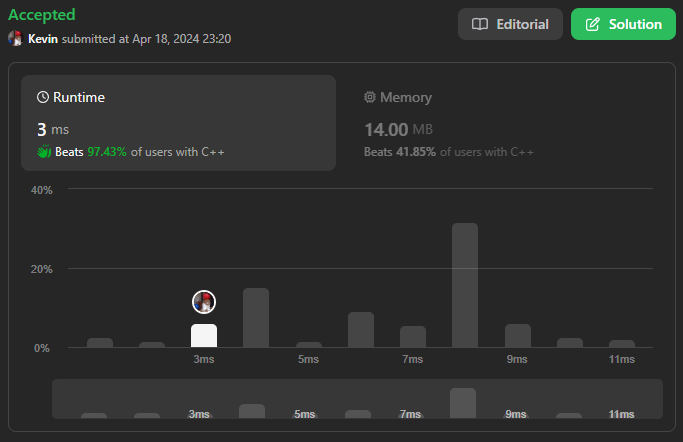

# 328. Odd Even Linked List

## Énoncé

Étant donné la `head` d'une liste chaînée simple, regroupez tous les nœuds avec des indices impairs ensemble suivis des nœuds avec des indices pairs, et retournez la liste réordonnée.

Le **premier** nœud est considéré comme **impair**, et le **deuxième** nœud est **pair**, ainsi de suite.

Notez que l'ordre relatif à l'intérieur des groupes pairs et impairs doit rester tel qu'il était à l'entrée.

Vous devez résoudre le problème avec une complexité spatiale de `O(1)` et une complexité temporelle de `O(n)`.

## Exemple

**Exemple 1:**

**Input:** head = [1,2,3,4,5]  
**Output:** [1,3,5,2,4]

**Exemple 2:**

**Input:** head = [2,1,3,5,6,4,7]  
**Output:** [2,3,6,7,1,5,4]

## Contraintes

Le nombre de nœuds dans la liste chaînée est dans la plage `[0, 10^4]`.  
`-10^6 <= Node.val <= 10^6`

## Note personnelle

Pour résoudre ce problème, j'ai opté pour une approche utilisant deux listes, une pour les indices pairs et une pour les indices impairs, que j'ai ensuite concaténées.

J'ai mis en place un total de 4 pointeurs:

- Le premier, appelé `even`, représente la tête de la liste des indices pairs.
- Les deux suivants, nommés `currOdd` et `currEven`, représentent respectivement le dernier élément actuel des listes des indices impairs et pairs.
- Le dernier, `curr`, représente l'élément actuel de la liste d'entrée.

Le concept est de parcourir la liste d'entrée avec `curr` et, en fonction de la parité de l'élément, de réaffecter l'élément suivant du dernier élément de la liste correspondante (utilisant `currOdd` et `currEven`) avec l'élément `curr`.

Ensuite, il suffit de réaffecter l'élément suivant du dernier élément de la liste impaire avec le premier élément de la liste paire sauvegardé avec `even`.

Cette approche présente une complexité temporelle de `O(n)` et une complexité spatiale de `O(1)`.

