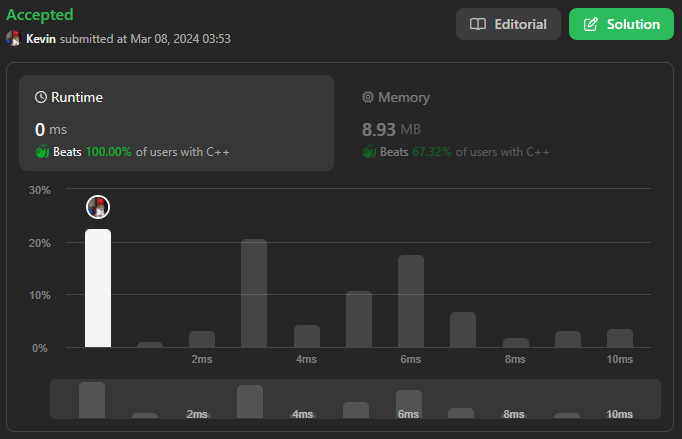
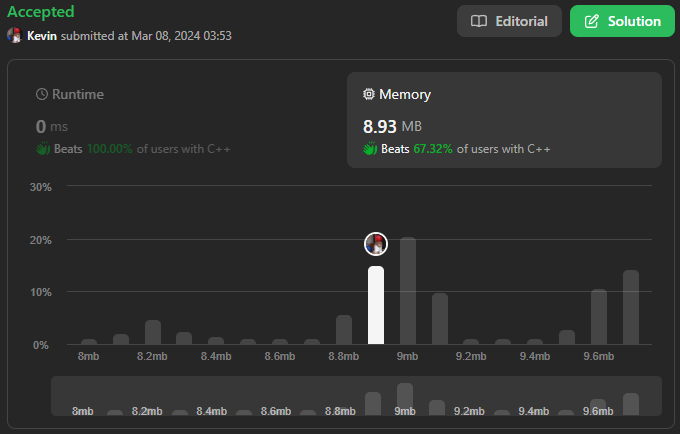

# 338. Counting Bits

## Énoncé

Étant donné un entier `n`, renvoie un tableau `ans` de longueur `n + 1` tel que pour chaque `i` (`0 <= i <= n`), `ans[i]` est le **nombre de `1`** dans la représentation binaire de `i`.

Il est très facile de trouver une solution avec un temps d'exécution de `O(n log n)`. Pouvez-vous le faire en temps linéaire `O(n)` et éventuellement en un seul passage ?

Pouvez-vous le faire sans utiliser de fonction intégrée (comme `__builtin_popcount` en C++)?

## Exemple

**Exemple 1:**  
**Input:** n = 2  
**Output:** [0,1,1]  
**Explication:**  
0 --> 0  
1 --> 1  
2 --> 10

**Exemple 2:**  
**Input:** n = 5  
**Output:** [0,1,1,2,1,2]  
**Explication:**  
0 --> 0  
1 --> 1  
2 --> 10  
3 --> 11  
4 --> 100  
5 --> 101

## Contraintes

`0 <= n <= 10^5`

## Note personnelle

La première approche consiste à utiliser la fonction `__builtin_popcount` une fonction intégrée permettant de compter le nombre de `1` dans la représentation binaire d'un nombre entier.

```cpp
vector<int> countBits(int n) {
  // Crée un vecteur pour stocker les nombres de bits de chaque nombre de 0 à n, initialisé à 0
  vector<int> answer(n + 1, 0);

  // Boucle à travers tous les nombres de 0 à n inclus
  for (int i = 0; i <= n; i++) {
    // Utilise la fonction __builtin_popcount pour compter le nombre de bits définis dans le nombre i
    answer[i] = __builtin_popcount(i);
  }

  return answer;
}
```

Cette méthode a une complexité temporelle de `O(n * log(n))` et une complexité spatiale de `O(n)`. Elle utilise une fonction intégrée, ce qui ne respecte pas les contraintes de l'exercice.

La seconde approche implique la division successive d'un nombre par 2 pour le convertir en binaire.

```cpp
vector<int> countBits(int n) {
  // Initialisation du vecteur de réponse avec des zéros, de taille (n + 1)
  vector<int> answer(n + 1, 0);

  // Parcourir chaque nombre de 0 à n inclusivement
  for (int i = 0; i <= n; i++) {
    int element = i;

    // Convertir l'élément en binaire et compter le nombre de bits 1
    while (element != 0) {
      // Obtenir le reste de la division par 2
      int r = element % 2;
      // Mettre à jour l'élément en divisant par 2
      element = (element - r) / 2;
      // Ajouter le bit courant à la somme des bits de l'index i
      answer[i] += r;
    }
  }

  return answer;
}
```

Cette approche présente également une complexité temporelle de `O(n * log(n))` et une complexité spatiale de `O(n)`. Bien qu'elle n'utilise pas de fonction intégrée, elle ne satisfait toujours pas la contrainte de l'exercice qui demande un algorithme de complexité `O(n)`.

Ma dernière approche est un peu inhabituelle. Sans l'intention de le faire, je suis tombé sur la solution. Plutôt que de la copier-coller aveuglément, j'ai cherché une approche différente pour créer un algorithme avec une complexité de `O(n)`.

L'idée m'est venue lorsque j'ai décidé de comparer les résultats en les regroupant par le nombre minimum de bits nécessaires pour convertir le nombre en binaire.

Un exemple illustrera mieux cette idée :

[0] --> 0 0 (tous les nombres pouvant être écrits avec 0 bit)

[1] --> 1 (tous les nombres pouvant être écrits avec 1 bit)  
[1, 2] --> 2, 3 (tous les nombres pouvant être écrits avec 2 bits)  
[1, 2, 2, 3] --> 4, 5, 6, 7 (tous les nombres pouvant être écrits avec 3 bits)  
[1, 2, 2, 3, 2, 3, 3, 4] --> 8, ..., 15 (4 bits)
[1, 2, 2, 3, 2, 3, 3, 4, 2, 3, 3, 4, 3, 4, 4, 5] --> 16, ..., 31 (5 bits)

Comme on peut l'observer, si l'on ne prend pas en compte le cas du 0, la taille de chaque sous-ensemble est multipliée par 2 lorsqu'on ajoute 1 bit. Les premiers éléments jusqu'à la moitié sont identiques à la totalité du sous-ensemble précédent, tandis que les éléments de la moitié jusqu'à la fin sont identiques plus 1.

Cette approche a une complexité temporelle et spatiale de `O(n)`, respectant ainsi les critères de l'énoncé.

Maintenant, parlons de l'approche que j'ai découverte involontairement. Pour calculer le nombre de bits définis pour un nombre `i`, on utilise la formule `dp[i] = dp[i/2] + i%2`. Pour expliquer cette formule, examinons séparément les deux termes de l'opération:

- `dp[i / 2]` représente le résultat où l'on a décalé d'un bit vers la droite.
- `i % 2` donne le bit le moins significatif de `i`.

En ajoutant `i % 2` et `dp[i / 2]` on obtient le nombre total de bits pour `i`.

```cpp
//Crédit @parthdharmale008 sur LeetCode
vector<int> countBits(int n) {
  // Initialisation d'un vecteur pour stocker les nombres de bits définis
  vector<int> dp(n+1);

  // Cas de base : si n est égal à 0, aucun bit n'est défini, donc le vecteur est renvoyé tel quel
  if(n == 0) return dp;

  // Initialisation des valeurs pour les cas de base
  dp[0] = 0; // Pour 0, le nombre de bits est 0
  dp[1] = 1; // Pour 1, le nombre de bits est 1

  // Parcours du reste des nombres de 2 à n
  for(int i = 2; i <= n; i++){
    // Pour chaque nombre i, le nombre de bits est calculé en prenant le reste de la division par 2
    // et en ajoutant le nombre de bits déjà calculé pour la moitié de i (i/2)
    dp[i] = i % 2 + dp[i / 2];
  }

  return dp;
}
```



