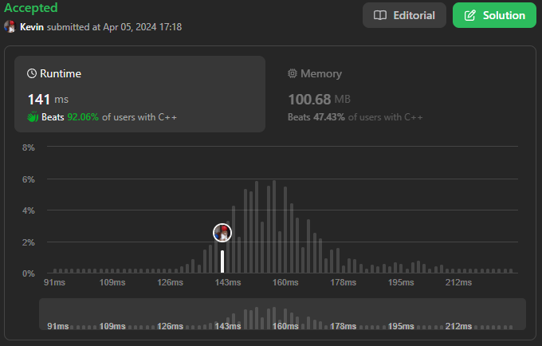

# 380. Insert Delete GetRandom O(1)

## Énoncé

Implémentez la classe `RandomizedSet`:

- `RandomizedSet()` Initialise l'objet `RandomizedSet`.
- `bool insert(int val)` Insère un élément `val` dans l'ensemble s'il n'est pas présent. Renvoie `true` si l'élément n'était pas présent, sinon `false`.
- `bool remove(int val)` Supprime un élément `val` de l'ensemble s'il est présent. Renvoie `true` si l'élément était présent, sinon `false`.
- `int getRandom()` Renvoie un élément aléatoire de l'ensemble (il est garanti qu'au moins un élément existe lorsque cette méthode est appelée). Chaque élément doit avoir la **même probabilité** d'être renvoyé.

Vous devez implémenter les fonctions de la classe de telle sorte que chaque fonction est une complexité temporelle **moyenne** de `O(1)`.

## Exemple

**Exemple 1:**  
**Input:**  
["RandomizedSet", "insert", "remove", "insert", "getRandom", "remove", "insert", "getRandom"]  
[[], [1], [2], [2], [], [1], [2], []]  
**Output:** [null, true, false, true, 2, true, false, 2]  
**Explication:**

```
RandomizedSet randomizedSet = new RandomizedSet();
randomizedSet.insert(1); // Insère 1 dans l'ensemble. Renvoie true car 1 a été inséré avec succès.
randomizedSet.remove(2); // Renvoie false car 2 n'existe pas dans l'ensemble.
randomizedSet.insert(2); // nsère 2 dans l'ensemble, renvoie true. L'ensemble contient désormais [1,2].
randomizedSet.getRandom(); // getRandom() doit renvoyer 1 ou 2 au hasard.
randomizedSet.remove(1); // Supprime 1 de l'ensemble, renvoie true. L'ensemble contient désormais [2].
randomizedSet.insert(2); // 2 était déjà dans l'ensemble, alors retournez false.
randomizedSet.getRandom(); // Puisque 2 est le seul nombre de l’ensemble, getRandom() renverra toujours 2.
```

## Contraintes

`-2^31 <= val <= 2^31 - 1`  
Au maximum `2 * 10^5` appels seront effectués pour `insert`, `remove`, et `getRandom`.  
Il y aura au moins **un élément** dans la structure de données lorsque `getRandom` est appelé.

## Note personnelle

Pour résoudre ce problème, j'ai choisi de mettre en place ma propre structure de données, utilisant une fonction de hachage et la logique associée.

L'idée repose sur l'utilisation d'un tableau appelé `bucket` qui contient des listes chaînées. Chaque valeur insérée est hashée, et ce hash représente l'index dans `bucket` où cette valeur sera stockée. Les listes chaînées permettent de gérer les éléments se chevauchant.

Pour garantir une complexité temporelle de `O(1)` pour la méthode `getRandom()`, j'ai utilisé un vecteur supplémentaire appelé `randomArr`, contenant des pointeurs vers les noeuds des listes chaînées.

La structure d'un noeud comprend les informations suivante:

- `value`: La valeur stockée dans le noeud.
- `index`: L'index du noeud dans le vecteur `randomArr`
- `next`: Un pointeur vers le prochain noeud dans la liste chaînée.

```cpp
// Définition de la structure de noeud pour la liste chaînée
struct NodeList {
  int value;      // Valeur du noeud
  int index;      // Index du noeud dans le vecteur randomArr
  NodeList *next; // Pointeur vers le prochain noeud
};
```

À l'initialisation de l'objet `RandomizedSet`, j'ai initialisé le générateur de nombres aléatoires et le vecteur `bucket` à une taille arbitraire de 256.

```cpp
// Constructeur
RandomizedSet() {
  // Initialisation du générateur de nombres aléatoires
  srand(time(NULL));
  // Initialisation du vecteur de hachage avec une taille de 256
  this->bucket = vector<NodeList *>(256, nullptr);
}
```

Pour calculer le hash d'une valeur, j'utilise simplement le reste de la division de la valeur absolue de `val` par la taille de `bucket`.

```cpp
int getHash(int val) {
  return abs(val) % this->bucketSize;
}
```

L'insertion d'un élément dans l'ensemble consiste à récupérer d'abord le hash de `val`, puis à parcourir la liste chaînée pour vérifier si la valeur existe déjà. Si elle est trouvée, l'insertion échoue. Sinon, un nouveau noeud est créé et inséré dans la liste chaînée correspondante, ainsi que dans `randomArr`.

```cpp
// Methode pour insérer une valeur dans l'ensemble
bool insert(int val) {
  // Calcul de l'indice de hachage
  int hash = this->getHash(val);

  // Récupération du premier noeud dans le seau correspondant
  NodeList *node = this->bucket[hash];

  // Parcours de la liste chaînée pour vérifier si la valeur existe déjà
  while (node) {
    if (node->value == val) {
      // La valeur existe déjà, donc l'insertion échoue
      return false;
    }
    // Passer au prochain noeud dans la liste chaînée
    node = node->next;
  }

  // Création d'un nouveau noeud avec la valeur et son index dans randomArr
  NodeList *newNode = new NodeList(val, this->randomArr.size(), this->bucket[hash]);
  // Ajout du nouveau noeud au début du seau correspondant
  this->bucket[hash] = newNode;
  // Ajout du nouveau noeud à randomArr
  this->randomArr.push_back(newNode);

  // Redimensionnement du vecteur de hachage si nécessaire
  this->resizeBucket();

  // Insertion réussie
  return true;
}
```

La suppression d'un élément suit un processus similaire. Après avoir récupéré le hash de `val`, je cherche l'élément dans la liste chaînée en gardant une trace du noeud courant et de son prédécesseur. Si l'élément est trouvé, il est supprimé en ajustant les pointeurs appropriés dans `bucket`. On doit également retirer le noeud à supprimer du vecteur `randomArr`. Pour garantir une complexité de suppression en temps constant, j'utilise une technique appelée "swap and pop". Au lieu de supprimer le noeud directement, on échange sa position avec le dernier noeud dans `randomArr`, puis on supprime ce dernier noeud. Cela évite le décalage des éléments. Je modifie également la valeur de `index` du noeud qui a été déplacé.

```cpp
// Methode pour supprimer une valeur de l'ensemble
bool remove(int val) {
  // Calcul de l'indice de hachage
  int hash = this->getHash(val);

  // Pointeur vers le noeud précédent dans la liste chaînée
  NodeList *prev = nullptr;
  // Pointeur vers le premier noeud dans le seau correspondant
  NodeList *current = this->bucket[hash];

  // Parcours de la liste chaînée pour trouver le noeud à supprimer
  while (current) {
    if (current->value == val) {
      // noeud trouvé, sortie de la boucle
      break;
    }
    // Mise à jour du noeud précédent
    prev = current;
    // Passage au prochain noeud dans la liste chaînée
    current = current->next;
  }

  // Vérification si le noeud à supprimer a été trouvé
  if (current) {
    if (prev) {
      // Relier le noeud précédent au noeud suivant
      prev->next = current->next;
    }
    else {
      // Mettre à jour le premier noeud du seau si le noeud à supprimer est en tête
      this->bucket[hash] = current->next;
    }

    // Mise à jour de l'index du dernier noeud dans randomArr et échange avec le noeud à supprimer
    this->randomArr.back()->index = current->index;
    swap(this->randomArr[current->index], this->randomArr.back());
    // Suppression du dernier noeud de randomArr
    this->randomArr.pop_back();

    // Libération de la mémoire occupée par le noeud supprimé
    delete current;
    // Suppression réussie
    return true;
  }
  // La valeur à supprimer n'a pas été trouvée
  return false;
}
```

Grâce à l'utilisation du vecteur `randomArr`, l'implémentation de la fonction `getRandom` est toute simple

```cpp
// Methode pour obtenir une valeur aléatoire dans l'ensemble
int getRandom() {
  return this->randomArr[rand() % this->randomArr.size()]->value;
}
```

J'ai également implémenté une méthode pour redimensionner `bucket`. Cela amortit la complexité des méthodes d'insertion et de suppression à `O(1)`. Cette méthode profite du fait que `randomArr` contient tous les noeuds, évitant ainsi de parcourir `bucket` et de créer une liste temporaire. À chaque appel de cette méthode, la taille de `bucket` est doublée.

```cpp
// Methode pour redimensionner le vecteur de hachage si nécessaire
void resizeBucket() {
  // Vérification si le facteur de charge dépasse 0.7
  if ((double)this->randomArr.size() / this->bucket.size() >= 0.7) {
    // Redimensionnement du vecteur de hachage avec une taille doublée
    this->bucket = vector<NodeList *>(this->bucket.size() * 2, nullptr);

    // Réaffectation des noeuds dans le nouveau vecteur de hachage
    for (NodeList *node : randomArr) {
      // Calcul de l'indice de hachage pour chaque noeud
      int hash = this->getHash(node->value);
      // Mise à jour du pointeur next du noeud
      node->next = this->bucket[hash];
      // Ajout du noeud au début du seau correspondant
      this->bucket[hash] = node;
    }
  }
}
```

Grâce à cette logique mise en place, la complexité temporelle des opérations principales est de `O(1)` amortie, tandis que la complexité spatiale est de `O(n)`.



