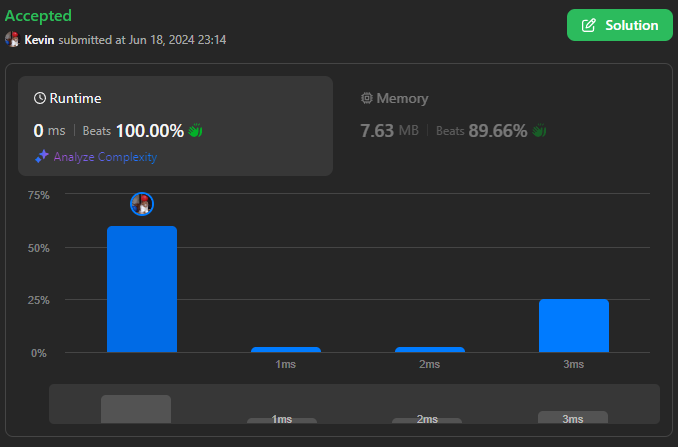
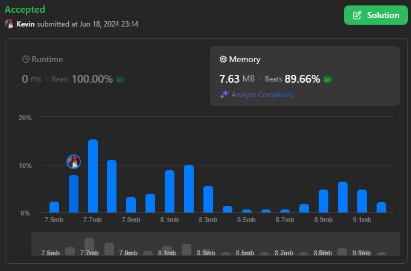

# 401. Binary Watch

## Énoncé

Une montre binaire a 4 LED en haut pour représenter les heures (0-11), et 6 LED en bas pour représenter les minutes (0-59). Chaque LED représente un zéro ou un un, avec le bit de poids le plus faible à droite.

Par exemple, la montre binaire ci-dessous indique `4:51`


Étant donné un entier `turnedOn` qui représente le nombre de LED actuellement allumées (en ignorant le PM), retournez toutes les heures possibles que la montre pourrait afficher. Vous pouvez renvoyer la réponse dans **n'importe quel ordre**.

L'heure ne doit pas contenir de zéro en tête.  
Par exemple, `01:00` n'est pas valide. Cela devrait être `1:00`.

Les minutes doivent être composées de deux chiffres et peuvent contenir un zéro en tête.  
Par exemple, `10:2` n'est pas valide. Cela devrait être `10:02`.

## Exemple

**Exemple 1:**  
**Input:** turnedOn = 1  
**Output:** ["0:01","0:02","0:04","0:08","0:16","0:32","1:00","2:00","4:00","8:00"]

**Exemple 2:**  
**Input:** turnedOn = 9  
**Output:** []

## Contraintes

`0 <= turnedOn <= 10`

## Note personnelle

Pour résoudre ce problème, ma première approche utilise le backtracking.

L'idée est d'explorer toutes les combinaisons possibles pour allumer exactement `turnedOn` LEDs.

Lorsque le nombre de LEDs allumées atteint `turnedOn`, on vérifie si les heures et les minutes respectent les limites de temps, à savoir `heures < 12` et `minutes < 60`. Si c'est le cas, nous formons la chaîne correspondante et l'ajoutons à notre tableau de résultats. Dans tous les cas, nous revenons en arrière pour essayer d'autres combinaisons en désactivant les LEDs ajoutées précédemment.

```cpp
// Vecteur contenant les valeurs binaires correspondantes aux positions des LEDs (0-9)
vector<int> nums = {8, 4, 2, 1, 32, 16, 8, 4, 2, 1};


/**
 * Fonction de backtracking pour générer les heures et minutes possibles.
 *
 * @param n Nombre total de LEDs allumées.
 * @param currCount Nombre actuel de LEDs allumées.
 * @param currI Index actuel dans le vecteur nums.
 * @param hours Heure calculée actuellement.
 * @param minutes Minutes calculées actuellement.
 * @param ans Vecteur de chaînes de caractères pour stocker les résultats valides.
 */
void backtracking(int n, int currCount, int currI, int hours, int minutes, vector<string> &ans){
  // Vérifier si le nombre de LEDs allumées correspond au nombre demandé
  if(currCount == n){
    // Vérifier si les heures et les minutes sont valides
    if(hours < 12 && minutes < 60){
      // Formatage de l'heure sous forme de chaîne "HH:MM"
      string r = to_string(hours) + (minutes < 10 ? ":0" : ":") + to_string(minutes);
      ans.push_back(r);
    }
    return;
  }

  // Parcourir les positions possibles pour allumer une nouvelle LED
  for(int i = currI; i < 10; i++){
    // Les 4 premières positions correspondent aux heures
    if(i < 4){
      backtracking(n, currCount + 1, i + 1, hours + nums[i], minutes, ans);
    }
    // Les 6 dernières positions correspondent aux minutes
    else{
      backtracking(n, currCount + 1, i + 1, hours, minutes + nums[i], ans);
    }
  }
}

/**
 * Fonction pour lire les différentes heures possibles sur une montre binaire.
 *
 * @param turnedOn Nombre de LEDs allumées.
 * @return Vecteur de chaînes de caractères représentant les heures possibles.
 */
vector<string> readBinaryWatch(int turnedOn) {
  // Si plus de 8 LEDs sont allumées, aucune combinaison valide n'est possible
  if(turnedOn >= 9){
    return {};
  }

  vector<string> ans;

  // Appel de la fonction de backtracking pour générer les combinaisons valides
  backtracking(turnedOn, 0, 0, 0, 0, ans);

  return ans;
}
```

Cette méthode présente une complexité temporelle de `O(2^n)` et spatiale de `O(2^n)`.

Une autre approche consiste à itérer sur toutes les valeurs possibles d'heures (0 à 11) et de minutes (0 à 59), et à vérifier si le nombre total de bits allumés (dans les heures et les minutes) est égal à `turnedOn` Si c'est le cas, nous ajoutons l'heure formatée "HH:MM" à notre tableau de résultats.

```cpp
vector<string> readBinaryWatch(int turnedOn) {
  vector<string> ans;

  // Parcourir toutes les combinaisons possibles d'heures (0 à 11) et de minutes (0 à 59)
  for(int hours = 0; hours < 12; hours++){
    for(int minutes = 0; minutes < 60; minutes++){
      // Vérifier si le nombre total de bits allumés (dans les heures et les minutes) est égal à turnedOn
      if(__builtin_popcount(hours) + __builtin_popcount(minutes) == turnedOn){
        // Ajouter l'heure formatée "HH:MM" au vecteur des résultats
        ans.push_back(to_string(hours) + (minutes < 10 ? ":0" : ":") + to_string(minutes));
      }
    }
  }

  return ans;
}
```

Cette approche a une complexité temporelle de `O(720 * b)` où `b` est le nombre de bits dans un entier, et une complexité spatiale constante de `O(720)`.

En recherchant des optimisations, j'ai découvert une méthode utilisant une table de recherche (lookup table) pour compter efficacement le nombre de bits. Cette table, souvent de taille 256 pour des entiers codés sur 8 bits, précalcule le nombre de bits pour chaque valeur possible de 0 à 255.

L'idée est plutot astucieuse, la table est préremplie avec le nombre de bits correspondant à chaque index.

- table[0] = 0 (00000000)
- table[1] = 1 (00000001)
- table[2] = 2 (00000010)
- ...
- table[255] = 8 (11111111)

Le code suivant permet de la généré:

```cpp
lookupTable[0] = 0;
for(int i = 1; i < 256; i++){
  lookupTable[i] = (i & 1) + lookupTable[i / 2];
}
```

Ensuite, pour compter le nombre de bits d'un entier codé sur 32 bits, on segmente simplement l'entier en groupes de 8 bits :

```cpp
int countBit(int n){
  return lookupTable[n & 0xff] +
  lookupTable[n >> 8 & 0xff] +
  lookupTable[n >> 16 & 0xff] +
  lookupTable[n >> 24 & 0xff];
}
```

Cette fonction permet de compter les bits pour un entier de 32 bits. En utilisant l'opérateur `&` entre `n` et `0xff` (255 en hexadécimal), on extrait les 8 premiers bits pour les correspondre avec la table de recherche. On répète cette opération en décalant `n` de 8 bits entre chaque groupe.

Lors des évaluations sur Leetcode en backend, une seule instance de la classe `Solution` est initialisée, et plusieurs appels sont faits à la fonction principale pour chaque jeu de tests. En initialisant la lookup table une seule fois, cette approche profite de ces avantages sur chaque jeu de tests, remplaçant ainsi `__builtin_popcount` par `countBit`.

```cpp
class Solution {
public:
    int lookupTable[256];

    Solution(){
        lookupTable[0] = 0;
        for(int i = 1; i < 256; i++){
            lookupTable[i] = (i & 1) + lookupTable[i / 2];
        }
    }

    int countBit(int n){
        return lookupTable[n & 0xff] +
        lookupTable[n >> 8 & 0xff] +
        lookupTable[n >> 16 & 0xff] +
        lookupTable[n >> 24 & 0xff];
    }

    vector<string> readBinaryWatch(int turnedOn) {
        if (turnedOn >= 9) {
            return {};
        }
        vector<string> ans;

        for(int hours = 0; hours < 12; hours++){
            for(int minutes = 0; minutes < 60; minutes++){
                if(countBit(hours) + countBit(minutes) == turnedOn){
                    ans.push_back(to_string(hours) + (minutes < 10 ? ":0" : ":") + to_string(minutes));
                }
            }
        }

        return ans;
    }
};
```

Voici une estimation approximative du nombre d'opération nécessaire avec ou sans table de recherche:

- Approche 1: 12 \* 60 \* b = 720 \* 32 (int32) ~= 23000 opérations.
- Approche 2: 256 + 12 \* 60 = 256 + 720 ~= 1000 opérations.



