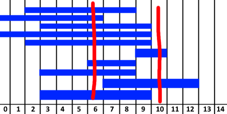

# 452. Minimum Number of Arrows to Burst Balloons

## Énoncé

Il y a des ballons sphériques collés sur un mur plat qui représentent le plan XY. Les ballons sont représentés sous la forme d'un tableau d'entiers 2D `points` où `points[i] = [xstart, xend]` désigne un ballon dont le **diamètre horizontal** s'étend entre `xstart` et `xend`. Vous ne connaissez pas les coordonnées exactes en y des ballons.

Des flèches peuvent être tirées vers le haut **verticalement** à partir de différents points le long de l'axe x. Un ballon avec `xstart` et `xend` est éclaté par une flèche tirée sur `x` si `xstart <= x <= xend`. Il n'y a **aucune limite** au nombre de flèches pouvant être tirées. Une flèche tirée continue de monter à l'infini, faisant éclater tous les ballons sur son passage.

Étant donné le tableau `points`, renvoie le nombre **minimum** de flèches qui doivent être tirées pour faire éclater tous les ballons.

## Exemple

**Exemple 1:**  
**Input:** points = [[10,16],[2,8],[1,6],[7,12]]  
**Output:** 2  
**Explication:** Les ballons peuvent être éclatés par 2 flèches:

- Tirez une flèche en x = 6, faisant éclater les ballons [2,8] et [1,6].
- Tirez une flèche en x = 11, faisant éclater les ballons [10,16] et [7,12].

**Exemple 2:**  
**Input:** points = [[1,2],[3,4],[5,6],[7,8]]  
**Output:** 4  
**Explication:** Une flèche doit être tirée pour chaque ballon pour un total de 4 flèches.

**Exemple 3:**  
**Input:** points = [[1,2],[2,3],[3,4],[4,5]]  
**Output:** 2  
**Explication:** Les ballons peuvent être éclatés par 2 flèches:

- Tirez une flèche en x = 2, faisant éclater les ballons [1,2] et [2,3].
- Tirez une flèche en x = 4, faisant éclater les ballons [3,4] et [4,5].

## Contraintes

`1 <= points.length <= 10^5`  
`points[i].length == 2`  
`-2^31 <= xstart < xend <= 2^31 - 1`

## Note personnelle

L'énoncé fournit de nombreuses informations qui pourraient être synthétisées grâce à cette image pour une meilleure clarté:  

Chaque rectangle bleu représente un ballon, et l'objectif est de déterminer le nombre minimal de flèches nécessaires pour traverser tous les intervalles (indiqués en rouge).

Ma méthode nécessite le tri des intervalles selon leurs points de départ `xstart`.

Une fois triés, l'idée est de parcourir les intervalles en maintenant un "intervalle fictif" représentant l'intersection de tous ceux déjà traités pendant l'itération. Tant que l'intervalle actuel est chevauché par l'intervalle fictif, nous continuons en mettant à jour ce dernier. Lorsqu'un intervalle ne chevauche pas l'intervalle fictif, nous incrémentons le nombre de flèches nécessaires et recommençons le même processus jusqu'à la fin de la liste.

Cette approche nous permet de parcourir la liste triée une seule fois pour obtenir notre résultat.

La complexité temporelle de cette méthode est de `O(n log n)` et la complexité spatiale est de `O(n)`.

