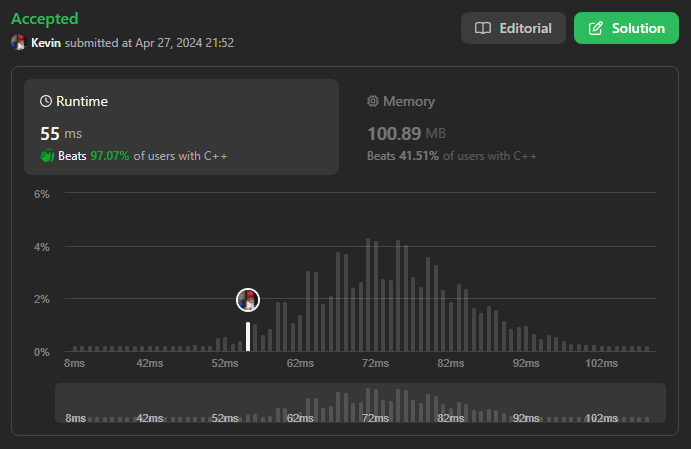
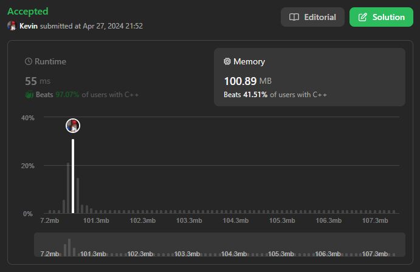

# 463. Island Perimeter

## Énoncé

On vous une `grid` de taille `row x col` représentant une carte où `grid[i][j] = 1` représente la terre et `grid[i][j] = 0` représente l'eau.

Les cellules de la grille sont connectées **horizontalement/verticalement** (pas en diagonale). La grille est complètement entourée par de l'eau, et il y a exactement une île (c'est-à-dire une ou plusieurs cellules de terre connectées).

L'île n'a pas de "lacs". Une cellule est un carré de côté 1. La grille est rectangulaire, la largeur et la hauteur ne dépassent pas 100. Détermine le périmètre de l'île.

## Exemple

**Exemple 1:**


**Input:** grid = [[0,1,0,0],[1,1,1,0],[0,1,0,0],[1,1,0,0]]  
**Output:** 16  
**Explication:** Le périmètre est constitué des 16 bandes jaunes dans l’image ci-dessus.

**Exemple 2:**  
**Input:** grid = [[1]]  
**Output:** 4

**Exemple 3:**  
**Input:** grid = [[1,0]]  
**Output:** 4

## Contraintes

`row == grid.length`
`col == grid[i].length`  
`1 <= row, col <= 100`  
`grid[i][j]` vaut `0` ou `1`.  
Il y a exactement une île dans `grid`.

## Note personnelle

Pour aborder ce problème, ma première stratégie a été de parcourir la grille pour trouver une portion de l'île. Une fois cette étape accomplie, j'ai utilisé une recherche en profondeur (DFS) pour explorer cette portion et trouver son périmètre.

Pour marquer les cases déjà visitées, j'ai simplement modifié les entiers dans la grille en les remplaçant par `-1`.

```cpp
class Solution {
public:
  // Vecteurs pour stocker les déplacements dans les directions (haut, gauche, bas, droite)
  vector<int> dx = {0, -1, 0, 1};
  vector<int> dy = {-1, 0, 1, 0};

  // Fonction de recherche en profondeur (DFS)
  int dfs(int y, int x, vector<vector<int>> &grid){
    // Initialise la somme du périmètre à 0
    int sum = 0;

    // Parcourir les 4 directions autour de la cellule actuelle
    for(int d = 0; d < 4; d++){
      int _y = y + dy[d]; // Coordonnée y de la cellule voisine dans la direction d
      int _x = x + dx[d]; // Coordonnée x de la cellule voisine dans la direction d

      // Vérifier les conditions pour le périmètre
      if(_y < 0 || _y >= grid.size() || _x < 0 || _x >= grid[0].size() || grid[_y][_x] == 0){
        sum++;
      }
      // Si la cellule voisine est une partie de l'île
      else if(grid[_y][_x] == 1){
        grid[_y][_x] = -1; // Marquer la cellule comme visitée pour éviter les boucles infinies
        sum += dfs(_y, _x, grid); // Appeler récursivement la fonction DFS pour explorer cette cellule voisine
      }
    }

    return sum; // Retourner le périmètre total
  }

  // Fonction principale pour calculer le périmètre de l'île
  int islandPerimeter(vector<vector<int>>& grid) {
    // Parcourir chaque cellule de la grille
    for (int y = 0; y < grid.size(); y++) {
      for (int x = 0; x < grid[0].size(); x++) {
        // Si la cellule est une partie de l'île
        if (grid[y][x] == 1) {
          // Marquer la cellule comme visitée
          grid[y][x] = -1;
          // Appeler la fonction DFS pour explorer l'île à partir de cette cellule
          return dfs(y, x, grid);
        }
      }
    }

    // Retourner 0 si aucune île n'est trouvée dans la grille
    return 0;
  }
};
```

La complexité spatiale et temporelle de cette approche est de `O(n)`, où `n` est le nombre de cellules dans `grid`.

Pour optimiser cette approche, j'ai essayé de parcourir uniquement les bords de l'île. Cependant, étant donné la taille relativement réduite de la grille, les coûts engendrés ont conduit à des performances moins élevées lors des tests de validation.

Une autre approche offrant de meilleures performances consiste à parcourir simplement la grille et, pour chaque case de l'île, à vérifier les bordures et à compter le nombre de cellules d'eau adjacentes.

Cette approche présente une complexité temporelle de `O(n)` et une complexité spatiale de `O(1)`.

Je conclus que le choix de l'approche peut varier en fonction de différents scénarios. L'approche DFS sera généralement plus performante dans le cas d'une petite île par rapport à la grille. L'approche DFS optimisée semble plus efficace dans le cas d'une grande île dans une grande grille, tandis que l'approche qui parcourt seulement la grille semble être efficace pour les petites grilles.



