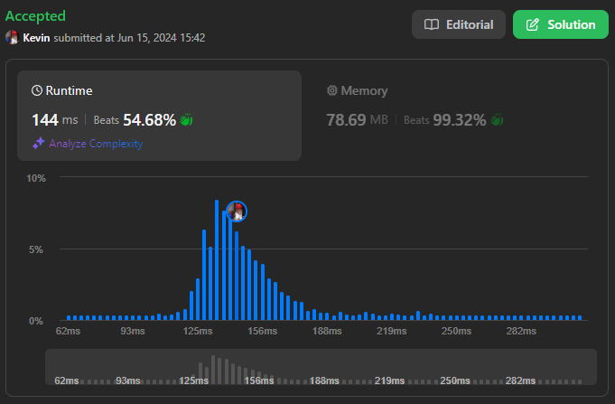

# 502. IPO

## Énoncé

Supposons que LeetCode va bientôt lancer son **Introduction en Bourse**. Afin de vendre ses actions à un bon prix aux capital-risqueurs, LeetCode souhaiterait travailler sur quelques projets pour augmenter son capital avant l'**Introduction en Bourse**. Étant donné qu'elle dispose de ressources limitées, elle ne peut terminer au maximum que `k` projets distincts avant l'**Introduction en Bourse**. Aidez LeetCode à concevoir la meilleure façon de maximiser son capital total après avoir terminé au maximum `k` projets distincts.

On vous donne `n` projets où le `ième` projet a un profit net `profits[i]` et nécessite un capital minimum de `capital[i]` pour commencer.

Initialement, vous disposez d'un capital `w`. Lorsque vous terminez un projet, vous obtenez son profit net et ce profit est ajouté à votre capital total.

Choisissez une liste de **au plus** `k` projets distincts parmi les projets donnés pour **maximiser votre capital final**, et retournez le capital maximisé final.

La réponse est garantie de tenir dans un entier signé de 32 bits.

## Exemple

**Exemple 1:**  
**Input:** k = 2, w = 0, profits = [1,2,3], capital = [0,1,1]  
**Output:** 4  
**Explication:** Étant donné que votre capital initial est de 0, vous ne pouvez démarrer que le projet indexé 0.
Après l'avoir terminé, vous obtiendrez un profit de 1 et votre capital devient 1.
Avec un capital de 1, vous pouvez soit démarrer le projet indexé 1, soit le projet indexé 2.
Étant donné que vous ne pouvez choisir que 2 projets au maximum, vous devez terminer le projet indexé 2 pour obtenir le capital maximal.
Par conséquent, affichez le capital maximal final, qui est 0 + 1 + 3 = 4.

**Exemple 2:**  
**Input:** k = 3, w = 0, profits = [1,2,3], capital = [0,1,2]  
**Output:** 6

## Contraintes

`1 <= k <= 10^5`  
`0 <= w <= 10^9`  
`n == profits.length`  
`n == capital.length`  
`1 <= n <= 10^5`  
`0 <= profits[i] <= 10^4`  
`0 <= capital[i] <= 10^9`

## Note personnelle

Pour résoudre ce problème, j'ai commencé par trier les projets en fonction du capital nécessaire pour les démarrer.

J'ai initialisé une Priority Queue pour sélectionner rapidement le projet offrant le plus de profit, quel que soit son capital, ainsi qu'un indice `last` représentant le prochain projet non traité.

Ensuite, la logique suivante est répétée `k` fois:

- Remplir la Priority Queue avec les projets ayant un capital inférieur ou égal au capital actuel.
- Si la Priority Queue est vide, arrêter l'itération.
- Ajouter le profit du projet ayant la plus grande priorité au capital actuel.

Cette approche présente une complexité temporelle de `O(n log n)` et une complexité spatiale de `O(n)`.

Ma première implémentation était la suivante:

```cpp
class Solution {
public:
    struct A{
        int capital;
        int profit;

        // Surcharge de l'opérateur < pour comparer les objets A par profit croissant utilisé par la priority queue
        bool operator<(const A& other) const {
            return profit < other.profit;
        }
    };

    int findMaximizedCapital(int k, int w, vector<int>& profits, vector<int>& capital) {
        // Création du vecteur de structures A à partir des vecteurs profits et capital
        vector<A> arr;
        for(int i = 0; i < profits.size(); i++){
            arr.push_back({capital[i], profits[i]});
        }

        // Tri du vecteur arr par capital croissant
        sort(arr.begin(), arr.end(), [](const A &a, const A &b){
            return a.capital < b.capital;
        });

        // File de priorité pour maintenir les projets disponibles triés par profit décroissant
        priority_queue<A> pq;
        int last = 0;

        // Sélection des k projets maximisant le capital
        for(int i = 0; i < k; i++){
            // Ajoute tous les projets avec un capital inférieur ou égal à w dans la file de priorité
            while(last < arr.size() && arr[last].capital <= w){
                pq.push(arr[last]);
                last++;
            }

            // Si la file de priorité est vide, il n'y a plus de projets à entreprendre
            if(pq.size() == 0){
                return w;
            }

            // Ajoute le profit du projet le plus rentable à w et retire ce projet de la file de priorité
            w += pq.top().profit;
            pq.pop();
        }

        return w;
    }
};
```

Cette implémentation donne les résultats escomptés. Cependant, pour trier les projets, j'ai simplement recréé un tableau avec une structure personnalisée.

L'idée pour résoudre ce problème était d'implémenter ma propre fonction de tri. De cette façon, je pouvais effectuer les comparaisons avec le tableau `capital` et reproduire les mêmes déplacements sur le tableau `profits`.

J'ai choisi QuickSort comme algorithme de tri.

```cpp
void swapArr(vector<int>& arr1, vector<int>& arr2, int indexA, int indexB) {
  swap(arr1[indexA], arr1[indexB]);
  swap(arr2[indexA], arr2[indexB]);
}

int partition(vector<int>& arr1, vector<int>& arr2, int start, int end, int pivot) {
  swapArr(arr1, arr2, end, pivot);
  int j = start;

  for (int i = start; i < end; i++) {
    if (arr1[i] <= arr1[end]) {
      swapArr(arr1, arr2, i, j);
      j++;
    }
  }
  swapArr(arr1, arr2, end, j);

  return j;
}

void quickSort(vector<int>& arr1, vector<int>& arr2, int start, int end) {
  if (start < end) {
    int pivot = start + (rand() % (end - start + 1));
    pivot = partition(arr1, arr2, start, end, pivot);

    quickSort(arr1, arr2, start, pivot - 1);
    quickSort(arr1, arr2, pivot + 1, end);
  }
}
```

J'ai donc remplacé les lignes du script initial:

```cpp
vector<A> arr;
for(int i = 0; i < profits.size(); i++){
  arr.push_back({capital[i], profits[i]});
}

sort(arr.begin(), arr.end(), [](const A &a, const A &b){
  return a.capital < b.capital;
});
```

par:

```cpp
quickSort(capital, profits, 0, capital.size() - 1);
```

Cependant, cette implémentation de QuickSort n'est pas aussi efficace que l'implémentation `sort` de c++ (probablement IntroSort d'après ce que j'ai pu lire).

J'ai donc amélioré mon implémentation en ajoutant l'algorithme Insertion Sort pour les tableaux de petite taille, car il nécessite moins d'opérations intermédiaires et est parfaitement adapté pour les petits tableaux.

Une autre optimisation consiste à sélectionner un pivot plus performant. La manière la plus optimale est généralement de sélectionner la médiane du sous-tableau, mais cela rendrait l'algorithme moins efficace en raison du temps de calcul supplémentaire pour la trouver. J'ai donc choisi de sélectionner la médiane entre le premier, le milieu et le dernier élément du sous-tableau.

L'implémentation se trouve [ici](main.cpp).

### Preuve de l'optimalité de l'algorithme glouton

#### 1. Préparation des données à une logique gloutonne

Pour préparer les données, elles sont initialement triées par ordre croissant du capital nécessaire pour commencer un projet.

#### 2. Choix Glouton

À chaque étape, on choisit le projet avec le profit maximal disponible parmi ceux dont le capital nécessaire est inférieur ou égal au capital actuel. Cela garantit que l'on maximise le profit à chaque étape.

#### 3. Sous-structure optimale

Après avoir choisi un projet à une étape donnée, le problème résiduel est similaire mais avec un capital augmenté et les projets déjà sélectionnés retirés. Cette propriété montre que la solution optimale globale peut être construite à partir de solutions optimales pour les sous-problèmes.

#### 4. Conclusion

En combinant la propriété de choix glouton et la sous-structure optimale, on peut conclure que l'algorithme glouton décrit est correct pour le problème de sélection de projets avec capital initial.



