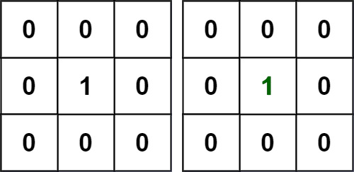
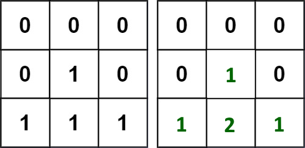

# 542. 01 Matrix

## Énoncé

Étant donné une matrice binaire `m x n` `mat`, renvoie la distance du `0` le plus proche pour chaque cellule.

La distance entre deux cellules adjacentes est `1`.

## Exemple

**Exemple 1:**



**Input:** mat = [[0,0,0],[0,1,0],[0,0,0]]  
**Output:** [[0,0,0],[0,1,0],[0,0,0]]

**Exemple 2:**



**Input:** mat = [[0,0,0],[0,1,0],[1,1,1]]  
**Output:** [[0,0,0],[0,1,0],[1,2,1]]

## Contraintes

`m == mat.length`  
`n == mat[i].length`  
`1 <= m, n <= 10^4`  
`1 <= m * n <= 10^4`  
`mat[i][j]` vaut `0` ou `1`.  
Il y a au moins un `0` dans `mat`.

## Note personnelle

Pour aborder cette problématique, j'ai opté en premier lieu pour l'utilisation d'un BFS (parcours en largeur).

Le principe est plutôt simple: j'initialise une matrice de la même taille que `mat` pour stocker les résultats, puis je parcours une fois la matrice en stockant les paires d'indices pour chaque cellule ayant pour valeur `0` dans une file. Je marque également ces cellules comme visitées en leur attribuant la valeur `-1`.

Ensuite, j'itère sur la file en gardant une trace de la profondeur actuelle. Pour chaque cellule, je vérifie ses 4 voisins, et pour chaque voisin, il y a différents scénarios:

- Si le voisin est `1` ou `0`, je l'ajoute à la file et le marque comme visité.
- Si le voisin est `1`, j'attribue à la matrice de retour la valeur de la profondeur actuelle pour cette cellule.
- Si le voisin est marqué comme visité, je passe au suivant.

```cpp
vector<vector<int>> updateMatrix(vector<vector<int>>& mat) {
  vector<int> dx = {0, 1, 0, -1}; // Vecteur de déplacement horizontal pour parcourir les cellules voisines
  vector<int> dy = {1, 0, -1, 0}; // Vecteur de déplacement vertical pour parcourir les cellules voisines

  // Initialiser la matrice de réponses avec des zéros
  vector<vector<int>> ans(mat.size(), vector<int>(mat[0].size(), 0));

  queue<pair<int, int>> q; // File pour le parcours en largeur

  // Parcours de la matrice pour trouver les cellules contenant 0
  for(int i = 0; i < mat.size(); i++){
    for(int j = 0; j < mat[0].size(); j++){
      if(mat[i][j] == 0){
        q.push(make_pair(i, j));  // Ajouter les cellules contenant 0 à la file
        mat[i][j] = -1;           // Marquer la cellule comme visitée
      }
    }
  }

  int depth = 1; // Profondeur actuelle du BFS

  // Parcours en largeur
  while(!q.empty()){
    int size = q.size();
    for(int i = 0; i < size; i++){
      pair<int, int> current = q.front(); // Récupérer le noeud en tête de la file
      q.pop();

      // Parcours des cellules voisines
      for(int d = 0; d < 4; d++){
        int y = current.first + dy[d];
        int x = current.second + dx[d];

        // Vérifier les limites de la matrice et si la cellule n'a pas déjà été visitée
        if(y >= 0 && y < mat.size() && x >= 0 && x < mat[0].size() && mat[y][x] != -1){
          if(mat[y][x] == 1){
            ans[y][x] = depth; // Mettre à jour la distance dans la matrice de réponses
          }
          mat[y][x] = -1;           // Marquer la cellule comme visitée
          q.push(make_pair(y, x));  // Ajouter la cellule à la file
        }
      }
    }
    depth++; // Augmenter la profondeur pour la prochaine itération
  }

  return ans;
}
```

Cette méthode présente une complexité temporelle et spatiale de `O(n)`, où `n` est le nombre de cellules dans la matrice `mat`.

Une autre approche utilise le principe de la programmation dynamique. L'idée est de parcourir la matrice en mettant à jour au fur et à mesure les distances directement dans la matrice en entrée. Il faut deux parcours pour mettre à jour correctement les valeurs.

Pour le premier parcours, je pars du coin supérieur gauche. Si je rencontre une cellule qui a pour valeur `1`, je lui attribue comme valeur le minimum entre la cellule du haut et de gauche + 1.

Pour le second parcours, je pars du coin inférieur droit. Si je rencontre une cellule qui a une valeur différente de `0`, je lui attribue comme valeur le minimum entre ses 4 voisins + 1.

Cette approche présente une complexité temporelle de `O(n)` et une complexité spatiale de `O(1)`.


