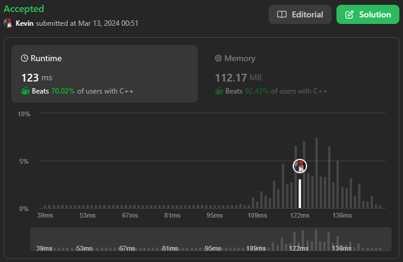

# 643. Maximum Average Subarray I

## Énoncé

Vous recevez un tableau d'entiers `nums` composé de `n` éléments et d'un entier `k`.

Recherchez un sous-tableau contigu dont la **longueur est égale à** `k` qui a la valeur moyenne maximale et renvoyez cette valeur. Toute réponse avec une erreur de calcul inférieure à `10^-5` sera acceptée.

## Exemple

**Exemple 1:**  
**Input:** nums = [1,12,-5,-6,50,3], k = 4  
**Output:** 12.75000  
**Explication:** La moyenne maximale est (12 - 5 - 6 + 50) / 4 = 51 / 4 = 12.75

**Exemple 2:**  
**Input:** nums = [5], k = 1  
**Output:** 5.00000

## Contraintes

`n == nums.length`  
`1 <= k <= n <= 10^5`  
`-10^4 <= nums[i] <= 10^4`

## Note personnelle

Pour résoudre ce problème, une approche naïve consiste à imbriquer deux boucles et à calculer la moyenne de chaque sous-tableau.

Voici une implémentation:

```cpp
double findMaxAverage(vector<int>& nums, int k) {
  // Initialisation de maxAvr avec une valeur très basse pour garantir qu'elle sera remplacée par une valeur valide
  double maxAvr = -numeric_limits<double>::max();

  // Parcours des éléments du tableau
  for(int i = k; i <= nums.size(); i++){
    double sum = 0;
    // Calcul de la somme des k éléments précédents
    for(int j = i - k; j < i; j++){
      sum += nums[j];
    }
    // Calcul de la moyenne et mise à jour de maxAvr si nécessaire
    maxAvr = fmax(maxAvr, sum / k);
  }

  // Retourne la moyenne maximale trouvée
  return maxAvr;
}
```

Cette approche a une complexité temporelle de `O(n * k)` avec une complexité spatiale de `O(1)`.

Cependant, nous effectuons des calculs de manière redondante. Pour éviter cela, nous allons utiliser le principe de **prefixSum**.

- Nous calculons d'abord la somme cumulée pour un index donné en parcourant le tableau.
- Nous initialisons notre variable pour contenir la moyenne maximale sur `nums[k - 1] / k`
- Ensuite, nous itérons de `k` jusqu'à `nums.size()`. Étant donné que nous avons calculé les sommes cumulées, nous pouvons obtenir la somme d'une plage comme ceci: `nums[i] - nums[i - k]`.

```cpp
double findMaxAverage(vector<int>& nums, int k) {
  // Calcul des sommes cumulatives jusqu'à chaque élément du vecteur
  for(int i = 1; i < nums.size(); i++){
    nums[i] += nums[i - 1];
  }

  // Initialisation de maxAvr avec la moyenne des premiers k éléments
  double maxAvr = ((double)nums[k - 1]) / k;

  // Parcours des éléments à partir de l'indice k
  for(int i = k; i < nums.size(); i++){
    // Calcul de la somme des k éléments consécutifs
    double sum = nums[i] - nums[i - k];
    // Mise à jour de maxAvr si la moyenne actuelle est plus grande
    maxAvr = fmax(maxAvr, sum / k);
  }

  // Retourne la moyenne maximale trouvée
  return maxAvr;
}
```

Cette approche présente une complexité temporelle de `O(n)` et une complexité spatiale de `O(1)`.
Cependant, nous modifions le tableau d'origine. Pour résoudre ce problème, on pourrait ne pas passer de pointeur vers celui-ci, mais cela reviendrait à effectuer une copie du tableau.

La version optimisée de cette approche consiste à initialiser une variable `sum`, puis à itérer sur `nums` de `0` à `k` pour calculer la somme de départ. On initialise une variable `maxAvg` avec `sum`.
Ensuite, on itère de `k` jusqu'à `nums.size()`, et à chaque itération, on calcule la nouvelle somme en lui ajoutant `nums[i]` et en soustrayant `nums[i - k]`.

Une légère optimisation consiste à garder une trace de la somme maximum et à calculer la moyenne à la fin, ce qui n'altérera pas le résultat et réduira la charge de calcul.

La complexité temporelle est alors de `O(n)` et la complexité spatiale de `O(1)`.



