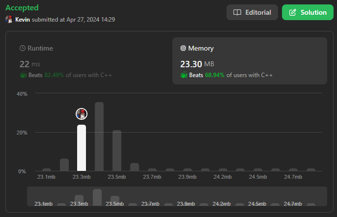

# 703. Kth Largest Element in a Stream

## Énoncé

Concevez une classe pour trouver le `k-ième` plus grand élément dans un flux. Notez qu'il s'agit du `k-ième` plus grand élément dans l'ordre trié, et non pas du `k-ième` élément distinct.

Implémentez la classe `KthLargest`:

- `KthLargest(int k, int[] nums)` Initialise l'objet avec l'entier `k` et le flux d'entiers `nums`.
- `int add(int val)` Ajoute l'entier `val` au flux et renvoie l'élément représentant le `k-ième` plus grand élément dans le flux.

## Exemple

**Exemple 1:**  
**Input:**  
["KthLargest", "add", "add", "add", "add", "add"]  
[[3, [4, 5, 8, 2]], [3], [5], [10], [9], [4]]  
**Output:**  
[null, 4, 5, 5, 8, 8]  
**Explication:**

```cpp
KthLargest kthLargest = new KthLargest(3, [4, 5, 8, 2]);
kthLargest.add(3);   // return 4
kthLargest.add(5);   // return 5
kthLargest.add(10);  // return 5
kthLargest.add(9);   // return 8
kthLargest.add(4);   // return 8
```

## Contraintes

`1 <= k <= 10^4`  
`0 <= nums.length <= 10^4`  
`-10^4 <= nums[i] <= 10^4`  
`-10^4 <= val <= 10^4`  
Au plus `10^4` appels seront effectués pour `add`.  
Il est garanti qu'il y aura au moins `k`éléments dans le tableau lorsque vous recherchez le `k-ième` élément.

## Note personnelle

Pour implémenter cette classe, l'idée est d'utiliser une file de priorité minimale:

```cpp
priority_queue<int, vector<int>, greater<int>> pq;
```

Cela nous permettra de conserver une trace des `k` éléments les plus grands.

Lors de l'initialisation de l'objet, nous remplissons la file de priorité avec les éléments de `nums`.

```cpp
KthLargest(int k, vector<int> &nums) {
  this->k = k;
  // Parcourir tous les nombres et les ajouter à la file de priorité
  for (int n : nums) {
    pq.push(n);
    // Si la taille de la file de priorité dépasse k, retirer le plus petit élément
    if (pq.size() > k) {
      pq.pop();
    }
  }
}
```

Lors de l'appel de la fonction `add`, nous ajoutons `val` à la file de priorité, et si cela fait dépasser la taille de `k`, nous retirons un élément.

```cpp
int add(int val) {
  pq.push(val); // Ajouter le nouveau nombre à la file de priorité

  // Si la taille de la file de priorité dépasse k, retirer le plus petit élément
  if(pq.size() > k){
    pq.pop();
  }

  // Retourner le k-ième plus grand élément actuel
  return pq.top();
}
```

La complexité temporelle du constructeur est de `O(n log(k))` , et celle de la méthode `add` est des `O(log(k))`.

La complexité spatiale de la classe est de `O(k)`.

Une autre approche consiste à utiliser un Arbre Binaire de Recherche (ABR). L'idée est que pour chaque noeud, son sous-arbre gauche est rempli de valeurs inférieures ou égales à lui, et son sous-arbre droit est rempli de valeurs supérieures.

Grâce à cette disposition, il est facile de récupérer la valeur minimale ou maximale de celui-ci.

L'idée est la même que pour la file de priorité, garder seulement `k` éléments dans celui-ci.

Pour la suppression d'un élément, étant donné que l'on supprime seulement le minimum, on peut faire une version simplifiée de cette fonction adaptée à notre cas :

```cpp
// Définition de la structure d'un noeud dans l'ABR
struct Node{
  int value;    // Valeur stockée dans le noeud
  Node* left;   // Pointeur vers le sous-arbre gauche
  Node* right;  // Pointeur vers le sous-arbre gauche
};

class KthLargest {
private:
  // La valeur de k pour trouver le k-ième plus grand élément
  int k;
  // Nombre d'éléments actuellement stockés dans l'ABR
  int currentSize;
  // Pointeur vers la racine de l'ABR
  Node* root;

  // Méthode pour insérer une nouvelle valeur dans l'ABR
  void insert(int value){
    Node* current = root;
    Node* parent = nullptr;

    // Parcourir l'ABR pour trouver l'emplacement approprié pour insérer la nouvelle valeur
    while(current){
      parent = current;
      if(current->value > value){
        current = current->left;
      }
      else{
        current = current->right;
      }
    }

    // Créer un nouveau noeud avec la valeur donnée
    Node* newNode = new Node(value, nullptr, nullptr);

    // Insérer le nouveau noeud à la bonne position dans l'ABR
    if(!parent){
      root = newNode;
    }
    else if(parent->value > value){
      parent->left = newNode;
    }
    else{
      parent->right = newNode;
    }

    currentSize++;
  }

  // Méthode pour trouver le noeud contenant la plus petite valeur dans un sous-arbre donné
  Node* findMin(Node* root){
    if(!root || !root->left){
      return root;
    }

    return findMin(root->left);
  }

  // Méthode pour supprimer le noeud contenant la plus petite valeur dans l'ABR
  void deleteMin(){
    Node* current = root;
    Node* prev = nullptr;

    // Trouver le noeud contenant la plus petite valeur
    while(current && current->left){
      prev = current;
      current = current->left;
    }

    // Mettre à jour les pointeurs pour supprimer le noeud
    if(!prev){
      root = root->right;
    }
    else{
      prev->left = current->right;
    }

    delete current;

    currentSize--;
  }


public:
  // Constructeur prenant k et un vecteur de nombres
  KthLargest(int k, vector<int>& nums) {
    this->k = k;
    currentSize = 0;
    root = nullptr;

    // Insérer chaque nombre dans l'ABR
    for(int i = 0; i < nums.size(); i++){
      insert(nums[i]);

      // Si le nombre d'éléments dans l'ABR dépasse k, supprimer le plus petit élément
      if(currentSize > k){
        deleteMin();
      }
    }
  }

  // Méthode pour ajouter un nouveau nombre à l'ensemble et retourner le k-ième plus grand élément actuel
  int add(int val) {
    insert(val);

    // Si le nombre d'éléments dans l'ABR dépasse k, supprimer le plus petit élément
    if(currentSize > k){
      deleteMin();
    }

    // Retourner la plus petite valeur dans l'ABR, qui est le k-ième plus grand élément
    return findMin(root)->value;
  }
};

/**
* Your KthLargest object will be instantiated and called as such:
* KthLargest* obj = new KthLargest(k, nums);
* int param_1 = obj->add(val);
*/
```

Cette approche présente la même complexité temporelle et spatiale que la version utilisant une file de priorité. Cependant, dans le pire des cas, la complexité temporelle peut être de `O(k)` pour l'insertion/suppression/recherche du minimum.



