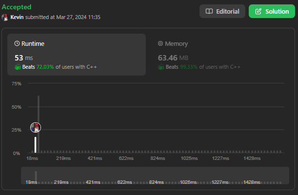
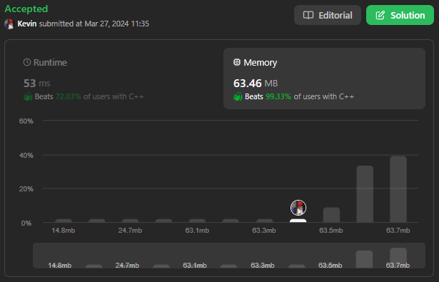

# 713. Subarray Product Less Than K

## Énoncé

Étant donné un tableau d'entiers `nums` et un entier `k`, renvoie le nombre de sous-tableaux contigus où le produit de tous les éléments du sous-tableau est strictement inférieur à `k`.

## Exemple

**Exemple 1:**  
**Input:** nums = [10,5,2,6], k = 100  
**Output:** 8  
**Explication:** Les 8 sous-tableaux dont le produit est inférieur à 100 sont:  
[10], [5], [2], [6], [10, 5], [5, 2], [2, 6], [5, 2, 6]

**Exemple 2:**  
**Input:** nums = [1,2,3], k = 0  
**Output:** 0

## Contraintes

`1 <= nums.length <= 3 * 10^4`  
`1 <= nums[i] <= 1000`  
`0 <= k <= 10^6`

## Note personnelle

Mon approche repose sur le principe de **Deux Pointeur**, qui désignent le premier et le dernier élément d'une **Fenêtre Glissante**. Initialement `left` est défini sur `-1` et `right` sur `0`.

L'idée est relativement simple: nous conservons une trace du produit des éléments de la fenêtre. À chaque itération, nous incrémentons la borne droite et multiplions notre produit par `nums[right]`. Si ce produit dépasse `k`, alors nous déplaçons la borne gauche vers la droite en divisant notre produit par `nums[left]`.

Pour obtenir le nombre de sous-tableaux, à chaque itération, nous ajoutons à notre compteur la valeur `right - left`.

Preuve de la formule:
Prenons l'exemple du tableau: "[1,2,3,4]"et cherchons à compter le nombre de sous-tableaux. Pour cet exemple `left` est initialisé à `-1`.

- À la 1ère itération: `right = 0`, nous avons 1 sous-tableau [1]
- À la 2ème itération: `right = 1`, nous avons 2 sous-tableaux [1,2] [2]
- À la 3ème itération: `right = 2`, nous avons 3 sous-tableaux [1,2,3] [2,3] [3]
- À la 4ème itération: `right = 3`, nous avons 4 sous-tableaux [1,2,3,4] [2,3,4] [3,4] [4]

Le total des sous-tableaux pour le tableau [1,2,3,4] est de 10.

Cette approche présente une complexité temporelle de `O(n)`, où `n` est la taille du tableau `nums`, et une complexité spatiale de `O(1)`.

