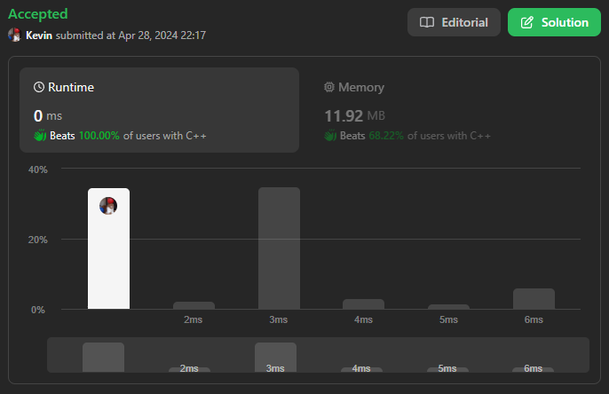
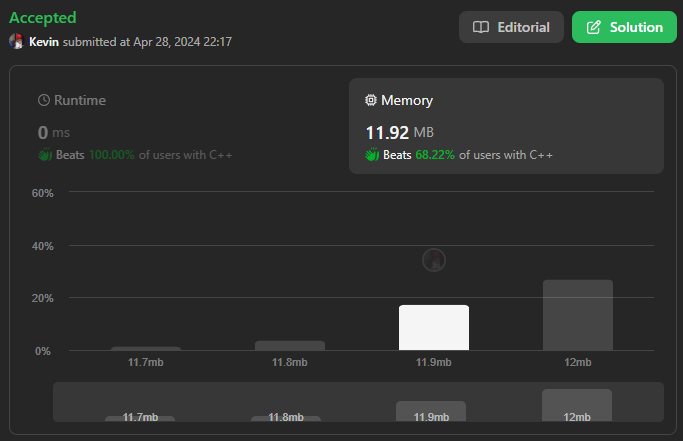

# 717. 1-bit and 2-bit Characters

## Énoncé

Nous avons deux caractères spéciaux:

- Le premier caractère peut être représenté par un bit `0`.
- Le deuxième caractère peut être représenté par deux bits (`10` ou `11`).

Étant donné un tableau binaire `bits` qui se termine par `0`, renvoie `true` si le dernier caractère doit être un caractère d'un bit.

## Exemple

**Exemple 1:**  
**Input:** bits = [1,0,0]  
**Output:** true  
**Explication:** La seule façon de le décoder est un caractère à deux bits et un caractère à un bit.
Le dernier caractère est donc un caractère d'un bit.

**Exemple 2:**  
**Input:** bits = [1,1,1,0]  
**Output:** false  
**Explication:** La seule façon de le décoder est le caractère à deux bits et le caractère à deux bits.
Le dernier caractère n’est donc pas un caractère d’un seul bit.

## Contraintes

`1 <= bits.length <= 1000`  
`bits[i]` vaut `0` ou `1`.

## Note personnelle

Comme mentionné dans l'énoncé, un caractère encodé sur 2 bits commence toujours par `1`. Ainsi, l'idée consiste à parcourir le tableau jusqu'à l'avant-dernier élément tout en maintenant une trace du début du prochain caractère.

À la fin du parcours, si l'indice se trouve sur le dernier élément du tableau, alors le dernier caractère est encodé sur 2 bits. Sinon, il est encodé sur 1 bit.

```cpp
bool isOneBitCharacter(vector<int> &bits) {
  int i = 0;               // Index actuel
  int a = bits.size() - 1; // Avant-dernier index du tableau

  // Parcours du tableau jusqu'à l'avant-dernier élément
  while (i < a) {
    // Avance d'un ou deux indices selon la valeur de bits[i]
    i += 1 + bits[i];
  }

  // Si i est égal à l'avant-dernier index, alors le dernier caractère est un bit unique
  return i == a;
}
```

Cette approche présente une complexité temporelle de `O(n)` et une complexité spatiale de `O(1)`.



