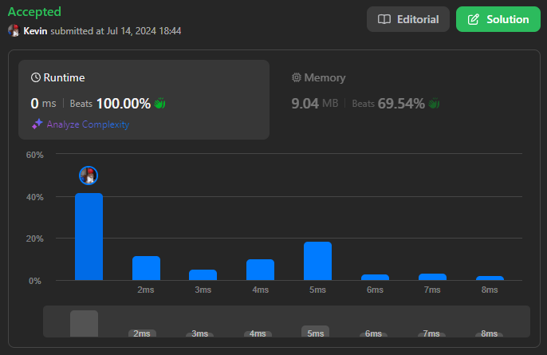
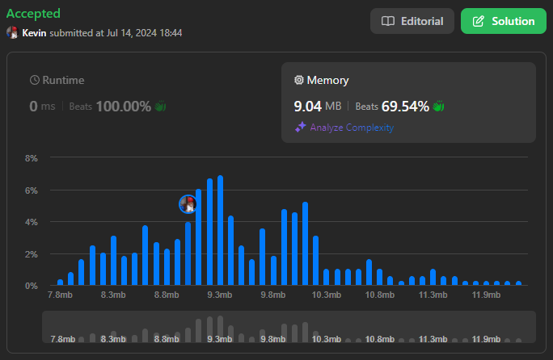

# 726. Number of Atoms

## Énoncé

Étant donné une chaîne de caractères `formula` représentant une formule chimique, retourne le compte de chaque atome.

L'élément atomique commence toujours par un caractère majuscule, suivi de zéro ou plusieurs lettres minuscules, représentant le nom.

Un ou plusieurs chiffres représentant le nombre de cet élément peuvent suivre si ce nombre est supérieur à `1`. Si le nombre est `1`, aucun chiffre ne suivra.

Par exemple, `"H2O"` et `"H2O2"` sont possibles, mais `"H1O2"` est impossible.

Deux formules sont concaténées ensemble pour produire une autre formule.

Par exemple, `"H2O2He3Mg4"` est également une formule.

Une formule placée entre parenthèses, avec un nombre (ajouté optionnellement) est également une formule.

Par exemple, `"(H2O2)"` et `"(H2O2)3"` sont des formules.

Retourne le compte de tous les éléments sous forme de chaîne de caractères dans l'ordre suivant : le premier nom (par ordre alphabétique), suivi de son compte (si ce compte est supérieur à `1`), suivi du deuxième nom (par ordre alphabétique), suivi de son compte (si ce compte est supérieur à `1`), et ainsi de suite.

Les jeux de test sont générés de sorte que toutes les valeurs dans la sortie tiennent dans un entier **32 bits**.

## Exemple

**Exemple 1:**  
**Input:** formula = "H2O"  
**Output:** "H2O"  
**Explication:** Le nombre d'éléments est {'H': 2, 'O': 1}.

**Exemple 2:**  
**Input:** formula = "Mg(OH)2"  
**Output:** "H2MgO2"  
**Explication:** Le nombre d'éléments est {'H': 2, 'Mg': 1, 'O': 2}.

**Exemple 3:**  
**Input:** formula = "K4(ON(SO3)2)2"  
**Output:** "K4N214S4"  
**Explication:** Le nombre d'éléments est {'K': 4, 'N': 2, 'O': 14, 'S': 4}.

## Contraintes

`1 <= formula.length <= 1000`  
`formula` se compose de lettres anglaises, de chiffres, `'('`, et `')'`.  
`formula` est toujours valide.

## Note personnelle

### Approche 1: Récursion

Cette approche utilise une combinaison de `parsing` et de `récursion` pour traiter la chaîne de caractères. Tout ce qui est entre parenthèses est traité de manière récursive, l'algorithme extrait la clé de l'atome et son nombre d'occurrences.

```cpp
// Fonction pour extraire un nombre de la chaîne, en partant de l'index donné
int getNumber(string &s, int &i){
  int count = 0;

  // Parcours de la chaîne pour construire le nombre
  while(s[i] >= '0' && s[i] <= '9'){
    count *= 10;
    count += s[i++] - '0';
  }

  // Si aucun nombre trouvé, on retourne 1 par défaut
  return count == 0 ? 1 : count;
}

// Fonction récursive pour analyser la formule chimique
unordered_map<string, int> parse(string &s, int i, int end){
  unordered_map<string, int> mp;

  // Parcours de la chaîne jusqu'à l'index de fin
  while(i <= end){
    // Détection d'un élément chimique
    if(s[i] >= 'A' && s[i] <= 'Z'){
      // Extractions de la clé de l'élément chimique (format [A-Z][a-z]*)
      string key = "";
      key += s[i++];
      while(s[i] >= 'a' && s[i] <= 'z'){
        key += s[i++];
      }

      // Ajout du nombre d'atomes correspondant à l'élément
      mp[key] += getNumber(s, i);
    }
    // Détection d'une sous-formule entre parenthèses
    else if(s[i] == '('){
      int start = i;
      int depth = 1;

      // Parcours de la sous-formule en tenant compte des parenthèses imbriquées
      while(depth != 0){
        i++;
        if(s[i] == '('){
          depth++;
        }
        else if(s[i] == ')'){
          depth--;
        }
      }

      // Appel récursif pour analyser la sous-formule
      unordered_map<string, int> _mp = parse(s, start + 1, i - 1);
      int count = getNumber(s, ++i);

      // Multiplication des éléments de la sous-formule par le coefficient
      for(auto it = _mp.begin(); it != _mp.end(); it++){
        mp[it->first] += it->second * count;
      }
    }
  }

  return mp;
}

string countOfAtoms(string formula) {
  unordered_map<string, int> mp = parse(formula, 0, formula.size() - 1);
  vector<pair<string, int>> v(mp.begin(), mp.end());

  // Trie des éléments chimiques par ordre alphabétique
  sort(v.begin(), v.end());

  // Construction de la chaîne de sortie
  string ans = "";
  for(pair<string, int> &p : v){
    ans += p.first;
    if(p.second > 1){
      ans += to_string(p.second);
    }
  }

  return ans;
}
```

- Complexité Temporelle: `O(n + m log m)`, où `n` est la taille de `formula` et `m` le nombre d'éléments chimiques distincts.
- Complexité Spatiale: `O(n + m)`

### Approche 2: Pile

Cette approche utilise le même principe de fonctionnement que l'approche récursive, sauf qu'elle est itérative et les appels récursifs sont remplacés par une pile.

```cpp
// Fonction pour extraire un nombre de la chaîne, en partant de l'index donné
int getNumber(string& s, int& i) {
  int count = 0;

  // Parcours de la chaîne pour construire le nombre
  while (s[i] >= '0' && s[i] <= '9') {
    count *= 10;
    count += s[i++] - '0';
  }

  // Si aucun nombre trouvé, on retourne 1 par défaut
  return count == 0 ? 1 : count;
}

// Fonction pour analyser la formule chimique
unordered_map<string, int> parse(string& s) {
  // Pile pour gérer les sous-formules
  stack<unordered_map<string, int>> sta;
  // Pousse une map vide au début
  sta.push({});

  int i = 0;

  // Parcours de la chaîne jusqu'à la fin
  while (i < s.size()) {
    // Détection d'un élément chimique
    if (s[i] >= 'A' && s[i] <= 'Z') {
      // Extractions de la clé de l'élément chimique (format [A-Z][a-z]*)
      string key = "";
      key += s[i++];
      while (s[i] >= 'a' && s[i] <= 'z') {
        key += s[i++];
      }

      // Ajout du nombre d'atomes correspondant à l'élément
      sta.top()[key] += getNumber(s, i);
    }
    // Détection d'une sous-formule entre parenthèses
    else if (s[i] == '(') {
      sta.push({});
      i++;
    }
    // Détection de la fin d'une sous-formule
    else {
      // Nombre après la parenthèse fermante
      int count = getNumber(s, ++i);
      unordered_map<string, int> mp = sta.top();
      sta.pop();

      // Multiplication des éléments de la sous-formule par le coefficient
      for (auto it = mp.begin(); it != mp.end(); it++) {
        sta.top()[it->first] += it->second * count;
      }
    }
  }

  return sta.top();
}

string countOfAtoms(string formula) {
  unordered_map<string, int> mp = parse(formula);
  vector<pair<string, int>> v(mp.begin(), mp.end());

  // Trie des éléments chimiques par ordre alphabétique
  sort(v.begin(), v.end());

  // Construction de la chaîne de sortie
  string ans = "";
  for(pair<string, int> &p : v){
    ans += p.first;
    if(p.second > 1){
      ans += to_string(p.second);
    }
  }

  return ans;
}
```

- Complexité Temporelle: `O(n + m log m)`
- Complexité Spatiale: `O(n + m)`

### Optimisation Pile

Cette optimisation consiste à remplacer la pile de hashmaps par une pile d'entiers, dans laquelle seront stockés les coefficients multiplicateurs en fonction de la profondeur de la formule. Pour éviter une complexité quadratique, il est nécessaire de parcourir la chaîne depuis la fin, ce qui permet de récupérer facilement ces coefficients.

```cpp
// Fonction pour extraire un nombre de la chaîne, en partant de l'index donné
int getNumber(string& s, int& i) {
  int count = 0;
  int n = 0;

  // Parcours de la chaîne à l'envers pour construire le nombre
  while (s[i] >= '0' && s[i] <= '9') {
    n += (s[i--] - '0') * pow(10, count++);
  }
  i++; // Corrige l'index après la boucle

  return n;
}

// Fonction pour analyser la formule chimique
unordered_map<string, int> parse(string& s) {
  unordered_map<string, int> mp;

  stack<int> sta;
  sta.push(1); // Initialise la pile avec un coefficient de 1

  int coef = 1;
  string key = "";

  // Parcours de la chaîne à l'envers
  for(int i = s.size() - 1; i >= 0; i--){
    // Détection d'un nombre
    if(s[i] >= '0' && s[i] <= '9'){
      coef = getNumber(s, i);
    }
    // Détection d'un élément chimique
    else if(s[i] >= 'A' && s[i] <= 'Z'){
      key += s[i];
      reverse(key.begin(), key.end());

      mp[key] += coef * sta.top();

      coef = 1;
      key = "";
    }
    // Ajout des lettres minuscules éventuelles
    else if(s[i] >= 'a' && s[i] <= 'z'){
      key += s[i];
    }
    // Détection de la fin d'une sous-formule
    else if(s[i] == ')'){
      sta.push(coef * sta.top());
      coef = 1;
    }
    // Détection du début d'une sous-formule s[i] == '('
    else{
      sta.pop();
    }
  }

  return mp;
}

string countOfAtoms(string formula) {
  unordered_map<string, int> mp = parse(formula);
  vector<pair<string, int>> v(mp.begin(), mp.end());

  // Trie des éléments chimiques par ordre alphabétique
  sort(v.begin(), v.end());

  // Construction de la chaîne de sortie
  string ans = "";
  for (pair<string, int>& p : v) {
    ans += p.first;
    if (p.second > 1) {
      ans += to_string(p.second);
    }
  }

  return ans;
}
```

- Complexité Temporelle: `O(n + m log m)`
- Complexité Spatiale: `O(n + m)`

### Comparaison des différentes méthodes

Bien que chaque approche ait la même complexité spatiale et temporelle, le choix entre elles dépend de légers détails.

- **Approche 1 Récursion**: Potentiellement la plus intuitive si l'on est à l'aise avec la récursivité.
- **Approche 2 Pile**: Approche itérative qui devrait être plus performante en théorie, mais peut être plus complexe à implémenter en raison des structures imbriquées utilisées.
- **Optimisation Approche 2**: Approche itérative avec une consommation de mémoire optimisée par rapport à l'Approche 2, mais peut être plus difficile à implémenter en raison de la gestion minutieuse des coefficients.



