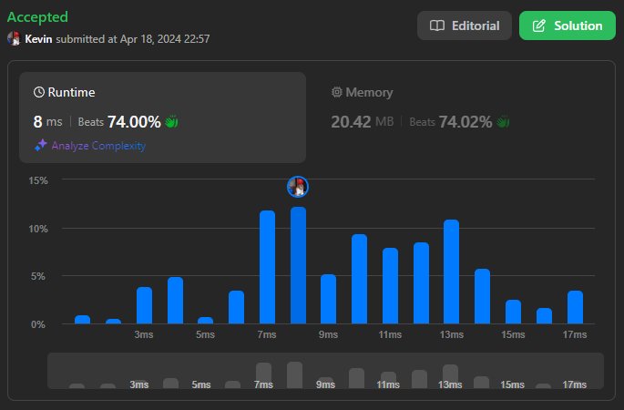
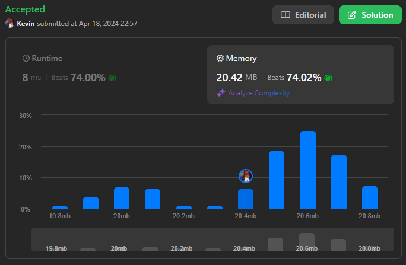

# 735. Asteroid Collision

## Énoncé

Nous avons un tableau `asteroids` d'entiers représentant des astéroïdes en ligne.

Pour chaque astéroïde, la valeur absolue représente sa taille, et le signe représente sa direction (positif signifiant droite, négatif signifiant gauche). Chaque astéroïde se déplace à la même vitesse.

Découvrez l'état des astéroïdes après toutes les collisions. Si deux astéroïdes se rencontrent, le plus petit explosera. Si les deux ont la même taille, les deux exploseront. Deux astéroïdes se déplaçant dans la même direction ne se rencontreront jamais.

## Exemple

**Exemple 1:**  
**Input:** asteroids = [5,10,-5]  
**Output:** [5,10]  
**Explication:** Les 10 et -5 entrent en collision, entraînant l'explosion du -5. Le 5 et le 10 ne se heurtent jamais.

**Exemple 2:**  
**Input:** asteroids = [8,-8]  
**Output:** []  
**Explication:** Les 8 et -8 entrent en collision et explosent.

**Exemple 3:**  
**Input:** asteroids = [10,2,-5]  
**Output:** [10]  
**Explication:** Les 2 et -5 entrent en collision, entraînant l'explosion du 2. Les 10 et -5 entrent en collision, entraînant l'explosion du -5.

## Contraintes

`2 <= asteroids.length <= 10^4`  
`-1000 <= asteroids[i] <= 1000`  
`asteroids[i] != 0`

## Note personnelle

Pour résoudre ce problème, l'idée principale est d'utiliser une pile. Nous remplirons cette pile progressivement en parcourant la liste des astéroïdes, en ajoutant ceux qui vont vers la droite. Lorsqu'un astéroïde allant vers la gauche est rencontré, nous supprimons de la pile les astéroïdes plus petits qui vont vers la droite.

```cpp
vector<int> asteroidCollision(vector<int>& asteroids) {
  vector<int> ans;

  // Parcourir tous les astéroïdes dans la liste
  for(int n : asteroids){
    // Si l'astéroïde se déplace vers la droite, on l'ajoute au résultat
    if(n > 0){
      ans.push_back(n);
    }
    // Si l'astéroïde se déplace vers la gauche
    else{
      n = -n; // Récupérer la taille de l'astéroïde

      // Tant que le dernier astéroïde dans 'ans' se déplace vers la droite et est plus petit que l'actuel astéroïde se déplaçant vers la gauche
      while(ans.size() >= 1 && ans.back() > 0 && ans.back() < n){
        ans.pop_back(); // On supprime le dernier astéroïde car il est détruit
      }

      // Si 'ans' est vide ou si le dernier astéroïde se déplace vers la gauche, on ajoute l'astéroïde actuel se déplaçant vers la gauche
      if(ans.empty() || ans.back() < 0){
        ans.push_back(-n);
      }
      // Si les deux astéroïdes sont de même taille mais opposés, ils explosent
      else if(ans.back() == n){
        ans.pop_back();
      }
      // Si ans.back() > n, le dernier astéroïde dans 'ans' détruit l'actuel astéroïde donc on n'a rien à faire dans ce cas
    }
  }

  return ans;
}
```

- Complexité Temporelle: `O(n)`
- Complexité Spatiale: `O(n)`



