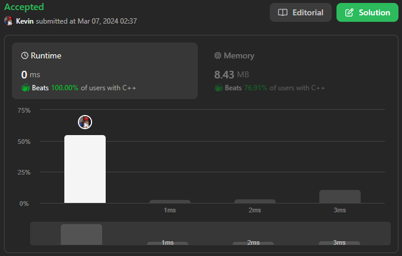

# 876. Middle of the Linked List

## Énoncé

Étant donné la `head` d’une liste chaînée unique, renvoie le noeud central de la liste chaînée.

S'il y a deux noeuds du milieu, renvoie **le deuxième noeud du milieu**.

## Exemple

**Exemple 1:**  

**Input:** head = [1,2,3,4,5]  
**Output:** [3,4,5]  
**Explication:** Le noeud du milieu de la liste est le nœud 3.

**Exemple 2:**  

**Input:** head = [1,2,3,4,5,6]  
**Output:** [4,5,6]  
**Explication:** Puisque la liste comporte deux noeuds du milieu avec les valeurs 3 et 4, nous renvoyons le second.

## Contraintes

Le nombre de noeuds dans la liste est compris entre `[1, 100]`  
`1 <= Node.val <= 100`

## Note personnelle

Pour résoudre ce problème, j'emploie une méthode qui implique l'initialisation de deux pointeurs, `slow` et `fast`, tous deux commençant à la tête de la liste chaînée.

Ensuite, je parcours la liste avec `slow` avançant d'un pas à la fois et `fast` de deux pas à la fois.

Ainsi, lorsque `fast` atteint la fin de la liste, `slow` se trouve au centre.

Cette approche garantit une complexité temporelle de `O(n)` et une complexité spatiale de `O(1)`.

