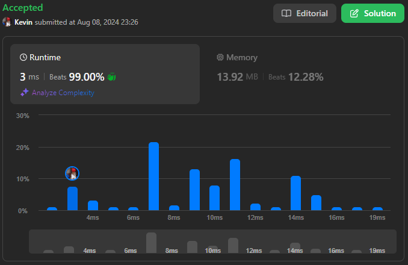
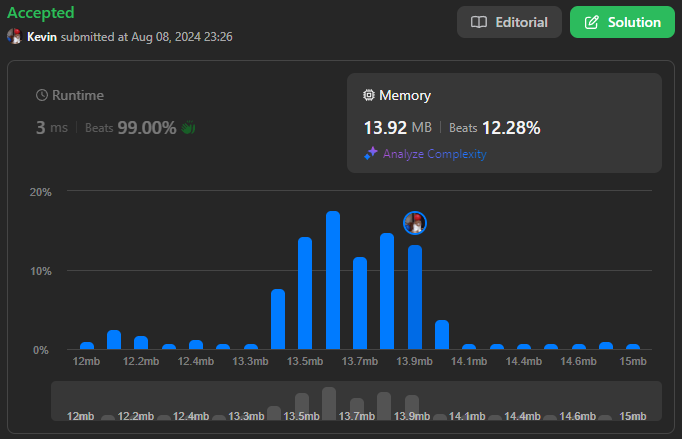

# 885. Spiral Matrix III

## Énoncé

Vous commencez à la cellule `(rStart, cStart)` d'une grille de dimensions `rows x cols`, face à l'est. Le coin nord-ouest se trouve à la première ligne et la première colonne de la grille, et le coin sud-est se trouve à la dernière ligne et colonne.

Vous allez marcher en spirale dans le sens des aiguilles d'une montre pour visiter chaque position de cette grille. Chaque fois que vous sortez des limites de la grille, vous continuez votre marche en dehors de la grille (mais il est possible de revenir plus tard à la frontière de la grille). Finalement, vous atteignez toutes les `rows * cols` cases de la grille.

Retournez un tableau de coordonnées représentant les positions de la grille dans l'ordre dans lequel vous les avez visitées.

## Exemple

**Exemple 1:**


**Input:** rows = 1, cols = 4, rStart = 0, cStart = 0  
**Output:** [[0,0],[0,1],[0,2],[0,3]]

**Exemple 2:**


**Input:** rows = 5, cols = 6, rStart = 1, cStart = 4  
**Output:** [[1,4],[1,5],[2,5],[2,4],[2,3],[1,3],[0,3],[0,4],[0,5],[3,5],[3,4],[3,3],[3,2],[2,2],[1,2],[0,2],[4,5],[4,4],[4,3],[4,2],[4,1],[3,1],[2,1],[1,1],[0,1],[4,0],[3,0],[2,0],[1,0],[0,0]]

## Contraintes

`1 <= rows, cols <= 100`  
`0 <= rStart < rows`  
`0 <= cStart < cols`

## Note personnelle

### Approche 1: Simulation

En examinant les illustrations de l'exemple, on constate qu'à chaque changement de direction, la longueur du déplacement sur l'axe concerné augmente tous les deux mouvements.

Cela crée une séquence de longueurs comme suit : [1, 1, 2, 2, 3, 3, 4, 4, 5, 5, ...].

L'algorithme simule simplement cette séquence de longueurs tout en parcourant la matrice. Si la position actuelle se trouve dans les limites de la matrice, on ajoute ses coordonnées à notre tableau de réponse.

```cpp
// Directions correspondantes aux mouvements dans l'ordre : droite, bas, gauche, haut
vector<vector<int>> dir = {{0, 1}, {1, 0}, {0, -1}, {-1, 0}};

vector<vector<int>> spiralMatrixIII(int rows, int cols, int rStart, int cStart) {
  // Calcul de la taille totale de la matrice
  int size = rows * cols;

  // Initialisation de la matrice de résultat avec la position de départ
  vector<vector<int>> ans = {{rStart, cStart}};

  // Variables pour garder la trace de la position actuelle
  int currR = rStart;
  int currC = cStart;
  // Variable pour indiquer la direction actuelle
  int d = 0;

   // Boucle jusqu'à ce que toutes les positions valides soient visitées
  while (ans.size() != size) {
    // Détermine la longueur de la prochaine étape dans la direction courante
    int length = (d / 2) + 1;
    // Sélectionne la direction actuelle (0: droite, 1: bas, 2: gauche, 3: haut)
    int curr = d % 4;

    // Avance dans la direction choisie pour la longueur déterminée
    for(int i = 0; i < length; i++){
      currR += dir[curr][0]; // Mise à jour de la ligne courante
      currC += dir[curr][1]; // Mise à jour de la colonne courante

      // Vérifie si la nouvelle position est dans les limites de la matrice
      if (currR >= 0 && currR < rows && currC >= 0 && currC < cols) {
        // Si c'est le cas, ajoute cette position à la liste des résultats
        ans.push_back({currR, currC});
      }
    }

    // Passe à la direction suivante
    d++;
  }

  return ans;
}
```

- Complexité Temporelle: `O(m * n)`.
- Complexité Spatiale: `O(m * n)`.

### Optimisation

Pour améliorer l'approche précédente, l'idée est de sauter les positions invalides, ce qui permet de réduire le nombre d'itérations.

Il existe quatre types de sauts possibles :

- Lorsque l'on incrémente la position sur un axe:
  - Si la position actuelle est inférieure à 0, on saute jusqu'à -1.
  - Si la position actuelle est supérieure ou égale à 0, on saute jusqu'à avoir parcouru `length` cases au total.
- Lorsque l'on décrémente la position sur un axe:
  - Si la position actuelle dépasse la dernière case de l'axe, on saute jusqu'à cette dernière case.
  - Si la position actuelle est inférieure à la dernière case de l'axe, on saute jusqu'à avoir parcouru `length` cases au total.

Ici, `length` représente le nombre de cases à parcourir sur l'axe en cours.

```cpp
// Définition des directions de mouvement : droite, bas, gauche, haut
vector<vector<int>> dir = {{0, 1}, {1, 0}, {0, -1}, {-1, 0}};

// Fonction pour ajuster les coordonnées lorsqu'on dépasse les limites sur les axes positif
void jumpA(int &i, int &curr, int length){
  // Si on sort du côté négatif, on ramène curr à -1 et ajuste l'indice i
  if(curr < 0){
    i += abs(curr) - 1;
    curr = -1;
  }
  // Sinon, on avance curr au maximum permis par la longueur restante et ajuste i
  else{
    curr += length - i - 1;
    i = length;
  }
}

// Fonction pour ajuster les coordonnées lorsqu'on dépasse les limites sur les axes négatif
void jumpB(int &i, int &curr, int length, int n){
  // Si curr dépasse la limite supérieure, on l'ajuste à la limite et ajuste l'indice i
  if(curr >= n){
    i += curr - n;
    curr = n;
  }
  // Sinon, on recule curr de la longueur restante et ajuste i
  else{
    curr -= length - i - 1;
    i = length;
  }
}

// Génère une matrice parcourue en spirale à partir d'une position de départ
vector<vector<int>> spiralMatrixIII(int rows, int cols, int rStart, int cStart) {
  // Calcul de la taille totale de la matrice
  int size = rows * cols;

  // Initialisation de la matrice de résultat avec la position de départ
  vector<vector<int>> ans = {{rStart, cStart}};

  // Variables pour garder la trace de la position actuelle
  int currR = rStart;
  int currC = cStart;
  // Variable pour indiquer la direction actuelle
  int d = 0;

  // Boucle jusqu'à ce que toutes les positions valides soient visitées
  while (ans.size() != size) {
    // Détermine la longueur de la prochaine étape dans la direction courante
    int length = (d / 2) + 1;
    // Sélectionne la direction actuelle (0: droite, 1: bas, 2: gauche, 3: haut)
    int curr = d % 4;

    // Avance dans la direction choisie pour la longueur déterminée
    for(int i = 0; i < length; i++){
      currR += dir[curr][0]; // Mise à jour de la ligne courante
      currC += dir[curr][1]; // Mise à jour de la colonne courante

      // Si la nouvelle position est à l'intérieur de la matrice, l'ajoute au résultat
      if (currR >= 0 && currR < rows && currC >= 0 && currC < cols) {
        ans.push_back({currR, currC});
      }
      // Si la position dépasse les limites elle est ajusté
      else {
        if(curr == 0){
          jumpA(i, currC, length);  // Ajuste la colonne en cas de dépassement à droite
        }
        else if(curr == 1){
          jumpA(i, currR, length);  // Ajuste la ligne en cas de dépassement en bas
        }
        else if(curr == 2){
          jumpB(i, currC, length, cols);  // Ajuste la colonne en cas de dépassement à gauche
        }
        else {
          jumpB(i, currR, length, rows);  // Ajuste la ligne en cas de dépassement en haut
        }
      }
    }

    // Passe à la direction suivante
    d++;
  }

  return ans;
}
```

- Complexité Temporelle: `O(m * n)`.
- Complexité Spatiale: `O(m * n)`.

Cette optimisation n'affecte pas la complexité temporelle, cependant elle permet de réduire de manière significative le nombre d'itérations lorsque le point de départ est proche des bords de la matrice.



