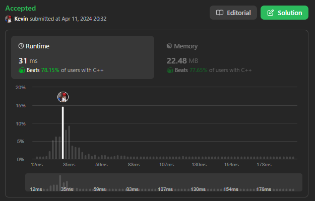

# 934. Shortest Bridge

## Énoncé

Vous recevez une grille matricielle binaire `n x n` où `1` représente la terre et `0` représente l'eau.

Une **île** est un groupe de `1` connectés dans 4 directions. Il y a **exactement deux îles** dans la `grid`.

Vous pouvez remplacer les `0` par des `1` pour relier les deux îles afin de former **une seule île**.

Renvoie le plus petit nombre de `0` que vous devez retourner pour connecter les deux îles.

## Exemple

**Exemple 1:**  
**Input:** grid = [[0,1],[1,0]]  
**Output:** 1

**Exemple 2:**  
**Input:** grid = [[0,1,0],[0,0,0],[0,0,1]]  
**Output:** 2

**Exemple 3:**  
**Input:** grid = [[1,1,1,1,1],[1,0,0,0,1],[1,0,1,0,1],[1,0,0,0,1],[1,1,1,1,1]]  
**Output:** 1

## Contraintes

`n == grid.length == grid[i].length`  
`2 <= n <= 100`  
`grid[i][j]` vaut `0` ou `1`.  
Il y a exactement deux îles dans la `grid`.

## Note personnelle

Ma première approche pour résoudre ce problème a impliqué l'utilisation d'un algorithme BFS (Breadth-First Search). L'idée était de parcourir la grille: lorsqu'une case appartenant à une île n'avait pas encore été marquée, j'appelais la fonction BFS pour récupérer toutes les cellules de cette île dans un vecteur. Ce processus se répétait jusqu'à ce que la deuxième île soit trouvée.

Une fois les deux îles identifiées, j'ai calculé la distance entre chaque case de la première île et celles de la deuxième, en conservant une trace du minimum trouvé.

```cpp
vector<int> dx = {0, 0, 1, -1}; // Vecteur de déplacement horizontal
vector<int> dy = {1, -1, 0, 0}; // Vecteur de déplacement vertical

class Solution {
public:
  // Matrice de suivi des cellules visitées
  vector<vector<bool>> visited;

  // Fonction de parcours en largeur (BFS)
  vector<pair<int, int>> bfs(pair<int, int> start, vector<vector<int>>& grid) {
    vector<pair<int, int>> v; // Vecteur pour stocker les cellules visitées

    queue<pair<int, int>> q; // File d'attente pour le parcours BFS
    q.push(start);           // Ajouter le point de départ à la file d'attente

    // Boucle principale du parcours BFS
    while (!q.empty()) {
      pair<int, int> current = q.front(); // Prendre le premier élément de la file
      q.pop();                            // Retirer cet élément de la file

      v.push_back(current); // Ajouter la cellule courante au vecteur des cellules visitées

      // Parcourir les quatre directions possibles à partir de la cellule courante
      for (int i = 0; i < 4; i++) {
        int _y = current.second + dy[i]; // Calculer la coordonnée verticale de la cellule adjacente
        int _x = current.first + dx[i];  // Calculer la coordonnée horizontale de la cellule adjacente

        // Vérifier les limites du tableau
        if (_y < 0 || _y >= grid.size() || _x < 0 || _x >= grid.size()) {
          continue;
        }

        pair<int, int> p = make_pair(_x, _y); // Créer une paire de coordonnées pour la cellule adjacente

        // Si la cellule est un terrain (valeur 1) et n'a pas été visitée
        if (grid[_y][_x] == 1 && !visited[_y][_x]) {
          // Marquer la cellule comme visitée
          visited[_y][_x] = true;
          // Ajouter la cellule à la file pour exploration ultérieure
          q.push(p);
        }
      }
    }

    // Retourner le vecteur de cellules visitées
    return v;
  }

  // Fonction pour calculer la distance de Manhattan entre deux points
  int distance(int x, int y, int _x, int _y) {
    return abs(x - _x) + abs(y - _y);
  }


  // Fonction pour trouver la plus courte distance entre deux îles
  int shortestBridge(vector<vector<int>>& grid) {
    // Vecteur de vecteurs de cellules pour les deux îles
    vector<vector<pair<int, int>>> islands;
    // Initialisation de la matrice de visite
    visited = vector<vector<bool>>(grid.size(), vector<bool>(grid.size(), false));

    // Parcourir la grille pour trouver les îles et les marquer comme visitées
    for (int y = 0; y < grid.size(); y++) {
      for (int x = 0; x < grid.size(); x++) {
        // Si la cellule est un terrain (valeur 1) et n'a pas été visitée
        if (grid[y][x] == 1 && !visited[y][x]) {
          visited[y][x] = false;
          //Recherche en largeur depuis le point actuel
          vector<pair<int, int>> v = bfs(make_pair(x, y), grid);
          // Ajouter les cellules de l'île au vecteur
          islands.push_back(v);
        }
      }
    }

    // Initialiser la réponse à une valeur maximale
    int ans = INT_MAX;
    // Parcourir les cellules de la première île
    for (auto& p1 : islands[0]) {
      // Parcourir les cellules de la deuxième île
      for (auto& p2 : islands[1]) {
        // Calculer la distance entre les deux cellules
        int d = distance(p1.first, p1.second, p2.first, p2.second);
        // Mettre à jour la réponse avec la plus petite distance
        ans = min(ans, d);
      }
    }

    // Retourner la distance minimale moins 1 (en considérant le pont)
    return ans - 1;
  }
};
```

Cette approche présentait une complexité temporelle de `O(n ^ 2)` et une complexité spatiale de `O(n)` où `n` représente la taille de `grid`.

Bien que cette méthode permette de trouver une solution au problème, elle peut être optimisée. En effet, actuellement, nous gardons une trace de toutes les cellules des îles, alors que pour calculer la distance minimale entre les deux îles, seuls les contours sont nécessaires.

Cette approche montre un goulot d'étranglement, notamment la boucle imbriquée dans la fonction `shortestBridge` qui calcule la distance minimale. C'est la partie du script ayant une complexité temporelle élevée. Réduire le nombre de cellules utilisées pour chaque île permet de réduire le nombre d'itérations de cette partie du code et améliore ainsi l'efficacité globale.

Bien que la complexité temporelle et spatiale reste inchangée, en pratique, une amélioration significative peut être observée.



