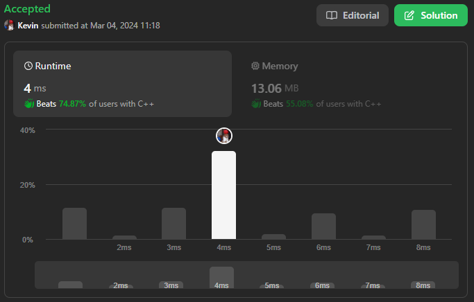
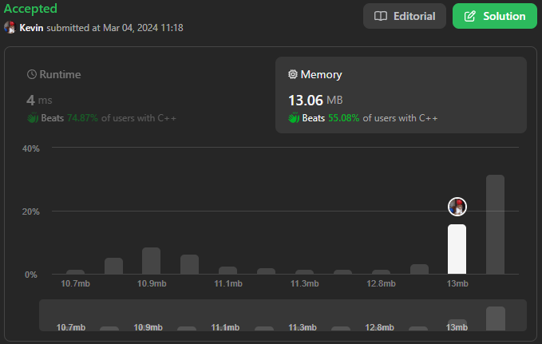

# 948. Bag of Tokens

## Énoncé

Vous commencez avec une **puissance** initiale de `power`, un **score** initial de `0`, et un sac de jetons donné sous forme de tableau d'entiers `tokens`.

Votre objectif est de **maximiser** le **score** total en jouant stratégiquement ces jetons. En un seul coup, vous pouvez jouer un jeton **non joué** de l'une des deux manières (mais pas les deux pour le même jeton):

- **Face visible**: Si votre pouvoir actuel est d'**au moins** `tokens[i]`, vous pouvez le jouer, perdant `tokens[i]` de pouvoir et gagnant `1` de score.
- **Face cachée**: Si votre score actuel est **au moins** de `1`, vous pouvez le jouer, gagnant `tokens[i]` de pouvoir et perdant `1` de score.

Renvoie le score **maximum** possible que vous pouvez atteindre après avoir joué **n'importe quel** nombre de jetons.

## Exemple

**Exemple 1:**  
**Input:** tokens = [100], power = 50  
**Output:** 0  
**Explication:** Puisque votre score est initialement de `0`, vous ne pouvez pas jouer le jeton face cachée. Vous ne pouvez pas non plus le jouer face visible puisque votre puissance (`50`) est inférieure à `tokens[0]` (`100`).

**Exemple 2:**  
**Input:** tokens = [200,100], power = 150  
**Output:** 1  
**Explication:** Jouez `tokens[1]` (`100`) face visible, réduisant votre puissance à `50` et augmentant votre score à `1`.  
Il n'est pas nécessaire de jouer `tokens[0]`, puisque vous ne pouvez pas le jouer face visible pour augmenter votre score. Le score maximum pouvant être obtenu est de `1`.

**Exemple 3:**  
**Input:** tokens = [100,200,300,400], power = 200  
**Output:** 2  
**Explication:** Jouez les jetons dans cet ordre pour obtenir un score de `2`:  
Jouez `tokens[0]` (`100`) face visible, réduisant la puissance à `100` et en augmentant le score à `1`.  
Jouez `tokens[3]` (`400`) face cachée, augmentant la puissance à `500` et réduisant le score à `0`.  
Jouez `tokens[1]` (`200`) face visible, réduisant la puissance à `300` et en augmentant le score à `1`.  
Jouez `tokens[2]` (`300`) face visible, réduisant la puissance à `0` et en augmentant le score à `2`.  
Le score maximum pouvant être obtenu est de `2`.

## Contraintes

`0 <= tokens.length <= 1000`  
`0 <= tokens[i], power < 10^4`

## Note personnelle

Ma méthode implique de parcourir le tableau `tokens` trié à l'aide de deux pointeurs, un au début (représenté par `i`) et l'autre à la fin (représenté par `j`), tant que `i <= j`.

Si la puissance actuelle est supérieure à `tokens[i]`, je réduis ma puissance de `tokens[i]`, j'incrémente mon score de `1` et je mets à jour le score maximum obtenu.

Sinon, je vérifie si mon score est `>= 1`. Dans ce cas, j'ajoute à ma puissance `tokens[j]` et je réduis mon score de `1`.

Si aucune des conditions précédentes n'est satisfaite, je sors de la boucle.

Cette approche est gloutonne car elle choisit la meilleure option locale dans le but d'obtenir un résultat global optimal, ce qui est réussi pour ce problème spécifique.

Complexité temporelle: `O(n log n)`  
Complexité spatiale : `O(1)`

