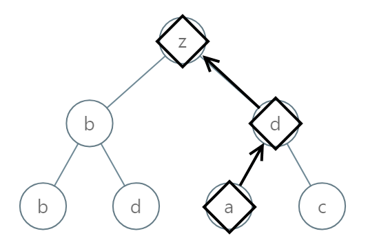

# 988. Smallest String Starting From Leaf

## Énoncé

Vous recevez la `root` d'un arbre binaire où chaque noeud a une valeur comprise dans la plage `[0, 25]` représentant les lettres `'a'` à `'z'`.

Renvoie la chaîne **lexicographiquement la plus petite** qui commence à une feuille de cet arbre et se termine à la racine.

Pour rappel, tout préfixe plus court d'une chaîne est **lexicographiquement plus petit**.

Par exemple, `"ab"` est lexicographiquement plus petit que `"aba"`.

Une feuille est un noeud qui n'a pas d'enfants.

## Exemple

**Exemple 1:**


**Input:** root = [0,1,2,3,4,3,4]  
**Output:** "dba"

**Exemple 2:**



**Input:** root = [25,1,3,1,3,0,2]  
**Output:** "adz"

**Exemple 3:**


**Input:** root = [2,2,1,null,1,0,null,0]  
**Output:** "abc"

## Contraintes

Le nombre de noeuds dans l'arborescence est compris entre `[1, 8500]`.  
`0 <= Node.val <= 25`

## Note personnelle

Pour résoudre ce problème, j'ai débuté en développant un algorithme non optimal qui servirait de base pour les itérations ultérieures.

Cet algorithme repose sur un parcours en profondeur (DFS). À chaque feuille de l'arbre, je collecte la chaîne résultante inversée (pour obtenir une chaîne partant de la feuille vers la racine), que je stocke dans un vecteur. Une fois l'arbre parcouru, je trie ce vecteur et retourne la première chaîne qu'il contient.

```cpp
// Déclaration d'un vecteur pour stocker les mots trouvés lors du parcours de l'arbre
vector<string> words;

// Fonction de parcours en profondeur (DFS) pour explorer tous les chemins de l'arbre.
void dfs(TreeNode* root, string curr){
  // Si le noeud est nul, retourner
  if(!root){
    return;
  }

  // Ajouter la valeur du noeud convertie en caractère à la chaîne courante
  curr += 'a' + root->val;

  // Si le noeud est une feuille
  if(!root->left && !root->right){
    // Inverser la chaîne pour obtenir l'ordre correct
    reverse(curr.begin(), curr.end());
    // Ajouter la chaîne à la liste des mots trouvés
    words.push_back(curr);
    return;
  }

  dfs(root->right, curr); // Parcourir le sous-arbre droit
  dfs(root->left, curr);  // Parcourir le sous-arbre gauche
}
// Fonction principale pour trouver la plus petite chaîne à partir des feuilles de l'arbre.
string smallestFromLeaf(TreeNode* root) {
  // Démarrer le parcours en profondeur (DFS) avec une chaîne vide comme chaîne initiale
  dfs(root, "");
  // Trier les mots trouvés par ordre lexicographique
  sort(words.begin(), words.end());
  // Retourner le plus petit mot trouvé
  return words[0];
}
```

Cette méthode présente une complexité temporelle de `O(n + m log m)` et une complexité spatiale de `O(m + (n * h))`, où `n` représente le nombre de noeuds dans l'arbre, `m` le nombre de mots trouvés dans celui-ci, et `h` sa hauteur.

En poursuivant les améliorations, j'ai constaté qu'une première piste consistait à éliminer le vecteur stockant les mots, ce qui permettait d'éviter le stockage et le tri des mots. Pour cela, j'ai décidé de maintenir une trace du plus petit mot trouvé jusqu'à présent. À chaque découverte d'un nouveau mot dans l'arbre, je le compare à ce dernier et le mets à jour si nécessaire.

```cpp
// Initialisation d'une chaîne avec un caractère arbitrairement grand pour stocker la plus petite chaîne trouvée lexicographiquement
string smallest = "|";

// Fonction pour vérifier si une chaîne est plus petite que la plus petite chaîne actuellement trouvée.
bool isSmaller(string& s) {
  int i = s.size() - 1;         // Indice pour parcourir la chaîne passée en paramètre
  int j = smallest.size() - 1;  // Indice pour parcourir la plus petite chaîne actuellement trouvée

  // Parcours des deux chaînes de droite à gauche
  while (i >= 0 && j >= 0) {
    // Si les caractères sont égaux, continuer la comparaison
    if (s[i] == smallest[j]) {
      i--;
      j--;
      continue;
    }
    // Si les caractères diffèrent, retourner vrai si le caractère de la chaîne actuelle est plus petit
    return s[i] < smallest[j];
  }
  // Si toutes les lettres correspondent mais la chaîne actuelle est plus courte, elle est considérée plus petite
  return s.size() < smallest.size();
}

// Fonction de parcours en profondeur (DFS) pour explorer tous les chemins de l'arbre.
void dfs(TreeNode* root, string curr) {
  // Si le noeud est nul, retourner
  if (!root) {
    return;
  }

  // Ajouter la valeur du noeud convertie en caractère à la chaîne courante
  curr += 'a' + root->val;

  // Si le noeud est une feuille
  if (!root->left && !root->right) {
    // Vérifier si la chaîne courante est plus petite que la plus petite trouvée jusqu'à présent
    if(isSmaller(curr)){
      // Mettre à jour la plus petite chaîne si nécessaire
      smallest = curr;
    }

    return;
  }

  dfs(root->right, curr); // Parcourir le sous-arbre droit
  dfs(root->left, curr);  // Parcourir le sous-arbre gauche
}

// Fonction principale pour trouver la plus petite chaîne à partir des feuilles de l'arbre.
string smallestFromLeaf(TreeNode* root) {
  // Démarrer le parcours en profondeur (DFS) avec une chaîne vide comme préfixe initial
  dfs(root, "");

  // Inverser la chaîne la plus petite pour obtenir l'ordre correct
  reverse(smallest.begin(), smallest.end());

  // Retourner la plus petite chaîne trouvée
  return smallest;
}
```

Cette approche réduit la complexité temporelle à `O(n)` et la complexité spatiale à `O(n * h)`.

Enfin, la dernière piste d'optimisation que j'ai explorée consistait à utiliser un pointeur pour remplacer la variable `curr` de la fonction `dfs`. En effectuant cette modification et en ajustant le code en conséquence, j'ai abouti à une solution qui présente toutes les caractéristiques du backtracking.

Cette version améliorée affiche une complexité temporelle de `O(n)` et une complexité spatiale de `O(h)`.


