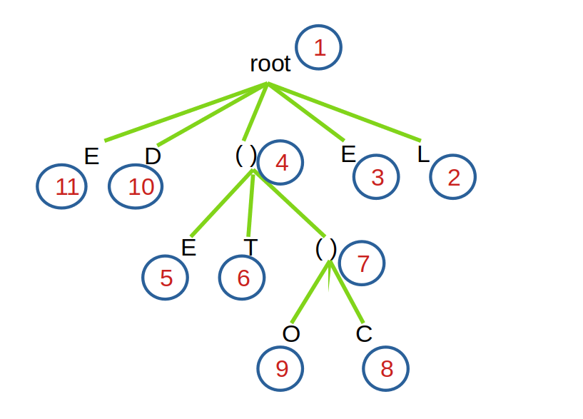
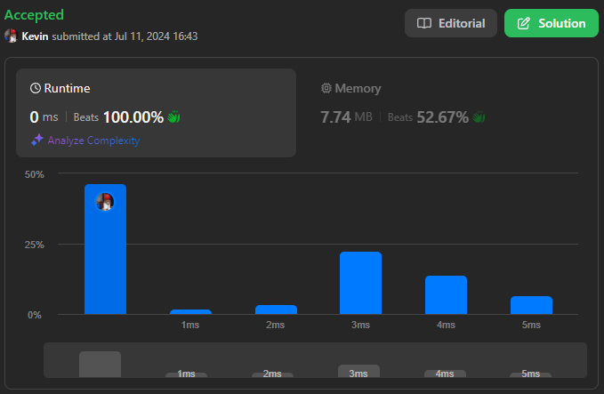
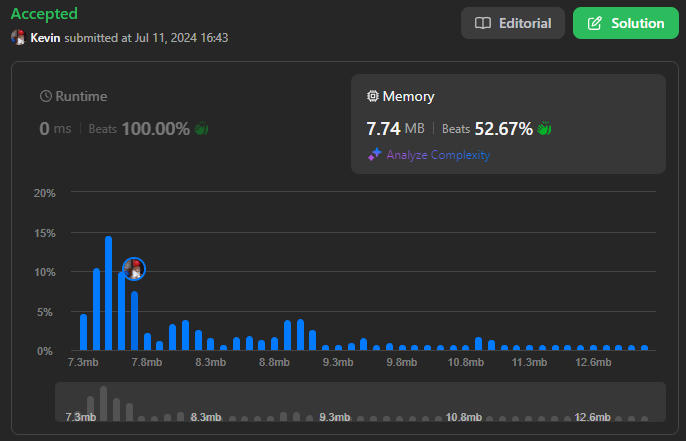

# 1190. Reverse Substrings Between Each Pair of Parentheses

## Énoncé

On vous donne une chaîne de caractères `s` composée de lettres minuscules anglaises et de parenthèses.

Inversez les chaînes de caractères dans chaque paire de parenthèses correspondante, en commençant par la plus imbriquée.

Votre résultat ne doit **pas** contenir de parenthèses.

## Exemple

**Exemple 1:**  
**Input:** s = "(abcd)"  
**Output:** "dcba"

**Exemple 2:**  
**Input:** s = "(u(love)i)"  
**Output:** "iloveu"  
**Explication:** La sous-chaîne "love" est inversée en premier, puis la chaîne entière est inversée.

**Exemple 3:**  
**Input:** s = "(ed(et(oc))el)"  
**Output:** "leetcode"  
**Explication:** Tout d’abord, nous inversons la sous-chaîne "oc", puis "etco", et enfin la chaîne entière.

## Contraintes

`1 <= s.length <= 2000`  
`s` ne contient que des caractères anglais minuscules et des parenthèses.  
Il est garanti que toutes les parenthèses sont équilibrées.

## Note personnelle

### Approche 1: Utilisation d'une Pile

L'idée de cette approche est d'utiliser une pile pour suivre les sous-chaînes courantes. Une nouvelle sous-chaîne est créée à chaque rencontre avec une parenthèse ouvrante, et celle-ci est inversée et concaténée avec la sous-chaîne précédente lorsqu'une parenthèse fermante est rencontrée.

```cpp
string reverseParentheses(string s) {
  // Déclaration d'une pile pour gérer les sous-chaînes
  stack<string> sta;
  // Initialiser la pile avec une chaîne vide
  sta.push("");

  // Parcours de chaque caractère de la chaîne d'entrée
  for(char c : s){
    if(c == '('){
      // Si on rencontre une parenthèse ouvrante, on empile une nouvelle chaîne vide
      sta.push("");
    }
    else if(c == ')'){
      // Si on rencontre une parenthèse fermante, on dépile et inverse la chaîne du sommet
      string _s = sta.top();
      sta.pop();
      reverse(_s.begin(), _s.end());

      // Ajouter la chaîne inversée à la nouvelle chaîne du sommet
      sta.top() += _s;
    }
    else{
      // Pour les autres caractères, on les ajoute à la chaîne du sommet
      sta.top() += c;
    }
  }

  // Le résultat final est la chaîne au sommet de la pile
  return sta.top();
}
```

Une optimisation consiste à gérer la chaîne en dehors de la pile. À chaque rencontre avec une parenthèse ouvrante, on ajoute l'index de début de la sous-chaîne dans la pile. Cette sous-chaîne est inversée à chaque rencontre avec une parenthèse fermante.

```cpp
string reverseParentheses(string s) {
  // Déclaration d'une pile pour stocker les indices
  stack<int> sta;
  // Chaîne pour accumuler le résultat final
  string ans = "";

  // Parcours de chaque caractère de la chaîne d'entrée
  for(int i = 0; i < s.size(); i++){
    if(s[i] == '('){
      // Si on rencontre une parenthèse ouvrante, on pousse la position actuelle de `ans` dans la pile
      sta.push(ans.size());
    }
    else if(s[i] == ')'){
      // Si on rencontre une parenthèse fermante, on inverse la sous-chaîne depuis la dernière parenthèse ouvrante
      reverse(ans.begin() + sta.top(), ans.end());
      sta.pop();
    }
    else{
      // Pour les autres caractères, on les ajoute à la chaîne `ans`
      ans += s[i];
    }
  }

  return ans;
}
```

- Complexité Temporelle: `O(n * d)` où `n` est la taille de `s` et `d` est la profondeur d'imbrication des parenthèses, simplifiable en `O(n^2)`.
- Complexité Spatiale: `O(n)`.

### Approche 2: Utilisation de la Récursion

L'idée de cette approche est de diviser la chaîne en trois parties : avant les parenthèses, entre les parenthèses et après les parenthèses. Les appels récursifs sont effectués sur les deuxième et troisième sous-chaînes. La deuxième sous-chaîne est ensuite inversée et les trois sous-chaînes sont concaténées.

```cpp
// Fonction récursive pour traiter les parenthèses et inverser les sous-chaînes
string process(string& s, int start, int end) {
  int left = start;

  // Avancer jusqu'à trouver la première parenthèse ouvrante
  while (left <= end && s[left] != '(') {
    left++;
  }

  // Si aucune parenthèse ouvrante n'est trouvée, retourner la sous-chaîne actuelle
  if (left == end + 1) {
    return s.substr(start, end - start + 1);
  }

  // Trouver la parenthèse fermante correspondante
  int count = 1;
  int right = left + 1;
  while (count != 0) {
    if (s[right] == '(') {
      count++;
    }
    else if (s[right] == ')') {
      count--;
    }
    right++;
  }
  right--; // Ajuster pour obtenir la position exacte de la parenthèse fermante

  // Extraire les différentes parties de la chaîne
  string a = s.substr(start, left - start);   // Partie avant la parenthèse ouvrante
  string b = process(s, left + 1, right - 1); // Partie entre les parenthèses
  string c = process(s, right + 1, end);      // Partie après la parenthèse fermante

  // Inverser la partie entre les parenthèses
  reverse(b.begin(), b.end());

  // Combiner les parties pour former le résultat
  string ans = a + b + c;

  return ans;
}

string reverseParentheses(string s) {
  return process(s, 0, s.size() - 1);
}
```

- Complexité Temporelle: `O(n^2)`
- Complexité Spatiale: `O(n)`

### Approche 3 Portal

Cette approche, inspirée par [lee215](https://leetcode.com/u/lee215) sur LeetCode, repose sur l'idée que chaque parenthèse (ouverte ou fermée) agit comme un "portail", permettant d'accéder à son extrémité correspondante. À chaque passage par un portail, on inverse la direction du parcours. Une cartographie des portails est créée pour faciliter les changements d'indices pendant le parcours.

**Illustration du Principe de Fonctionnement**

Pour `s` = `"(ed(et(oc))el)"`.

#### Identification des Portails:

- `portal[0] = 13` et `portal[13] = 0` (parenthèse ouvrante à l'indice 0 et parenthèse fermante à l'indice 13).
- `portal[3] = 10` et `portal[10] = 3` (parenthèse ouvrante à l'indice 3 et parenthèse fermante à l'indice 10).
- `portal[6] = 9` et `portal[9] = 6` (parenthèse ouvrante à l'indice 6 et parenthèse fermante à l'indice 9).

La cartographie des portails est la suivante:

`[13, -1, -1, 10, -1, -1, 9, -1, -1, 6, 3, -1, -1, 0]`

#### Parcours de la Chaîne et Construction du Résultat

- Étape 1: `i = 0`, `s[i] = '('` => Sauter à `i = 13`, inverser la direction (`dir = -1`).
- Étape 2: `i = 12`, `s[i] = 'l'` => Ajouter 'l' à `ans`.
- Étape 3: `i = 11`, `s[i] = 'e'` => Ajouter 'e' à `ans`.
- Étape 4: `i = 10`, `s[i] = ')'` => Sauter à `i = 3`, inverser la direction (`dir = 1`).
- Étape 5: `i = 4`, `s[i] = 'e'` => Ajouter 'e' à `ans`.
- Étape 6: `i = 5`, `s[i] = 't'` => Ajouter 't' à `ans`.
- Étape 7: `i = 6`, `s[i] = '('` => Sauter à `i = 9`, inverser la direction (`dir = -1`).
- Étape 8: `i = 8`, `s[i] = 'c'` => Ajouter 'c' à `ans`.
- Étape 9: `i = 7`, `s[i] = 'o'` => Ajouter 'o' à `ans`.
- Étape 10: `i = 6`, `s[i] = '('` => Sauter à `i = 9`, inverser la direction (`dir = 1`).
- Étape 11: `i = 10`, `s[i] = ')'` => Sauter à `i = 3`, inverser la direction (`dir = -1`).
- Étape 12: `i = 2`, `s[i] = 'd'` => Ajouter 'd' à `ans`.
- Étape 13: `i = 1`, `s[i] = 'e'` => Ajouter 'e' à `ans`.
- Étape 14: `i = 0`, `s[i] = '('` => Sauter à `i = 13`, inverser la direction (`dir = 1`).

Résultat final: `ans = "leetcode"`.

```cpp
string reverseParentheses(string s) {
  // Pile pour stocker les indices des parenthèses ouvrantes
  stack<int> sta;
  // Vector pour stocker les indices correspondants des parenthèses
  vector<int> portal(s.size(), -1);

  // Parcours de la chaîne pour trouver les paires de parenthèses
  for (int i = 0; i < s.size(); i++) {
    if (s[i] == '(') {
      sta.push(i);
    }
    else if (s[i] == ')') {
      portal[sta.top()] = i;
      portal[i] = sta.top();
      sta.pop();
    }
  }

  // Initialisation de la chaîne de résultat et de la direction
  string ans = "";
  int dir = 1;

  // Parcours de la chaîne pour construire le résultat final
  for (int i = 0; i < s.size(); i += dir) {
    if (s[i] == '(' || s[i] == ')') {
      // Inverser la direction et sauter à l'indice correspondant
      dir = -dir;
      i = portal[i];
    }
    else {
      // Ajouter le caractère à la chaîne de résultat
      ans += s[i];
    }
  }

  return ans;
}
```

- Complexité Temporelle: `O(n)`
- Complexité Spatiale: `O(n)`

### Approche 4: Utilisation d'un Arbre

Cette approche, inspirée par [kcsquared](https://leetcode.com/u/kcsquared/) sur LeetCode, consiste à construire un arbre avec la chaîne d'origine, où chaque nœud est un caractère. Lors de la construction de l'arbre, une parenthèse ouvrante implique de descendre d'un niveau, et une parenthèse fermante de remonter. Ensuite, un parcours en profondeur (DFS) est utilisé pour reconstruire la chaîne de réponse, avec un ordre défini par la profondeur actuelle de l'arbre.

Image illustrant l'arbre crée à partir de la chaine `(ED(ET(OC))EL)` et l'ordre de son parcours.  


```cpp
// Définition de la structure de nœud
struct Node{
  char c;
  vector<Node*> childs;
  Node* parent;

  // Constructeur pour initialiser un nœud avec un caractère et un parent
  Node(char c, Node* parent){
    this->c = c;
    this->parent = parent;
  }
};

// Fonction de parcours en profondeur (DFS)
void dfs(Node* root, string &ans, int depth){
  bool depthOdd = depth % 2 == 1;

  // Déterminer les indices de début, fin et incrément en fonction de la profondeur
  int start = depthOdd ? root->childs.size() - 1 : 0;
  int end = depthOdd ? -1 : root->childs.size();
  int inc = depthOdd ? -1 : 1;

  // Parcourir les enfants dans l'ordre approprié en fonction de la profondeur
  for(int i = start; i != end; i += inc){
    // Si le caractère est '(', descendre récursivement dans cet enfant
    if(root->childs[i]->c == '('){
      dfs(root->childs[i], ans, depth + 1);
    }
    // Sinon, ajouter le caractère à la réponse
    else{
      ans += root->childs[i]->c;
    }
  }
}
string reverseParentheses(string s) {
  // Créer un nœud racine pour l'arbre
  Node* root = new Node('\n', nullptr);
  // Nœud courant pour suivre l'emplacement actuel dans l'arborescence
  Node* curr = root;

  // Parcourir la chaîne d'entrée
  for(char c : s){
    // Si le caractère est ')', remonter vers le parent du nœud courant
    if(c == ')'){
      curr = curr->parent;
    }
    // Créer un nouveau nœud avec le caractère et l'ajouter comme enfant du nœud courant
    else{
      curr->childs.push_back(new Node(c, curr));
      // Si le caractère est '(', mettre à jour le nœud courant pour descendre dans cet enfant
      if(c == '('){
        curr = curr->childs.back();
      }
    }
  }

  // Chaîne pour stocker le résultat final après inversion
  string ans = "";
  // Appel à la fonction DFS pour parcourir l'arbre et construire la réponse
  dfs(root, ans, 0);

  return ans;
}
```

- Complexité Temporelle: `O(n)`
- Complexité Spatiale: `O(n)`

### Comparaison des différentes méthode

- **Approche 2: Récursion**: La moins performante en raison des concaténations de chaînes répétées et de la nature récursive. Complexité temporelle quadratique, suffisante pour des chaînes d'entrée relativement petites et pour ceux à l'aise avec la récursivité.
- **Approche 1: Pile**: Plus performante que la précédente grâce à des concaténations de caractères à la fin d'une chaîne, mais toujours quadratique en raison des multiples inversions. Suffisante pour des chaînes d'entrée relativement petites et pour ceux à l'aise avec les piles.
- **Approche 4: Arbre**: Amélioration significative avec une complexité temporelle linéaire. Peut engendrer un coût en mémoire plus élevé à cause des nœuds et de la gestion de la pile récursive. Efficace pour des grandes chaînes d'entrée, mais nécessite une compréhension des arbres.
- **Approche 3: Portal**: La plus efficace avec une complexité temporelle linéaire et un coût en mémoire réduit. Cependant, utilise une méthode peu commune en algorithmie, rendant son approche moins intuitive.



