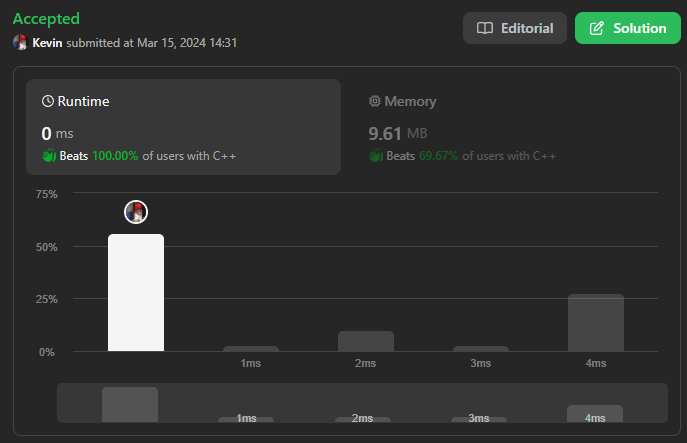
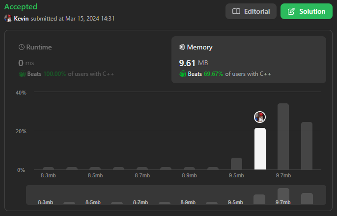

# 1290. Convert Binary Number in a Linked List to Integer

## Énoncé

Étant donné `head` qui est un noeud de référence vers une liste à lien unique. La valeur de chaque noeud de la liste chaînée est `0` ou `1`. La liste chaînée contient la représentation binaire d'un nombre.

Renvoie la valeur décimale du nombre dans la liste chaînée.

Le **bit le plus significatif** se trouve en tête de la liste chaînée.

## Exemple

**Exemple 1:**  


**Input:** head = [1,0,1]  
**Output:** 5

**Exemple 2:**  
**Input:** head = [0]  
**Output:** 0

## Contraintes

La liste chaînée n’est pas vide.  
Le nombre de noeuds ne dépassera pas `30`.  
La valeur de chaque noeud est `0` ou `1`.

## Note personnelle

Pour ma première approche, j'ai utilisé la manipulation de bits pour parvenir au résultat requis.

J'ai initié une variable `n` à 0 pour stocker le nombre à retourner. À chaque itération sur la liste, j'ai effectué un décalage de 1 bit vers la gauche et ajouté la valeur actuelle de la liste à `n`.

La complexité temporelle est de `O(n)` et la complexité spatiale de `O(1)`.

J'ai également développé une version récursive, caractérisée par une approche plus mathématique.

```cpp
int getDecimalValue(ListNode* head, int* power = new int(-1)) {
  // Si le pointeur head est nul, cela signifie que nous avons atteint la fin de la liste, donc la valeur est 0
  if(!head){
    return 0;
  }

  // Valeur du noeud actuel
  int value = head->val;
  // Récursivement calculer la valeur décimale pour les noeuds suivants
  int n = getDecimalValue(head->next, power);
  // Incrémenter la puissance de 2
  (*power)++;

  // Calculer et retourner la valeur décimale du nombre binaire en cours
  return n + (value * pow(2, *power));
}
```

Cette approche présente une complexité temporelle et spatiale de `O(n)` en raison de sa nature récursive.



