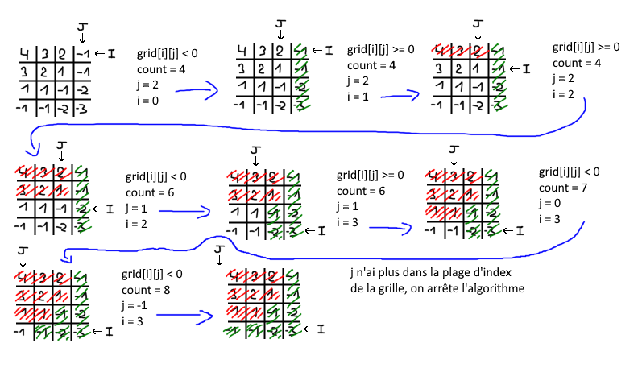

# 1351. Count Negative Numbers in a Sorted Matrix

## Énoncé

Étant donné une `grid` matricielle `m x n` qui est triée dans un ordre décroissant par ligne et par colonne, renvoie le nombre de nombres **négatifs** dans la `grid`.

Pourriez-vous trouver une solution en `O(n + m)` ?

## Exemple

**Exemple 1:**  
**Input:** grid = [[4,3,2,-1],[3,2,1,-1],[1,1,-1,-2],[-1,-1,-2,-3]]  
**Output:** 8  
**Explication:** Il y a 8 nombres négatifs dans la matrice.

**Exemple 2:**  
**Input:** grid = [[3,2],[1,0]]  
**Output:** 0

## Contraintes

`m == grid.length`  
`n == grid[i].length`  
`1 <= m, n <= 100`  
`-100 <= grid[i][j] <= 100`

## Note personnelle

Pour aborder ce problème, j'ai initialement opté pour une méthode itérative qui parcourt chaque ligne de la matrice. Pour chaque ligne, j'effectue une recherche binaire, avec la particularité de rechercher des nombres `< 0`, au lieu d'une cible spécifique. Une fois que j'ai trouvé l'index du plus petit nombre `< 0`, je renvoie `row.size() - index`, qui représente le nombre d'éléments négatifs dans cette ligne.

Cette approche présente une complexité temporelle de `O(m log n)` et une complexité spatiale de `O(1)`.

Cependant, l'énoncé exige une solution avec une complexité temporelle de `O(n + m)`.

Pour répondre à cette exigence, j'ai envisagé d'exploiter le fait que les lignes **et** les colonnes sont triées par ordre décroissant. J'ai donc initié deux indices en haut à droite de ma grille: `i` , représentant l'indice de la ligne initialisé à `0` et `j`, représentant l'indice de la colonne initialisé à `grid[0].size() - 1`.
J'utilise une variable `count` pour suivre le nombre de nombres négatifs.

Le processus de parcours se déroule comme suit:

- Si le nombre est négatif, je décrémente `j` de `1` et j'incrémente `count` de `grid.size() - i`.
- Si le nombre est positif ou nul, j'incrémente `i` de `1`.

Voici une explication visuelle de ce processus:



```cpp
int countNegatives(vector<vector<int>>& grid) {
  int i = 0; // Initialiser un indice de ligne à zéro
  int j = grid[0].size() - 1; // Initialiser un indice de colonne à la dernière colonne de la première ligne

  int count = 0; // Initialiser un compteur de nombres négatifs

  // Tant que les indices sont dans une plage valide.
  while(i < grid.size() && j >= 0){
    if(grid[i][j] < 0){ // Si l'élément actuel est négatif
      count += grid.size() - i; // Ajouter le nombre d'éléments restants dans la colonne actuelle au compteur
      j--; // Passer à la colonne précédente
    }
    else{
      i++; // Passer à la ligne suivante
    }
  }

return count; // Retourner le nombre total de nombres négatifs
}
```

Cette approche présente une complexité temporelle de `O(m + n)` et une complexité spatiale de `O(1)`.


