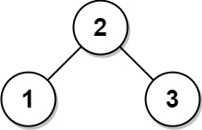
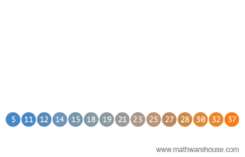

# 1382. Balance a Binary Search Tree

## Énoncé

Étant donné la racine `root` d'un arbre binaire de recherche, renvoyez un arbre binaire de recherche **équilibré** S'il y a plus d'une réponse, renvoyez **n'importe laquelle** d'entre elles.

Un arbre binaire de recherche est **équilibré** si la profondeur des deux sous-arbres de chaque nœud ne diffère jamais de plus de `1`.

## Exemple

**Exemple 1:**


**Input:** root = [1,null,2,null,3,null,4,null,null]  
**Output:** [2,1,3,null,null,null,4]  
**Explication:** Ce n'est pas la seule réponse correcte, [3,1,4,null,2] est également correcte.

**Exemple 2:**



**Input:** root = [2,1,3]  
**Output:** [2,1,3]

## Contraintes

Le nombre de nœuds dans l'arborescence est compris entre `[1, 10^4]`  
`1 <= Node.val <= 10^5`

## Note personnelle

Pour résoudre ce problème, je commence par créer un tableau des valeurs triées par ordre croissant. La méthode naïve pour y parvenir serait d'utiliser un parcours en profondeur (DFS) en pre-order puis de trier le tableau. Cependant, nous pouvons directement tirer parti de la propriété principale d'un arbre binaire de recherche (BST) et obtenir notre tableau trié en utilisant un DFS in-order.

À partir de notre liste triée, nous pouvons facilement construire un BST équilibré. L'idée est que la valeur racine de notre arbre est l'élément se trouvant au centre du tableau. Ensuite, nous divisons notre tableau en deux parties, l'élément de gauche de la racine est le milieu de la première partie du tableau et l'élément de droite est le milieu de la seconde partie, et ainsi de suite.

<br>

```cpp
// Fonction pour remplir un vecteur avec les valeurs de l'arbre en ordre croissant
void fillVector(TreeNode* root, vector<int> &arr) {
  if (!root) {
    return; // Si le nœud est nul, retour
  }

  fillVector(root->left, arr); // Parcourir le sous-arbre gauche
  arr.push_back(root->val);    // Ajouter la valeur du nœud courant au vecteur
  fillVector(root->right, arr); // Parcourir le sous-arbre droit
}

// Fonction pour construire un arbre binaire de recherche équilibré à partir d'un vecteur trié
TreeNode* buildBalancedBST(int start, int end, vector<int> &arr) {
  if (start <= end) {
    int mid = start + (end - start) / 2; // Calculer l'index du milieu

    TreeNode* newNode = new TreeNode(arr[mid]); // Créer un nouveau nœud avec la valeur du milieu

    newNode->left = buildBalancedBST(start, mid - 1, arr); // Construire le sous-arbre gauche
    newNode->right = buildBalancedBST(mid + 1, end, arr);  // Construire le sous-arbre droit

    return newNode; // Retourner le nœud créé
  }
  return nullptr; // Si la sous-partie est invalide, retourner nul
}

// Fonction pour équilibrer un arbre binaire de recherche
TreeNode* balanceBST(TreeNode* root) {
  vector<int> arr;
  fillVector(root, arr); // Remplir le vecteur avec les valeurs de l'arbre

  return buildBalancedBST(0, arr.size() - 1, arr); // Construire et retourner un arbre équilibré
}
```

Cette approche présente une complexité temporelle et spatiale de `O(n)`.

Une optimisation consiste à directement stocker les nœuds dans le vecteur au lieu des valeurs. De cette façon, nous pouvons simplement réattribuer les pointeurs et n'avoir qu'un seul arbre en mémoire.

```cpp
// Fonction pour remplir un vecteur avec les nœuds de l'arbre en ordre croissant
void fillVector(TreeNode* root, vector<TreeNode*> &arr){
  if(!root){
    return; // Si le nœud est nul, retour
  }

  fillVector(root->left, arr);  // Parcourir le sous-arbre gauche
  arr.push_back(root);          // Ajouter le nœud courant au vecteur
  fillVector(root->right, arr); // Parcourir le sous-arbre droit
}

// Fonction pour construire un arbre binaire de recherche équilibré à partir d'un vecteur de nœuds
TreeNode* buildBalancedBST(int start, int end, vector<TreeNode*> &arr){
  if(start <= end){
    int mid = start + (end - start) / 2; // Calculer l'index du milieu

    TreeNode* root = arr[mid]; // Récupérer le nœud du milieu

    root->left = buildBalancedBST(start, mid - 1, arr); // Construire le sous-arbre gauche
    root->right = buildBalancedBST(mid + 1, end, arr);  // Construire le sous-arbre droit

    return root; // Retourner le nœud racine
  }
  return nullptr; // Si la sous-partie est invalide, retourner nul
}

// Fonction pour équilibrer un arbre binaire de recherche
TreeNode* balanceBST(TreeNode* root) {
  vector<TreeNode*> arr;
  fillVector(root, arr); // Remplir le vecteur avec les nœuds de l'arbre

  return buildBalancedBST(0, arr.size() - 1, arr); // Construire et retourner un arbre équilibré
}
```

Cette optimisation présente la même complexité temporelle et spatiale.


