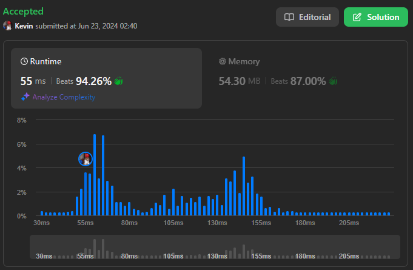
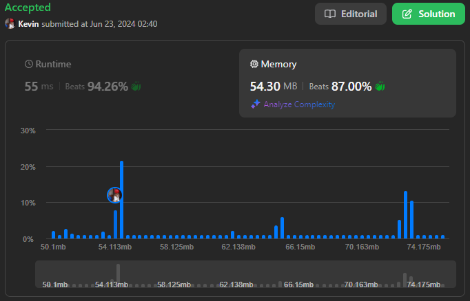

# 1438. Longest Continuous Subarray With Absolute Diff Less Than or Equal to Limit

## Énoncé

Étant donné un tableau d'entiers `nums` et un entier `limit`, retournez la taille de la plus longue sous-séquence **non vide** telle que la différence absolue entre deux éléments quelconques de cette sous-séquence soit inférieure ou égale à `limit`.

## Exemple

**Exemple 1:**  
**Input:** nums = [8,2,4,7], limit = 4  
**Output:** 2  
**Explication:**

```
Toutes les sous-séquences sont:
[8] avec une différence absolue maximale |8-8| = 0 <= 4.
[8,2] avec une différence absolue maximale |8-2| = 6 > 4.
[8,2,4] avec une différence absolue maximale |8-2| = 6 > 4.
[8,2,4,7] avec une différence absolue maximale |8-2| = 6 > 4.
[2] avec une différence absolue maximale |2-2| = 0 <= 4.
[2,4] avec une différence absolue maximale |2-4| = 2 <= 4.
[2,4,7] avec une différence absolue maximale |2-7| = 5 > 4.
[4] avec une différence absolue maximale |4-4| = 0 <= 4.
[4,7] avec une différence absolue maximale |4-7| = 3 <= 4.
[7] avec une différence absolue maximale |7-7| = 0 <= 4.
Par conséquent, la taille de la plus longue sous-séquence est 2.
```

**Exemple 2:**  
**Input:** nums = [10,1,2,4,7,2], limit = 5  
**Output:** 4
**Explication:** La sous-séquence [2,4,7,2] est la plus longue puisque la différence absolue maximale est |2-7| = 5 <= 5.

**Exemple 3:**  
**Input:** nums = [4,2,2,2,4,4,2,2], limit = 0  
**Output:** 3

## Contraintes

`1 <= nums.length <= 10^5`  
`1 <= nums[i] <= 10^9`  
`0 <= limit <= 10^9`

## Note personnelle

Pour aborder ce problème de manière simplifiée, nous cherchons un sous-tableau où la différence absolue entre deux éléments quelconques ne dépasse pas une limite donnée, appelée `limit`. L'approche initiale consiste à identifier la différence maximale dans ce sous-tableau, qui correspond à la différence entre sa plus grande et sa plus petite valeur.

La difficulté principale réside dans le choix d'une structure de données efficace pour accéder rapidement aux valeurs maximales et minimales du sous-tableau, tout en permettant des insertions et suppressions efficaces.

Pour parcourir les sous-tableaux, nous utilisons une méthode de fenêtre glissante, indépendamment de la structure spécifique choisie pour maintenir les valeurs.

Ma première approche utilise un ensemble ordonné, tel qu'un `multiset`, qui répond aux critères avec une complexité de `O(log n)` pour les opérations d'insertion, suppression et accès aux extrémités

```cpp
int longestSubarray(vector<int>& nums, int limit) {
  multiset<int> ms; // Multiset pour maintenir les valeurs du sous-tableau actuel

  int ans = 0;  // Variable pour stocker la longueur maximale
  int left = 0; // Indice de début du sous-tableau

  // Parcourir chaque élément du tableau
  for(int right = 0; right < nums.size(); right++){
    ms.insert(nums[right]); // Insérer l'élément actuel dans le multiset

    // Vérifier si la différence entre l'élément max et l'élément min dans le multiset dépasse la limite
    while((*ms.rbegin()) - (*ms.begin()) > limit){
      ms.erase(ms.find(nums[left++])); // Supprimer l'élément de gauche et incrémenter l'indice de début
    }

    // Mettre à jour la longueur maximale du sous-tableau
    ans = max(ans, right - left);
  }

  return ans + 1; // Retourner la longueur maximale trouvée
}
```

Cette approche présente une complexité temporelle de `O(n log n)` et une complexité spatiale de `O(n)`.

Une variante utilise une `map` ordonnée pour compter les occurrences de chaque élément du sous-tableau, ce qui peut économiser de la mémoire lorsque les éléments sont multiples. Elle offre des performances similaires à la première approche:

```cpp
int longestSubarray(vector<int>& nums, int limit) {
  map<int, int> mp; // Map pour maintenir les fréquences des éléments dans le sous-tableau actuel

  int ans = 0;  // Variable pour stocker la longueur maximale
  int left = 0; // Indice de début du sous-tableau

  // Parcourir chaque élément du tableau
  for(int right = 0; right < nums.size(); right++){
    mp[nums[right]]++; // Incrémenter la fréquence de l'élément actuel dans la map

    // Vérifier si la différence entre l'élément max et l'élément min dans la map dépasse la limite
    while(mp.rbegin()->first - mp.begin()->first > limit){
      auto it = mp.find(nums[left++]); // Trouver l'élément à l'indice 'left' dans la map

      // Supprimer l'élément de la map s'il n'en reste qu'un
      if(it->second == 1){
        mp.erase(it);
      }
      // Sinon, décrémenter la fréquence de l'élément
      else{
        it->second--;
      }
    }

    // Mettre à jour la longueur maximale du sous-tableau
    ans = max(ans, right - left);
  }

  return ans + 1; // Retourner la longueur maximale trouvée
}
```

Cependant, la solution optimale repose sur l'utilisation d'une file monotone, ou Monotonic Queue, qui garantit des performances constantes amorties pour toutes les opérations clés : insertion, suppression et accès aux extrémités.

J'ai donc fait ma propre implémentation de cette structure:

```cpp
class MonotonicQueue {
  public:
    deque<int> dqMin; // deque pour maintenir les valeurs minimales
    deque<int> dqMax; // deque pour maintenir les valeurs maximales

    // Constructeur par défaut
    MonotonicQueue() { }

    // Méthode pour ajouter un élément à la MonotonicQueue
    void push(int n) {
      // Nettoyer dqMin de tous les éléments plus grands que n
      while (!dqMin.empty() && dqMin.back() > n) {
        dqMin.pop_back();
      }
      // Nettoyer dqMax de tous les éléments plus petits que n
      while (!dqMax.empty() && dqMax.back() < n) {
        dqMax.pop_back();
      }
      // Ajouter n à la fin de dqMin et dqMax
      dqMin.push_back(n);
      dqMax.push_back(n);
    }

    // Méthode pour supprimer un élément de la MonotonicQueue
    void pop(int n) {
      // Si l'élément à supprimer est le premier de dqMin, le supprimer
      if (!dqMin.empty() && n == dqMin.front()) {
        dqMin.pop_front();
      }
      // Si l'élément à supprimer est le premier de dqMax, le supprimer
      if (!dqMax.empty() && n == dqMax.front()) {
        dqMax.pop_front();
      }
    }

    // Méthode pour obtenir la valeur minimale de la MonotonicQueue
    int getMin() {
      if (dqMin.empty()) {
        return -1; // Retourner -1 si dqMin est vide
      }
      return dqMin.front(); // Retourner le premier élément de dqMin
    }

    // Méthode pour obtenir la valeur maximale de la MonotonicQueue
    int getMax() {
      if (dqMax.empty()) {
        return -1; // Retourner -1 si dqMax est vide
      }
      return dqMax.front(); // Retourner le premier élément de dqMax
    }
};
```

Cela me permet de garder la même structure de code que les approches précédentes.

```cpp
int longestSubarray(vector<int> &nums, int limit) {
  MonotonicQueue mq = MonotonicQueue(); // Instance de la classe MonotonicQueue

  int ans = 0;  // Variable pour stocker la longueur maximale
  int left = 0; // Indice de début du sous-tableau

  // Parcourir chaque élément du tableau
  for (int right = 0; right < nums.size(); right++) {
    mq.push(nums[right]); // Ajouter l'élément actuel à la MonotonicQueue

    // Tant que la différence entre la valeur maximale et la valeur minimale de la MonotonicQueue dépasse la limite
    while (mq.getMax() - mq.getMin() > limit) {
      mq.pop(nums[left++]); // Supprimer l'élément à l'indice 'left' de la MonotonicQueue
    }

    // Mettre à jour la longueur maximale du sous-tableau
    ans = max(ans, right - left);
  }

  // Retourner la longueur maximale trouvée
  return ans + 1;
}
```

Cette approche offre une complexité temporelle et spatiale optimale de `O(n)` pour ce type de problème, en utilisant une approche de fenêtre glissante pour déterminer la longueur maximale du sous-tableau respectant les contraintes données.



