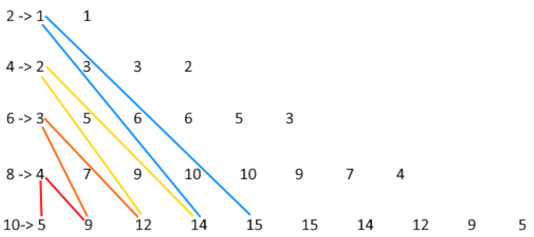
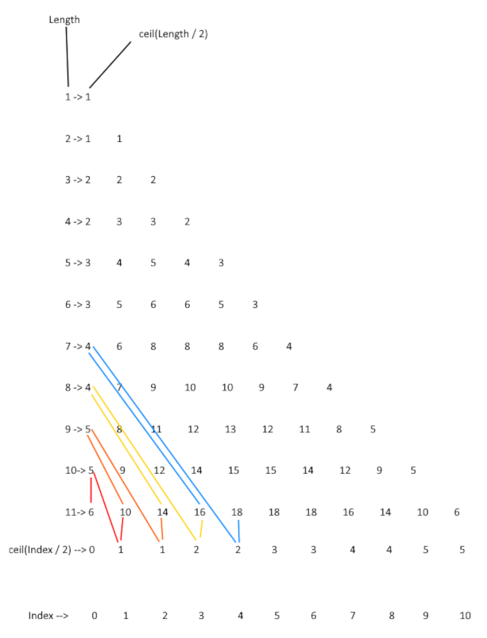
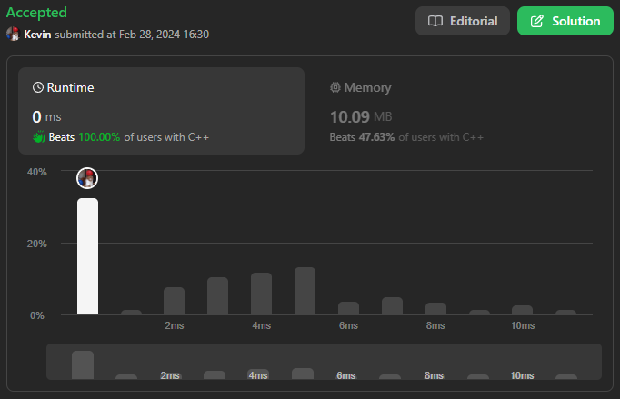
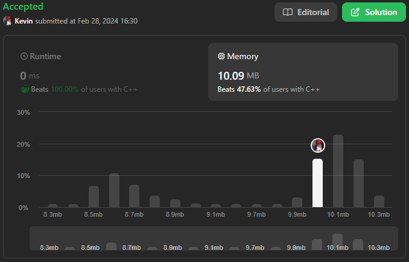

# 1588. Sum of All Odd Length Subarrays

## Énoncé

Étant donné un tableau d'entiers positifs `arr`, renvoie la somme de tous les **sous-tableaux de longueur impaire** possibles de `arr`.

Un **sous-tableau** est une sous-séquence consécutive du tableau.

Pourriez-vous résoudre ce problème en complexité temporelle `O(n)` ?

## Exemple

**Exemple 1:**  
**Input:** arr = [1,4,2,5,3]  
**Output:** 58  
**Explication:**  
Les sous-tableaux de longueur impaire de arr et leurs sommes sont :  
[1] = 1  
[4] = 4  
[2] = 2  
[5] = 5  
[3] = 3  
[1,4,2] = 7  
[4,2,5] = 11  
[2,5,3] = 10  
[1,4,2,5,3] = 15  
Si nous additionnons tout cela, nous obtenons 1 + 4 + 2 + 5 + 3 + 7 + 11 + 10 + 15 = 58

**Exemple 2:**  
**Input:** arr = [1,2]  
**Output:** 3  
**Explication:** Il n'y a que 2 sous-tableaux de longueur impaire, [1] et [2]. Leur somme est 3.

**Exemple 3:**  
**Input:** arr = [10,11,12]  
**Output:** 66

## Contraintes

`1 <= arr.length <= 100`  
`1 <= arr[i] <= 1000`

## Note personnelle

Exercice intéressant, en particulier en raison de la contrainte visant à trouver une solution avec une complexité de `O(n)`.

La première approche envisagée pour résoudre cet exercice implique une itération à travers la longueur du tableau, puis à travers chaque sous-tableau, et enfin à travers chaque élément du tableau.

```cpp
int sumOddLengthSubarrays(vector<int>& arr) {
  int sum = 0;

  // Parcourir sur la taille du vecteur
  for (int i = 0; i < arr.size(); i++) {
    // Parcourir les sous tableaux
    for (int j = i; j < arr.size(); j += 2) {
      // Parcourir les elements du sous tableaux pour calculer la somme
      for (int k = i; k <= j; k++) {
        sum += arr[k];
      }
    }
  }

  return sum;
}
```

Cependant, cette approche s'avérer inefficace, avec une complexité temporelle de `O(n^3)`

La seconde approche adoptée consisté à parcourir le tableau et à calculer les sommes cumulées.
À chaque itération sur les sous-tableaux, il est possible de récupérer leurs sommes de manière constante grâce aux calculs précédents.

```cpp
int sumOddLengthSubarrays(vector<int>& arr) {
    // Calcul des sommes cumulatives pour chaque élément
    for(int i = 1; i < arr.size(); i++){
        arr[i] += arr[i - 1]; // La somme cumulée à l'indice i est la somme cumulée à l'indice précédent + la valeur actuelle
    }

    int sum = arr[arr.size() - 1]; // Initialisation de la somme totale avec la somme cumulée jusqu'au dernier élément

    // Parcours des sous-tableaux de longueur impaire
    for(int n = 3; n <= arr.size(); n+=2){
        sum += arr[n - 1]; // Ajout de la somme cumulée du dernier élément du sous-tableau au total

        // Parcours des éléments du vecteur à partir de n (la longueur du sous-tableau)
        for(int i = n; i < arr.size(); i++){
            sum += arr[i] - arr[i - n]; // Ajout de la somme du sous-tableau actuel au total
        }
    }

    return sum;
}
```

Cette méthode est plus efficace que la précédente, avec une complexité temporelle de `O(n^2)`. Néanmoins, sachant que le problème peut être résolu en `O(n)`, il était nécessaire de poursuivre les recherches.

La troisième et dernière approche adoptée a demandé plus de temps à élaborer. En examinant les calculs effectués dans la version bruteforce, chaque indice a été analysé pour déterminer les fréquences d'apparition des nombres, révélant l'existence d'un motif distinct.

Voici la liste d'apparitions de chaque index en fonction de la longueur du tableau

```
1 -> 1
2 -> 1 1
3 -> 2 2 2
4 -> 2 3 3 2
5 -> 3 4 5 4 3
6 -> 3 5 6 6 5 3
7 -> 4 6 8 8 8 6 4
8 -> 4 7 9 10 10 9 7 4
9 -> 5 8 11 12 13 12 11 8 5
10-> 5 9 12 14 15 15 14 12 9 5
11-> 6 10 14 16 18 18 18 16 14 10 6
```

On peut déjà constater que la fréquence du premier élément de chaque tableau peut être calculée en arrondissant au supérieur le quotient de la longueur du tableau divisé par 2.

La première formule obtenue permet de calculer les fréquences pour les tableaux de taille paire.

`frequence[i] = frequence[i - 1] + ceil( (size - (2 * i)) / 2 )`

- `size` représente la taille du tableau actuel.
- `frequence[i - 1]` est la fréquence de l'élément précédent dans le tableau.
- `ceil( (size - (2 * i)) / 2)` est la fréquence du premier élément pour un tableau de taille `size - (2 * i)`

Le schéma suivant l'illustre ne manière plus claire:  


Néanmoins, cette formule n'était pas adaptée pour les tableaux de taille impaire. Une autre formule a donc été développée:

`frequence[i] = frequence[i - 1] + ceil((size - i) / 2) - ceil(i / 2)`

- `size` représente la taille du tableau actuel.
- `frequence[i - 1]` est la fréquence de l'élément précédent dans le tableau.
- `ceil((size - i) / 2)` est la fréquence du premier élément du tableau de taille `size - i`
- `ceil(i / 2)` est l'élément qui permet de faire la soustraction et qui s'incrémente de 1 chaque 2 éléments calculés.

Voici le schéma permettant de visualiser la formule:  


Cette formule a l'avantage d'etre applicable à la fois aux tableaux pairs et impairs.

La solution finale consiste donc à utiliser les fréquences d'apparition de chaque index, ce qui permet de parcourir le tableau une seule fois. Chaque élément est alors multiplié par sa fréquence respective, et la somme cumulative de tous les produits est calculée.

Cette approche présente une complexité temporelle de `O(n)`, répondant ainsi aux exigences du problème initial.



