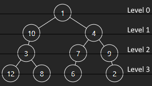
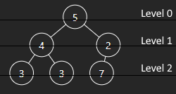
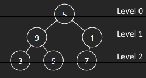
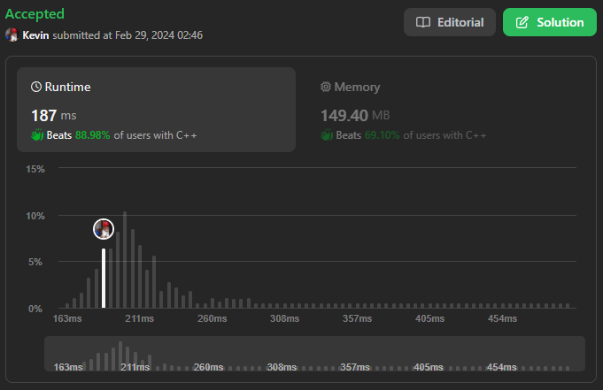
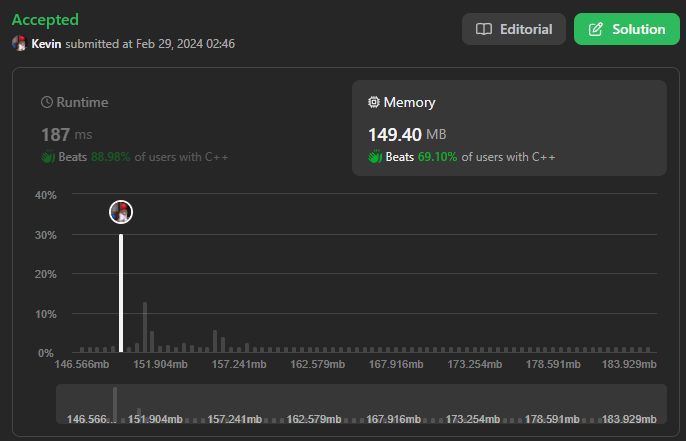

# 1609. Even Odd Tree

## Énoncé

Un arbre binaire est nommé **Pair-Impair** s'il remplit les conditions suivantes:

- La racine de l'arbre binaire est au niveau d'index `0`, ses enfants sont au niveau d'index `1`, eurs enfants sont au niveau d'index `2`, etc.
- Pour chaque **niveau à index pair**, tous les noeuds du niveau ont des valeurs entières **impaires** dans un ordre **strictement croissant** (de gauche à droite).
- Pour chaque **niveau à index impair**, tous les noeuds du niveau ont des valeurs entières paires dans un ordre **strictement décroissant** (de gauche à droite).

Étant donné la `root` d'un arbre binaire, renvoyez `true` si l'arbre binaire est **Pair-Impair**, sinon renvoyez `false`.

## Exemple

**Exemple 1:**  
  
**Input:** root = [1,10,4,3,null,7,9,12,8,6,null,null,2]  
**Output:** true  
**Explication:**  
Les valeurs des nœuds à chaque niveau sont:  
Level 0: [1]  
Level 1: [10,4]  
Level 2: [3,7,9]  
Level 3: [12,8,6,2]  
Puisque les niveaux 0 et 2 sont tous impairs et croissants et que les niveaux 1 et 3 sont tous pairs et décroissants, l’arbre est **Pair-Impair**.

**Exemple 2:**  
  
**Input:** root = [5,4,2,3,3,7]  
**Output:** false  
**Explication:**  
Les valeurs des nœuds à chaque niveau sont:  
Level 0: [5]  
Level 1: [4,2]  
Level 2: [3,3,7]  
Les valeurs des noeuds au niveau 2 doivent être dans un ordre strictement croissant, donc l'arbre n'est pas **Pair-Impair**.

**Exemple 3:**  
  
**Input:** root = [5,9,1,3,5,7]  
**Output:** false  
**Explication:** Les valeurs des noeuds du niveau 1 doivent être des nombres entiers pairs.

## Contraintes

Le nombre de noeuds dans l'arborescence est compris entre `[1, 10^5]`.  
`1 <= Node.val <= 10^6`

## Note personnelle

Ma solution consiste à mettre en oeuvre un parcours en largeur (BFS) en utilisant deux files, une principale et une temporaire.

La file principale est initialisée avec la racine de l'arbre. Nous itérons ensuite sur la file principale en effectuant les vérifications nécessaires pour vérifier les règles décrites dans l'énoncé.
À chaque itération, nous ajoutons les enfants à la file temporaire.

Une fois que la file temporaire est vide, nous inverserons la file principale et la file temporaire.

Cette approche nous permet de garder une trace de la profondeur actuelle et d'adapter les règles en fonction de celle-ci.

La complexité temporelle est de `O(n)`.  
La complexité spatiale est de `O(1)`.

