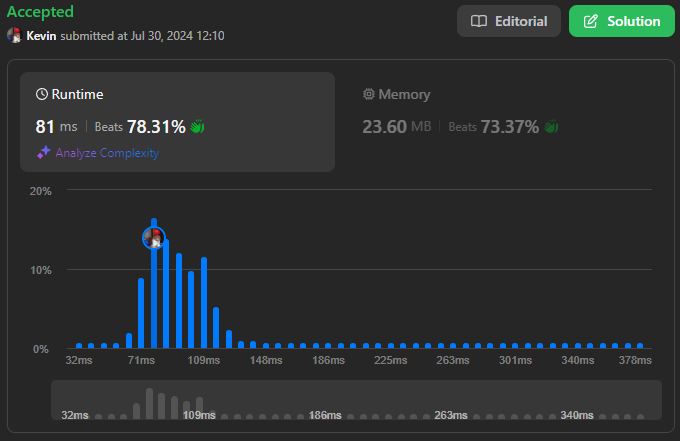
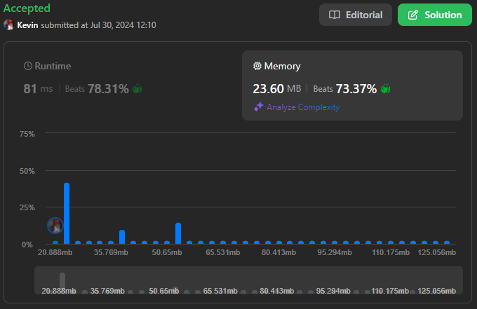

# 1653. Minimum Deletions to Make String Balanced

## Énoncé

On vous donne une chaîne de caractères `s` composée uniquement des caractères `'a'` et `'b'`​​​​.

Vous pouvez supprimer n'importe quel nombre de caractères dans `s` pour rendre `s` **équilibrée**. `s` est **équilibrée** s'il n'y a pas de paire d'indices `(i,j)` telle que `i < j` et `s[i] = 'b'` et `s[j]= 'a'`.

Retournez le **nombre minimum** de suppressions nécessaires pour rendre `s` **équilibrée**.

## Exemple

**Exemple 1:**  
**Input:** s = "aababbab"  
**Output:** 2  
**Explication:** vous pouvez soit:

- Supprimez les caractères aux positions 2 et 6 (indexées à partir de 0) ("aababbab" -> "aaabbb").
- Supprimez les caractères aux positions 3 et 6 (indexées à partir de 0) ("aababbab" -> "aabbbb").

**Exemple 2:**  
**Input:** s = "bbaaaaabb"  
**Output:** 2  
**Explication:** La seule solution est de supprimer les deux premiers caractères.

## Contraintes

`1 <= s.length <= 10^5`  
`S[i]` est `'a'` ou `'b'`.

## Note personnelle

### Approche 1: Stack

Cette approche consiste à maintenir une pile pour construire une chaîne sans aucune paire "ba". Chaque fois qu'une paire "ba" est détectée, elle est supprimée et le compteur de suppressions est incrémenté.

```cpp
int minimumDeletions(string s) {
  string sta;
  int ans = 0;

  // Parcourir chaque caractère de la chaîne
  for(char c : s){
    // Si le caractère actuel est 'a' et que le dernier caractère de la pile est 'b', alors une suppression est nécessaire pour éviter "ba"
    if(!sta.empty() && sta.back() == 'b' && c == 'a'){
      sta.pop_back(); // Retirer le 'b' de la pile
      ans++;          // Incrémenter le compteur de suppressions
    }
    else{
      sta.push_back(c); // Sinon, ajouter le caractère actuel à la pile
    }
  }

  // Retourner le nombre total de suppressions nécessaires
  return ans;
}
```

- Complexité Temporelle: `O(n)`.
- Complexité Spatiale: `O(n)`.

### Approche 2: 2 Passages + Espace Linéaire

Cette approche utilise un tableau de paires où chaque paire `arr[i]` contient deux valeurs: le nombre de `'a'` après l'index `i` et le nombre de `'b'` avant l'index `i` dans la chaîne `s`.

Un second passage est nécessaire pour calculer le résultat en prenant la somme minimale des paires.

```cpp
int minimumDeletions(string s) {
  vector<pair<int, int>> arr(s.size(), {0, 0});
  int countA = 0;
  int countB = 0;

  // Parcourir la chaîne une fois de gauche à droite et une fois de droite à gauche pour compter les 'b' avant et les 'a' après chaque position
  for(int i = 0, j = s.size() - 1; i < s.size(); i++, j--){
    arr[i].first = countB;  // Nombre de 'b' avant la position i
    arr[j].second = countA; // Nombre de 'a' après la position j

    if(s[i] == 'b'){
      countB++; // Incrémenter le compteur de 'b'
    }
    if(s[j] == 'a'){
      countA++; // Incrémenter le compteur de 'a'
    }
  }

  // Si la chaîne ne contient pas de 'a' ou pas de 'b', aucune suppression n'est nécessaire
  if(countA == 0 || countB == 0){
    return 0;
  }

  int ans = s.size();

  // Trouver la position où la somme des suppressions de 'b' avant et 'a' après est minimale
  for(int i = 0; i < s.size(); i++){
    ans = min(ans, arr[i].first + arr[i].second);
  }

  return ans; // Retourner le nombre minimum de suppressions nécessaires
}
```

- Complexité Temporelle: `O(n)`.
- Complexité Spatiale: `O(n)`.

### Approche 3: 2 Passages + Espace Constant

Cette approche est similaire à la précédente en termes de calcul, mais elle utilise un espace constant en évitant l'utilisation d'un tableau.

L'idée est de compter les occurrences de `'a'` en une seule itération. Lors du second passage, on met à jour les compteurs des occurrences de `'a'` et `'b'` tout en calculant le nombre minimum d'opérations nécessaires.

```cpp
int minimumDeletions(string s) {
  int countA = 0;

  // Compter le nombre total de 'a' dans la chaîne
  for(char c : s){
    if(c == 'a'){
      countA++;
    }
  }

  // Si la chaîne ne contient pas de 'a' ou si elle est composée uniquement de 'a', aucune suppression n'est nécessaire
  if(countA == 0 || countA == s.size()){
    return 0;
  }

  int countB = 0;
  int ans = s.size();

  // Parcourir la chaîne pour calculer le nombre minimum de suppressions
  for(char c : s){
    // Si le caractère actuel est 'a', réduire le compteur de 'a' restants à supprimer
    if(c == 'a'){
      countA--;
    }

    // Mettre à jour le résultat avec le nombre minimal de suppressions entre les 'a' restants et les 'b' rencontrés
    ans = min(countA + countB, ans);

    // Si le caractère actuel est 'b', augmenter le compteur de 'b'
    if(c == 'b'){
      countB++;
    }
  }

  return ans; // Retourner le nombre minimum de suppressions nécessaires
}
```

- Complexité Temporelle: `O(n)`.
- Complexité Spatiale: `O(1)`.

### Approche 4: Programmation Dynamique (DP)

Cette approche utilise la programmation dynamique pour obtenir la réponse en un seul passage.

Pour chaque position `i`, `dp[i]` représente le nombre de caractères à supprimer pour que la chaîne `s[0, i)` soit valide.

- Si le caractère est `'b'` le nombre de suppressions nécessaires est le même que pour `dp[i - 1]`.
- Si le caractère est `'a'` on choisit le minimum entre supprimer tous les `'b'` précédents ou ajouter une suppression.

```cpp
int minimumDeletions(string s) {
  // Initialiser un vecteur dp avec une taille de s.size() + 1, rempli de 0
  vector<int> dp(s.size() + 1, 0);
  int countB =  0;

  // Parcourir chaque caractère de la chaîne
  for(int i = 0; i < s.size(); i++){
    // Si le caractère est 'b', le nombre de suppressions reste le même que dp[i]
    if(s[i] == 'b'){
      dp[i + 1] = dp[i];
      countB++;
    }
    // Si le caractère est 'a', calculer le minimum entre supprimer tous les 'b' précédents ou ajouter une suppression (dp[i] + 1)
    else{
      dp[i + 1] = min(countB, dp[i] + 1);
    }
  }

  // Retourner le nombre minimum de suppressions nécessaires
  return dp[s.size()];
}
```

- Complexité Temporelle: `O(n)`.
- Complexité Spatiale: `O(n)`.

### Approche 5: Programmation Dynamique Optimisée

Cette approche optimise l'espace de l'approche DP en utilisant seulement quelques variables pour obtenir le résultat en espace constant.

```cpp
int minimumDeletions(string s) {
  int ans = 0;     // Initialiser le nombre minimum de suppressions nécessaires
  int countB =  0; // Compteur pour le nombre de 'b' rencontrés

  // Parcourir chaque caractère de la chaîne
  for(int i = 0; i < s.size(); i++){
    // Incrémenter le compteur de 'b' lorsque le caractère est 'b'
    if(s[i] == 'b'){
      countB++;
    }
    // Si le caractère est 'a', calculer le minimum entre le nombre actuel de suppressions et le nombre de 'b' rencontrés jusqu'à présent
    else{
      ans = min(ans + 1, countB);
    }
  }

  // Retourner le nombre minimum de suppressions nécessaires
  return ans;
}
```

- Complexité Temporelle: `O(n)`.
- Complexité Spatiale: `O(1)`.

### Comparaison des différentes approches

Rapport de performance généré avec [Benchmark Algorithm](https://github.com/SlicedPotatoes/BenchmarkAlgorithm).

Les performances des différentes approches sont évaluées comme suit. Les tests ont été réalisés avec x jeux de données de tailles variées:

**100 jeux de données de taille 1000**:

```
Approche 1 Stack - Mean: 35.852 µs, Min: 25.600 µs, Max: 67.800 µs,  Median: 32.300 µs, Total: 3.585 ms
Approche 2 2P ES - Mean: 52.201 µs, Min: 38.300 µs, Max: 117.700 µs, Median: 41.700 µs, Total: 5.220 ms
Approche 3 2P EC - Mean: 35.176 µs, Min: 31.900 µs, Max: 50.300 µs,  Median: 33.800 µs, Total: 3.518 ms
Approche 4 DP    - Mean: 25.925 µs, Min: 19.900 µs, Max: 46.800 µs,  Median: 22.300 µs, Total: 2.592 ms
Approche 5 DP Op - Mean: 14.240 µs, Min: 10.000 µs, Max: 32.100 µs,  Median: 10.600 µs, Total: 1.424 ms
```

**100 jeux de données de taille 10^5**:

```
Approche 1 Stack - Mean: 2.368 ms, Min: 2.038 ms,   Max: 10.392 ms, Median: 2.194 ms,   Total: 236.819 ms
Approche 2 2P ES - Mean: 4.048 ms, Min: 3.716 ms,   Max: 5.946 ms,  Median: 3.881 ms,   Total: 404.833 ms
Approche 3 2P EC - Mean: 3.215 ms, Min: 3.063 ms,   Max: 4.379 ms,  Median: 3.179 ms,   Total: 321.459 ms
Approche 4 DP    - Mean: 2.042 ms, Min: 1.871 ms,   Max: 3.034 ms,  Median: 1.959 ms,   Total: 204.164 ms
Approche 5 DP Op - Mean: 1.048 ms, Min: 942.700 µs, Max: 1.982 ms,  Median: 985.650 µs, Total: 104.794 ms
```

Les approches avec un seul passage (comme Stack, DP et DP optimisé) montrent de meilleures performances.

Parmi les approches utilisant des principes similaires, celles avec une complexité spatiale constante sont plus performantes:

- **Approche 2** vs **Approche 3**: L'approche 3 est plus efficace car elle n'utilise pas de conteneurs supplémentaires pour le précompte, réduisant ainsi la surcharge mémoire et le temps d'initialisation.
- **Approche 4** vs **Approche 5**: L'approche optimisée est plus rapide car elle réduit l'utilisation de la mémoire, diminuant ainsi le temps d'initialisation.

En conclusion, l'approche la plus efficace est l'approche 5, qui effectue un seul passage et utilise un espace constant.

Les jeux de test ont été générés avec la fonction suivante:

```cpp
TC generateRandomData(int size) {
  Input input;

  // Générer s
  std::string s;

  for (int i = 0; i < size; i++) {
    if (rand() % 2 == 0) {
      s.push_back('a');
    }
    else {
      s.push_back('b');
    }
  }

  // Récupérer le résultat
  int ans = 0;
  int countB = 0;

  for (int i = 0; i < s.size(); i++) {
    if (s[i] == 'b') {
      countB++;
    }
    else {
      ans = min(ans + 1, countB);
    }
  }

  // Renvoyer le TestCase
  get<0>(input) = s;
  return TC(input, ans);
}
```



