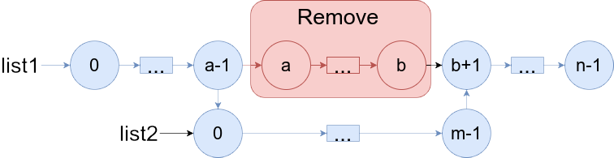
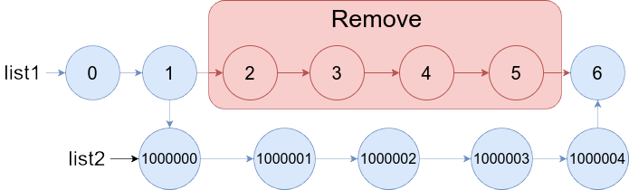

# 1669. Merge In Between Linked Lists

## Énoncé

Vous recevez deux listes chaînées : `list1` et `list2` de tailles `n` et `m` respectivement.

Supprimez les noeuds de `list1` de `a` jusqu'à `b` et mettez `list2` à leur place.



Construisez la liste de résultats et renvoyez sa `head`.

## Exemple


**Exemple 1:**  
**Input:** list1 = [10,1,13,6,9,5], a = 3, b = 4, list2 = [1000000,1000001,1000002]  
**Output:** [10,1,13,1000000,1000001,1000002,5]

**Exemple 2:**  


**Input:** list1 = [0,1,2,3,4,5,6], a = 2, b = 5, list2 = [1000000,1000001,1000002,1000003,1000004]  
**Output:** [0,1,1000000,1000001,1000002,1000003,1000004,6]

## Contraintes

`3 <= list1.length <= 10^4`  
`1 <= a <= b < list1.length - 1`  
`1 <= list2.length <= 10^4`

## Note personnelle

Ma méthode repose sur l'utilisation de trois boucles, chacune étant décrite ci-dessous.

La première boucle itère jusqu'au nœud `a - 1` dans `list1` afin de trouver le nœud où insérer `list2`. Ce nœud est ensuite enregistré dans un pointeur appelé `start`.

La deuxième boucle parcourt les nœuds de `list1` jusqu'au nœud `b` pour trouver le nœud qui se situera à la fin de `list2`.
Cet élément est stocké dans un pointeur nommé `end`.

La troisième boucle parcourt `list2` pour trouver son dernier élément. Ce dernier est stocké dans un pointeur nommé `endList2`.

Ensuite, il suffit de réaffecter correctement les pointeurs:

- `start->next = list2`
- `endList2->next = end`

Cette approche présente un problème de fuite de mémoire (memory leak). Pour le corriger, il suffit d'ajuster légèrement la deuxième boucle comme suit:

```cpp
for(int i = a; i <= b; i++){
  ListNode * temp = end;
  end = end->next;
  delete temp;
}
```

Cette fonction présente une complexité temporelle de `O(n)` et une complexité spatiale de `O(1)`.


