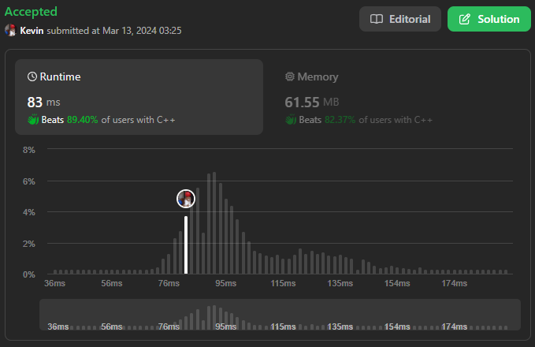

# 1679. Max Number of K-Sum Pairs

## Énoncé

Vous recevez un tableau d'entiers `nums` et un entier `k`.

En une seule opération, vous pouvez sélectionner deux nombres du tableau dont la somme est égale à `k` et les supprimer du tableau.

Renvoie le nombre maximum d'opérations que vous pouvez effectuer sur le tableau.

## Exemple

**Exemple 1:**  
**Input:** nums = [1,2,3,4], k = 5  
**Output:** 2  
**Explication:**  
Commencer avec nums = [1,2,3,4]:

- Supprimez les numéros 1 et 4, puis nums = [2,3]
- Supprimez les numéros 2 et 3, puis nums = []

Il n’y a plus de paires qui totalisent 5, donc un total de 2 opérations.

**Exemple 2:**  
**Input:** nums = [3,1,3,4,3], k = 6  
**Output:** 1  
**Explication:**  
Commencer avec nums = [3,1,3,4,3]:

- Supprimez les deux premiers 3, puis nums = [1,4,3]

Il n’y a plus de paires qui totalisent 6, donc un total de 1 opération.

## Contraintes

`1 <= nums.length <= 10^5`  
`1 <= nums[i] <= 10^9`  
`1 <= k <= 10^9`

## Note personnelle

Dans ma première approche pour résoudre le problème, j'ai utilisé une structure de données HashMap appelée `map` pour suivre les éléments et le nombre d'occurrences de chacun. J'ai également initialisé une variable `count` à `0` pour représenter le nombre d'opérations.

Le processus itératif sur les éléments de `nums` est le suivant:

- Chaque nombre est stocké dans une variable `n`.
- Ensuite, j'incrémente le compteur dans la HashMap `map[n]++`
- Je calcule également la valeur `target`: `target = k - n` qui représente la valeur à trouver dans le tableau pour former une paire dont la somme est `k`.

- Si `target == n`, je vérifie si `map[n] >= 2`. Si c'est le cas, j'incrémente `count` de `1` et décrémente `map[n]` de `2`.
- Sinon, si `target` est présent dans `map` avec une valeur d'au moins 1, j'incrémente `count` de `1` et je décrémente `map[n]` et `map[target]` de `1`.

```cpp
int maxOperations(vector<int>& nums, int k) {
  // Utilisation d'une table de hachage pour stocker les occurrences des éléments
  unordered_map<int, int> map;

  // Variable pour compter le nombre maximal d'opérations possibles
  int count = 0;

  // Parcours de chaque élément dans le vecteur 'nums'
  for (int n : nums) {
    // Incrémentation du nombre d'occurrences de l'élément 'n'
    map[n]++;
    // Calcul de la valeur cible nécessaire pour atteindre la somme 'k' avec 'n'
    int target = k - n;

    // Vérification si la valeur cible est égale à 'n'
    if (target == n) {
      // Vérification si l'élément 'n' apparaît au moins deux fois dans le vecteur
      if (map[n] >= 2) {
        // Incrémentation du nombre maximal d'opérations possibles
        count++;
        // Décrémentation du nombre d'occurrences de 'n' de deux unités
        map[n] -= 2;
      }
    }
    // Vérification si la valeur cible est présente dans la table de hachage
    else if (map.find(target) != map.end() && map[target] >= 1) {
      // Incrémentation du nombre maximal d'opérations possibles
      count++;
      // Décrémentation du nombre d'occurrences de 'n' de une unité
      map[n] -= 1;
      // Décrémentation du nombre d'occurrences de 'target' de une unité
      map[target] -= 1;
    }
  }

  // Retourne le nombre maximal d'opérations possibles
  return count;
}
```

Cette approche présente une complexité temporelle et spatiale de `O(n)`.

Une autre approche que j'ai envisagée consiste à trier le tableau et à utiliser deux indices pour parcourir le tableau trié: `i` initialisé à `0` et `j` initialisé à `nums.size() - 1`, ainsi qu'une variable pour compter le nombre d'opérations `count`.

On itère tant que `i < j` comme suit:

- On calcule `sum = nums[i] + nums[j]`.
- Si `sum == k`, on incrémente `count` et `i` de `1` et décrémente `j` de `1`.
- Sinon, si `sum > k`, on décrémente `j` de `1`.
- Sinon, on incrémente `i` de `1`.

Cette deuxième approche présente une complexité temporelle de `O(n log n)` et une complexité spatiale de `O(1)`.



