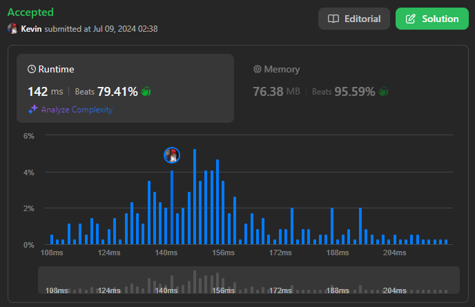
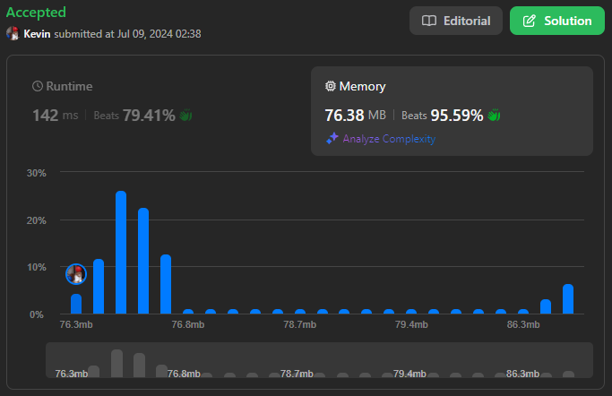

# 1701. Average Waiting Time

## Énoncé

Il y a un restaurant avec un seul chef. On vous donne un tableau `customers`, où `customers[i] = [arrivali, timei]`:

- `arrivali` est l'instant d'arrivée du `ième` client. Les temps d'arrivée sont triées par ordre **non décroissant**.
- `timei` est le temps nécessaire pour préparer la commande du `ième` client.

Lorsqu'un client arrive, il donne sa commande au chef, et le chef commence à la préparer une fois qu'il est libre. Le client attend jusqu'à ce que le chef termine de préparer sa commande. Le chef ne prépare pas de nourriture pour plus d'un client à la fois. Le chef prépare la nourriture pour les clients **dans l'ordre dans lequel ils sont donnés dans l'entrée**.

Retournez le **temps d'attente moyen** de tous les clients. Les solutions à `10^-5` près de la réponse réelle sont considérées comme acceptées.

## Exemple

**Exemple 1:**  
**Input:** customers = [[1,2],[2,5],[4,3]]  
**Output:** 5.00000  
**Explication:**

```
1) Le premier client arrive à l'instant 1, le chef prend sa commande et commence à la préparer immédiatement à l'instant 1, et termine à l'instant 3, donc le temps d'attente du premier client est de 3 - 1 = 2.
2) Le deuxième client arrive à l'instant 2, le chef prend sa commande et commence à la préparer à l'instant 3, et termine à l'instant 8, donc le temps d'attente du deuxième client est de 8 - 2 = 6.
3) Le troisième client arrive à l'instant 4, le chef prend sa commande et commence à la préparer à l'instant 8, et termine à l'instant 11, donc le temps d'attente du troisième client est de 11 - 4 = 7.

Ainsi, le temps d'attente moyen = (2 + 6 + 7) / 3 = 5.
```

**Exemple 2:**  
**Input:** customers = [[5,2],[5,4],[10,3],[20,1]]  
**Output:** 3.25000  
**Explication:**

```
1) Le premier client arrive à l'instant 5, le chef prend sa commande et commence à la préparer immédiatement à l'instant 5, et finit à l'instant 7, donc le temps d'attente du premier client est de 7 - 5 = 2.
2) Le deuxième client arrive à l'instant 5, le chef prend sa commande et commence à la préparer à l'instant 7, et finit à l'instant 11, donc le temps d'attente du deuxième client est de 11 - 5 = 6.
3) Le troisième client arrive à l'instant 10, le chef prend sa commande et commence à la préparer à l'instant 11, et finit à l'instant 14, donc le temps d'attente du troisième client est de 14 - 10 = 4.
4) Le quatrième client arrive à l'instant 20, le chef prend sa commande et commence à la préparer immédiatement à l'instant 20, et finit à l'instant 21, donc le temps d'attente du quatrième client est de 21 - 20 = 1.

Ainsi, le temps d'attente moyen = (2 + 6 + 4 + 1) / 4 = 3,25.
```

## Contraintes

`1 <= customers.length <= 10^5`  
`1 <= arrivali, timei <= 10^4`  
`arrivali <= arrivali+1`

## Note personnelle

Pour résoudre ce problème, la stratégie consiste à maintenir une trace de l'instant de fin de préparation de la commande précédente, stocké dans la variabl `currEnd`.

Je parcours chaque client et j'applique des actions différentes en fonction de la situation : si un client arrive pendant qu'une commande est en cours de préparation ou lorsque le chef est disponible.

Lorsque le chef est disponible, j'actualise l'heure de fin de la commande en ajoutant `customers[i].arrival` et `customers[i].time` , et j'incrémente le temps d'attente total par `customers[i].time`

Lorsque le chef prépare déjà une commande, je calcule le temps que le client attendra avant que la préparation de sa commande ne commence `currEnd - customers[i].arrival`. Ensuite, j'incrémente le temps d'attente total par le temps d'attente avant la préparation plus le temps de préparation. Enfin, j'actualise `currEnd` en ajoutant `customers[i].time`.

Il suffit ensuite de calculer et de retourner le temps moyen.

```cpp
double averageWaitingTime(vector<vector<int>>& customers) {
  long totalWaitTime = 0; // Variable pour stocker le temps d'attente total
  int currEnd = 0;        // Variable pour stocker la fin du traitement actuel

  // Boucle sur chaque client
  for(vector<int> &customer : customers){
    // Si le chef est libre
    if(currEnd <= customer[0]){
      currEnd = customer[0] + customer[1]; // Met à jour l'heure de fin actuelle
      totalWaitTime += customer[1];        // Le temps d'attente est le temps de traitement uniquement
    }
    // Si le chef est occupé à l'arrivée du client
    else{
      totalWaitTime += currEnd - customer[0] + customer[1]; // Temps d'attente = temps de traitement + (temps jusqu'à ce que le chef soit libre)
      currEnd += customer[1];                               // Met à jour l'heure de fin actuelle
    }
  }

  // Retourne le temps d'attente moyen
  return (double)totalWaitTime / customers.size();
}
```

- Complexité Temporelle: `O(n)`
- Complexité Spatiale: `O(1)`



