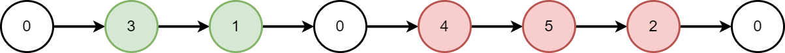
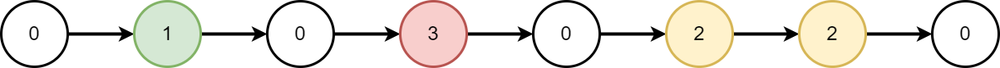

# 2181. Merge Nodes in Between Zeros

## Énoncé

On vous donne la `head` d'une liste chaînée qui contient une série d'entiers **séparés** par des `0`. Le **début** et la **fin** de la liste chaînée auront `Node.val == 0`.

Pour **chaque** paire de `0` consécutifs, **fusionnez** tous les noeuds situés entre eux en un seul noeud dont la valeur est la **somme** de tous les noeuds fusionnés. La liste modifiée ne doit contenir aucun `0`.

Retournez la `head` de la liste chaînée modifiée.

## Exemple

**Exemple 1:**



**Input:** head = [0,3,1,0,4,5,2,0]  
**Output:** [4,11]  
**Explication:**  
La figure ci-dessus représente la liste chaînée donnée. La liste modifiée contient

- La somme des noeuds marqués en vert: 3 + 1 = 4.
- La somme des noeuds marqués en rouge: 4 + 5 + 2 = 11.

**Exemple 2:**



**Input:** head = [0,1,0,3,0,2,2,0]  
**Output:** [1,3,4]  
**Explication:**  
La figure ci-dessus représente la liste chaînée donnée. La liste modifiée contient

- La somme des noeuds marqués en vert: 1 = 1.
- La somme des noeuds marqués en rouge: 3 = 3.
- La somme des noeuds marqués en jaune: 2 + 2 = 4.

## Contraintes

Le nombre de noeuds dans la liste est compris entre `[3, 2 * 10^5]`.  
`0 <= Node.val <= 1000`  
Il n'y a **pas** deux noeuds consécutifs avec `Node.val == 0`.  
Le **début** et la **fin** de la liste chaînée ont `Node.val == 0`.

## Note personnelle

### Approche Itérative 1

Cette méthode itère sur une liste et crée une nouvelle liste en accumulant les valeurs entre les zéros.

```cpp
ListNode* mergeNodes(ListNode* head) {
  // Création d'un noeud factice pour faciliter la gestion de la nouvelle liste
  ListNode* dummy = new ListNode(-1);
  ListNode* currAns = dummy;

  // Pointeur pour parcourir la liste à partir du deuxième noeud
  ListNode* curr = head->next;
  // Variable pour accumuler les valeurs entre les zéros
  int sum = 0;

  // Parcourir la liste chaînée
  while(curr){
    if(curr->val == 0){
      // Lorsque nous rencontrons un noeud avec la valeur 0,
      // nous créons un nouveau noeud avec la somme accumulée et réinitialisons la somme
      currAns->next = new ListNode(sum);
      currAns = currAns->next;
      sum = 0;
    }
    else{
      // Sinon, nous ajoutons la valeur du noeud courant à la somme
      sum += curr->val;
    }
    // Passer au noeud suivant
    curr = curr->next;
  }

  // Retourner le premier noeud de la nouvelle liste
  return dummy->next;
}
```

- Complexité Temporelle: `O(n)`.
- Complexité Spatiale: `O(n)`.

Pour éviter les **Memory Leaks**, il est essentiel de supprimer chaque noeud une fois qu'il n'est plus nécessaire, au moment où l'on change le pointeur `curr`:

```cpp
ListNode* temp = curr;
curr = curr->next;
delete temp;
```

### Approche Itérative 2

Cette approche itère sur la liste en la modifiant pour contenir uniquement les sommes cumulées.

```cpp
ListNode* mergeNodes(ListNode* head) {
  int sum = 0; // Variable pour accumuler les valeurs entre les zéros
  ListNode* curr = head->next; // Pointeur pour parcourir la liste à partir du deuxième noeud
  ListNode* currAns = new ListNode(-1, head); // Pointeur pour la nouvelle liste

  while(curr){
    if(curr->val == 0){
      // Lorsque nous rencontrons un noeud avec la valeur 0, nous définissons la valeur du noeud suivant dans currAns avec la somme accumulée
      currAns->next->val = sum;
      // Nous réutilisons le noeud actuel (qui a la valeur 0) pour le lien suivant
      currAns->next->next = curr;
      currAns = currAns->next; // Avancer à la prochaine position
      sum = 0; // Réinitialiser la somme
    }
    else{
      // Sinon, nous ajoutons la valeur du noeud courant à la somme
      sum += curr->val;
    }
    curr = curr->next; // Passer au noeud suivant
  }

  // Finalement, nous mettons le pointeur suivant de currAns à nullptr
  currAns->next = nullptr;

  return head; // Retourner la tête de la liste modifiée
}
```

- Complexité Temporelle: `O(n)`.
- Complexité Spatiale: `O(1)`.

Pour éviter les **Memory Leaks**, supprimer le noeud uniquement lorsque sa valeur n'est pas zéro:

```cpp
ListNode* temp = curr->next;
if(curr->val == 0){
  // Reste du code
}
else{
  sum += curr->val;
  delete curr;
}
curr = temp;
```

### Approche Récursive 1

Cette méthode crée une nouvelle liste avec les sommes cumulées de manière récursive.

```cpp
// Fonction récursive pour fusionner les noeuds d'une liste chaînée
ListNode* merge(ListNode* curr, int &sum){
  if(!curr){
    // Si le noeud courant est nul, retourner nullptr (fin de la liste)
    return nullptr;
  }

  // Appel récursif pour parcourir la liste jusqu'à la fin
  ListNode* tail = merge(curr->next, sum);

  if(curr->val == 0 && sum != 0){
    // Lorsque nous rencontrons un noeud avec la valeur 0 et que sum n'est pas zéro, nous créons un nouveau noeud avec la somme accumulée et le mettons en tête de la nouvelle liste
    tail = new ListNode(sum, tail);
    sum = 0; // Réinitialiser la somme
    return tail;
  }

  // Ajouter la valeur du noeud courant à la somme
  sum += curr->val;

  return tail;
}

ListNode* mergeNodes(ListNode* head) {
  int sum = 0;
  return merge(head, sum);
}
```

- Complexité Temporelle: `O(n)`.
- Complexité Spatiale: `O(n)`.

Pour éviter les **Memory Leaks**, supprimer le noeud avant de renvoyer `tail`:

```cpp
if(curr->val == 0 && sum != 0){
  // Reste du code
  delete curr;
  return tail;
}

// Reste du code

delete curr;
return tail;
```

### Approche Récursive 2

Cette approche itère sur la liste en la modifiant pour contenir uniquement les sommes cumulées de manière récursive.

```cpp
// Fonction récursive pour fusionner les noeuds d'une liste chaînée
ListNode* merge(ListNode* curr, int &sum){
  if(!curr){
    // Si le noeud courant est nul, retourner nullptr (fin de la liste)
    return nullptr;
  }

  // Appel récursif pour parcourir la liste jusqu'à la fin
  ListNode* tail = merge(curr->next, sum);

  if(curr->val == 0 && sum != 0){
    // Lorsque nous rencontrons un noeud avec la valeur 0 et que la somme n'est pas zéro, nous remplaçons la valeur du noeud actuel par la somme accumulée
    curr->val = sum;
    // Nous ajustons le pointeur suivant du noeud actuel pour qu'il pointe vers le prochain segment fusionné
    curr->next = tail;
    sum = 0; // Réinitialiser la somme
    return curr; // Retourner le noeud actuel mis à jour
  }

  // Ajouter la valeur du noeud courant à la somme
  sum += curr->val;

  // Retourner le tail pour construire la liste fusionnée
  return tail;
}

ListNode* mergeNodes(ListNode* head) {
  int sum = 0;
  return merge(head, sum);
}
```

- Complexité Temporelle: `O(n)`.
- Complexité Spatiale: `O(n)`.

Pour éviter les **Memory Leaks**, supprimer le noeud à la fin de la fonction récursive avant de renvoyer `tail`:

```cpp
if(curr->val == 0 && sum != 0){
  // Reste du code
}

// Reste du code

delete curr;
return tail;
```

### Avantages / Inconvénients de Chaque Approche

Globalement, les approches itératives ont tendance à être plus performantes en raison de la gestion de la pile d'appels et de leur coût mémoire potentiellement inférieur.

- **Approche Itérative 1** / **Récursive 1**:  
  Elle est avantageuse car elle crée une nouvelle liste sans détruire la liste d'origine, ce qui la rend préférable dans les contextes nécessitant la conservation de la liste initiale.
- **Approche Itérative 2**:
  Dans un contexte ou l'on n'a pas besoin de la liste d'origine, cet approche est la meilleurs option, elle n'utilise aucun espace suplémentaire.

Les approches récursives peuvent être préférées par ceux qui sont plus à l'aise avec la récursion, malgré leur potentiel coût en mémoire.


