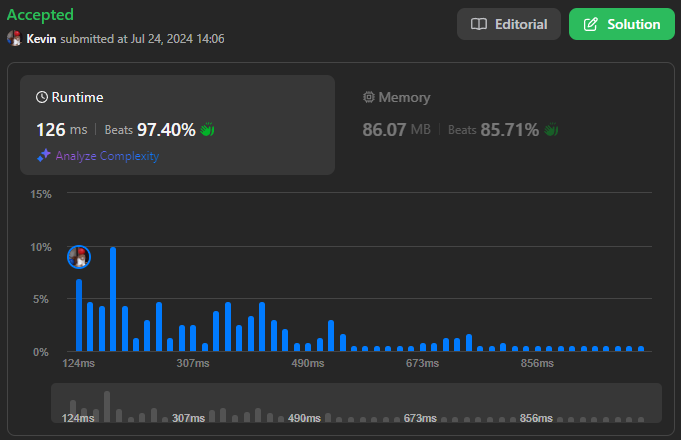

# 2191. Sort the Jumbled Numbers

## Énoncé

On vous donne un tableau d'entiers **indexé à partir de 0** `mapping` qui représente la règle de correspondance d'un système décimal mélangé. `mapping[i] = j` signifie que le chiffre `i` doit être remplacé par le chiffre `j` dans ce système.

La **valeur mappée** d'un entier est le nouvel entier obtenu en remplaçant chaque occurrence du chiffre `i` dans l'entier par `mapping[i]` pour tous les `0 <= i <= 9`.

On vous donne également un autre tableau d'entiers `nums`. Retournez le tableau `nums` trié dans un ordre **non décroissant** basé sur les **valeurs mappées** de ses éléments.

**Remarques**:

- Les éléments ayant les mêmes valeurs mappées doivent apparaître dans le **même ordre relatif** que dans l'entrée.
- Les éléments de `nums` ne doivent être triés que sur la base de leurs valeurs mappées et **ne doivent pas être remplacés** par elles.

## Exemple

**Exemple 1:**  
**Input:** mapping = [8,9,4,0,2,1,3,5,7,6], nums = [991,338,38]  
**Output:** [338,38,991]  
**Explication:** 991 se mappe à 669, 338 se mappe à 007, 38 se mappe à 07. Puisque 338 et 38 partagent la même valeur mappée, ils doivent rester dans le même ordre relatif, donc 338 vient avant 38. Ainsi, le tableau trié est [338, 38, 991].

**Exemple 2:**  
**Input:** mapping = [0,1,2,3,4,5,6,7,8,9], nums = [789,456,123]  
**Output:** [123,456,789]  
**Explication:** 789 se mappe à 789, 456 se mappe à 456, et 123 se mappe à 123. Ainsi, le tableau trié est [123, 456, 789].

## Contraintes

`mapping.length == 10`  
`0 <= mapping[i] <= 9`  
Toutes les valeurs de `mapping[i]` sont **uniques**.  
`1 <= nums.length <= 3 * 10^4`  
`0 <= nums[i] < 10^9`

## Note personnelle

### Approche 1: HashMap

Cette approche utilise une `HashMap` pour établir la correspondance entre les valeurs du vecteur `nums` et leurs valeurs mappées.

Dans cette méthode, la clé de la `HashMap` est le nombre original et la valeur associée est le nombre mappé.

```cpp
vector<int> sortJumbled(vector<int>& mapping, vector<int>& nums) {
  unordered_map<int, int> mp; // Map pour stocker les valeurs mappées

  // Transformation des éléments de nums selon le mapping
  for(int element : nums){
    int copy = element;

    int n = 0;
    int p = 1;

    // Convertir chaque chiffre de l'élément
    do {
      int digit = copy % 10;   // Extraire le dernier chiffre
      n += mapping[digit] * p; // Appliquer le mapping et mettre à la bonne position
      copy /= 10;              // Supprimer le dernier chiffre
      p *= 10;                 // Passer à la position suivante
    } while (copy > 0);

    mp[element] = n; // Enregistrer le nombre transformé
  }

  // Tri des éléments de nums basé sur leurs valeurs mappées
  stable_sort(nums.begin(), nums.end(), [&mp](int a, int b){
    return mp[a] < mp[b];
  });

  return nums; // Retourner le vecteur trié
}
```

- Complexité Temporelle: `O(n log n)`.
- Complexité Spatiale: `O(n)`

### Approche 2: Vecteur

Cette approche utilise un `vecteur` de paires, où chaque paire contient la valeur mappée et le nombre original.

Il suffit de trier ce vecteur en personnalisant la fonction de comparaison pour conserver l'ordre relatif des éléments.

```cpp
vector<int> sortJumbled(vector<int>& mapping, vector<int>& nums) {
  vector<pair<int, int>> arr; // Vecteur de paires pour stocker les nombres transformés et les originaux

  // Transformation des éléments de nums selon le mapping
  for (int i = 0; i < nums.size(); i++) {
    int element = nums[i];

    int n = 0;
    int p = 1;

    // Convertir chaque chiffre de l'élément
    do {
      int digit = element % 10; // Extraire le dernier chiffre
      n += mapping[digit] * p;  // Appliquer le mapping et mettre à la bonne position
      element /= 10;            // Supprimer le dernier chiffre
      p *= 10;                  // Passer à la position suivante
    } while (element > 0);

    arr.push_back({n, nums[i]}); // Ajouter le nombre transformé et l'original au vecteur de paires
  }

  // Tri des paires en fonction des valeurs transformées
  stable_sort(arr.begin(), arr.end(), [](auto &a, auto &b){
    return a.first < b.first;
  });

  // Mise à jour de nums avec les éléments triés
  for (int i = 0; i < arr.size(); i++) {
    nums[i] = arr[i].second;
  }

  return nums; // Retourner le vecteur trié
}
```

- Complexité Temporelle: `O(n log n)`.
- Complexité Spatiale: `O(n)`

### Approche 3: Map

Cette méthode utilise une `Map` pour maintenir l'ordre trié des éléments.

La clé de la `Map` est la valeur mappée et la valeur associée est un vecteur contenant les nombres originaux correspondant à cette clé.

```cpp
vector<int> sortJumbled(vector<int>& mapping, vector<int>& nums) {
  map<int, vector<int>> mp; // Map pour stocker les valeurs transformées et les originaux

  // Transformation des éléments de nums selon le mapping
  for (int i = 0; i < nums.size(); i++) {
    int element = nums[i];

    int n = 0;
    int p = 1;

    // Convertir chaque chiffre de l'élément
    do {
      int digit = element % 10; // Extraire le dernier chiffre
      n += mapping[digit] * p;  // Appliquer le mapping et mettre à la bonne position
      element /= 10;            // Supprimer le dernier chiffre
      p *= 10;                  // Passer à la position suivante
    } while (element > 0);

    mp[n].push_back(nums[i]); // Ajouter l'élément original sous la clé de la valeur transformée
  }

  // Reconstruction de nums avec les éléments triés
  int i = 0;
  for (auto it = mp.begin(); it != mp.end(); it++) {
    for(int n : it->second){
      nums[i++] = n;
    }
  }

  return nums; // Retourner le vecteur trié
}
```

- Complexité Temporelle: `O(n log n)`.
- Complexité Spatiale: `O(n)`

### Approche 4: Tri Direct avec Application du Mapping

Cette méthode consiste à appliquer le mapping directement lors du tri.

```cpp
// Fonction pour appliquer le mapping à un nombre entier
int applyMap(vector<int> &mapping, int n){
  int _n = 0; // Variable pour stocker le nombre transformé
  int p = 1;  // Valeur de position

  // Appliquer le mapping sur chaque chiffre du nombre
  do{
    int digit = n % 10;       // Extraire le dernier chiffre
    _n += mapping[digit] * p; // Convertir et ajouter à la position correcte
    n /= 10;                  // Supprimer le dernier chiffre du nombre
    p *= 10;                  // Passer à la position suivante
  } while(n > 0);

  return _n; // Retourner le nombre transformé
}

vector<int> sortJumbled(vector<int>& mapping, vector<int>& nums) {
  // Trier les éléments de nums en utilisant la fonction applyMap pour comparer les valeurs transformées
  stable_sort(nums.begin(), nums.end(), [&](int a, int b){
    int _a = applyMap(mapping, a);
    int _b = applyMap(mapping, b);

    return _a < _b; // Comparer les valeurs transformées
  });

  return nums; // Retourner le vecteur trié
}
```

- Complexité Temporelle: `O(n log n)`.
- Complexité Spatiale: `O(n)`

### Comparaison des différentes approches

Rapport de performance généré avec [Benchmark Algorithm](https://github.com/SlicedPotatoes/BenchmarkAlgorithm).

Les performances des différentes approches sont évaluées comme suit. Les tests ont été réalisés avec 300 jeux de données de tailles variées:

**100 jeux de données de taille 1000**:

```
Approche 1 - Mean: 1.862 ms,   Min: 1.759 ms,   Max: 2.636 ms,   Median: 1.842 ms,   Total: 186.202 ms
Approche 2 - Mean: 309.377 µs, Min: 300.200 µs, Max: 347.100 µs, Median: 307.800 µs, Total: 30.938 ms
Approche 3 - Mean: 689.691 µs, Min: 651.300 µs, Max: 878.400 µs, Median: 681.650 µs, Total: 68.969 ms
Approche 4 - Mean: 870.341 µs, Min: 849.600 µs, Max: 1.476 ms,   Median: 861.650 µs, Total: 87.034 ms
```

**100 jeux de données de taille 10^4**:

```
Approche 1 - Mean: 24.402 ms, Min: 23.666 ms, Max: 28.428 ms, Median: 24.274 ms, Total: 2.440 s
Approche 2 - Mean: 3.542 ms,  Min: 3.430 ms,  Max: 4.044 ms,  Median: 3.525 ms,  Total: 354.158 ms
Approche 3 - Mean: 7.393 ms,  Min: 7.071 ms,  Max: 9.592 ms,  Median: 7.312 ms,  Total: 739.252 ms
Approche 4 - Mean: 11.134 ms, Min: 10.822 ms, Max: 12.547 ms, Median: 11.094 ms, Total: 1.113 s
```

**100 jeux de données de taille 10^5**:

```
Approche 1 - Mean: 321.045 ms, Min: 283.546 ms, Max: 566.762 ms, Median: 298.548 ms, Total: 32.104 s
Approche 2 - Mean: 41.935 ms,  Min: 40.964 ms,  Max: 63.997 ms,  Median: 41.605 ms,  Total: 4.194 s
Approche 3 - Mean: 95.742 ms,  Min: 85.727 ms,  Max: 167.579 ms, Median: 91.365 ms,  Total: 9.574 s
Approche 4 - Mean: 138.160 ms, Min: 135.212 ms, Max: 165.119 ms, Median: 137.182 ms, Total: 13.816 s
```

**Approche 2** est la plus performante dans tous les tests en raison de son efficacité dans la gestion des données et du tri.

L'**Approche 3** offre un bon compromis entre lisibilité et performance pour les utilisateurs plus à l'aise avec les `Map`.

L'**Approche 4** est une bonne alternative pour les environnements à mémoire limitée.

L'**Approche 1** est rapide pour des tailles de données plus petites mais devient moins efficace pour des tailles plus grandes en raison de la gestion des données dans une `HashMap`.

Les jeux de test ont été générés avec la fonction suivante:

```cpp
TC generateRandomData(int size) {
  Input input;

  std::random_device rd;
  std::mt19937 gen(rd());
  std::uniform_int_distribution<> dist(1, 1000000000);

  // Générer le mapping
  vector<int> mapping(10);
  for (int i = 0; i < 10; i++) {
    mapping[i] = i;
  }
  shuffle(mapping.begin(), mapping.end(), rd);

  // Générer nums
  vector<int> nums;
  for (int i = 0; i < size; i++) {
    nums.push_back(dist(gen));
  }

  // Générer la réponse
  vector<int> result;
  map<int, vector<int>> mp;

  for (int i = 0; i < nums.size(); i++) {
    int element = nums[i];

    int n = 0;
    int p = 1;

    do {
      int digit = element % 10;
      n += mapping[digit] * p;
      element /= 10;
      p *= 10;
    } while (element > 0);

    mp[n].push_back(nums[i]);
  }

  for (auto it = mp.begin(); it != mp.end(); it++) {
    for (int n : it->second) {
      result.push_back(n);
    }
  }

  get<0>(input) = mapping;
  get<1>(input) = nums;

  // Renvoyer le TestCase
  return TC(input, result);
}
```



