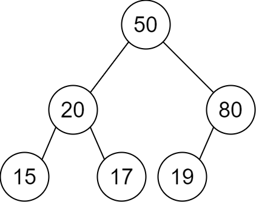
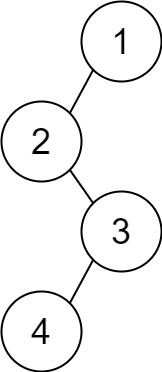

# 2196. Create Binary Tree From Descriptions

## Énoncé

Vous disposez d'un tableau 2D d'entiers `descriptions` où `descriptions[i] = [parenti, childi, isLefti]` indique que `parenti` est le **parent** de `childi` dans un arbre **binaire** de valeurs **uniques**. De plus,

- Si `isLefti == 1`, alors `childi` est l'enfant gauche de `parenti`.
- Si `isLefti == 0`, alors `childi` est l'enfant droit de `parenti`.

Construisez l'arbre binaire décrit par `descriptions` et renvoyez sa **racine**.

Les jeux de test sont générés de telle sorte que l'arbre binaire soit **valide**.

## Exemple

**Exemple 1:**



**Input:** descriptions = [[20,15,1],[20,17,0],[50,20,1],[50,80,0],[80,19,1]]  
**Output:** [50,20,80,15,17,19]

**Exemple 2:**



**Input:** descriptions = [[1,2,1],[2,3,0],[3,4,1]]  
**Output:** [1,2,null,null,3,4]

## Contraintes

`1 <= descriptions.length <= 10^4`  
`descriptions[i].length == 3`  
`1 <= parenti, childi <= 10^5`  
`0 <= isLefti <= 1`  
L'arbre binaire décrit par `descriptions` est valide.

## Note personnelle

Pour résoudre ce problème, j'ai utilisé une `HashMap` (ou `unordered_map` en C++) pour accéder facilement aux nœuds associés à chaque valeur.

Un autre défi de cet exercice est de trouver la racine de l'arbre. Pour cela, j'ai utilisé un `Ensemble` (`unordered_set`). À chaque insertion d'un parent dans la `HashMap`, je l'ajoute également à l'ensemble, et je supprime chaque enfant de cet ensemble. À la fin du processus, il ne reste qu'une seule valeur dans l'ensemble, qui est la racine de l'arbre.

```cpp
TreeNode* createBinaryTree(vector<vector<int>>& descriptions) {
  unordered_map<int, TreeNode*> mp; // Lecture des valeurs de la description
  unordered_set<int> set; // Set pour identifier les potentiels racines

  // Parcours de chaque description
  for(vector<int> &v : descriptions){
    TreeNode* parent = mp[v[0]]; // Récupère le noeud parent depuis la map
    TreeNode* child = mp[v[1]];  // Récupère le noeud enfant depuis la map

    // Si le noeud enfant n'existe pas encore
    if(!child){
      child = new TreeNode(v[1]); // Crée un nouveau noeud enfant
      mp[v[1]] = child;           // Ajoute le noeud enfant à la map
    }

    // Si le noeud parent n'existe pas encore
    if(!parent){
      parent = new TreeNode(v[0]); // Crée un nouveau noeud parent
      mp[v[0]] = parent;           // Ajoute le noeud parent à la map
      set.insert(v[0]);            // Ajoute le parent au set des potentiels racines
    }

    // Affecter l'enfant au parent
    if(v[2]){
      parent->left = child;
    }
    else{
      parent->right = child;
    }

    // L'enfant ne peut pas être une racine, donc on l'enlève du set
    set.erase(v[1]);
  }

  // Le seul élément restant dans le set est la racine de l'arbre
  return mp[*set.begin()];
}
```

- Complexité Temporelle: `O(n)`
- Complexité Spatiale: `O(n)`


