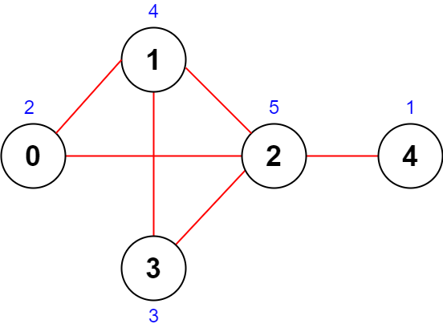

# 2285. Maximum Total Importance of Roads

## Énoncé

On vous donne un entier `n` représentant le nombre de villes dans un pays. Les villes sont numérotées de `0` à `n - 1`.

On vous donne également un tableau d'entiers à deux dimensions `roads` où `roads[i] = [ai, bi]` indique qu'il existe une route **bidirectionnelle** reliant les villes `ai` et `bi`.

Vous devez attribuer à chaque ville une valeur entière de `1` à `n`, chaque valeur ne pouvant être utilisée **qu'une seule fois**. L' **importance** d'une route est alors définie comme la **somme** des valeurs des deux villes qu'elle relie.

Retournez l'**importance totale maximale** de toutes les routes possibles après avoir attribué les valeurs de manière optimale.

## Exemple

**Exemple 1:**



**Input:** n = 5, roads = [[0,1],[1,2],[2,3],[0,2],[1,3],[2,4]]  
**Output:** 43  
**Explication:**  
La figure ci-dessus montre le pays et les valeurs attribuées de [2,4,5,3,1].

- La route (0,1) a une importance de 2 + 4 = 6.
- La route (1,2) a une importance de 4 + 5 = 9.
- La route (2,3) a une importance de 5 + 3 = 8.
- La route (0,2) a une importance de 2 + 5 = 7.
- La route (1,3) a une importance de 4 + 3 = 7.
- La route (2,4) a une importance de 5 + 1 = 6.

L'importance totale de toutes les routes est de 6 + 9 + 8 + 7 + 7 + 6 = 43.  
On peut montrer qu'il est impossible d'obtenir une importance totale plus grande que 43.

**Exemple 2:**


**Input:** n = 5, roads = [[0,3],[2,4],[1,3]]  
**Output:** 20  
**Explication:**  
La figure ci-dessus montre le pays et les valeurs attribuées de [4,3,2,5,1].

- La route (0,3) a une importance de 4 + 5 = 9.
- La route (2,4) a une importance de 2 + 1 = 3.
- La route (1,3) a une importance de 3 + 5 = 8.

L'importance totale de toutes les routes est de 9 + 3 + 8 = 20.  
On peut montrer qu'il est impossible d'obtenir une importance totale plus grande que 20.

## Contraintes

`2 <= n <= 5 * 10^4`  
`1 <= roads.length <= 5 * 10^4`  
`roads[i].length == 2`  
`0 <= ai, bi <= n - 1`  
`ai != bi`  
Il n'y a pas de routes en double.

## Note personnelle

Pour résoudre ce problème, l'enjeu principal réside dans le calcul optimal de l'importance de chaque ville, basé sur le nombre de ses connexions routières. J'ai adopté une approche gloutonne, attribuant un score à chaque ville en fonction du nombre de routes auxquelles elle est connectée. Cette stratégie maximise le score global en valorisant davantage les villes fortement connectées par rapport à celles avec moins de connexions.

### Première Approche

J'ai commencé par définir une structure pour représenter chaque ville, avec un identifiant unique (de `0` à `n - 1`) et un score initialisé à zéro. Ensuite, j'ai créé un tableau de taille `n` pour stocker ces structures.

J'ai parcouru la liste des routes pour calculer le nombre de connexions de chaque ville, en incrémentant le score correspondant dans le tableau.

Ensuite, j'ai trié ce tableau en ordre décroissant en fonction des scores.

Après avoir attribué les scores finaux aux villes selon l'ordre du tableau trié, j'ai procédé à un second tri pour réorganiser le tableau par identifiant de ville dans l'ordre croissant.

Enfin, j'ai calculé la somme totale de l'importance de chaque route en utilisant les scores des villes connectées.

```cpp
// Structure pour stocker l'ID d'une ville et son score associé
struct CountryScore{
    int cityID;
    int score;
};
long long maximumImportance(int n, vector<vector<int>>& roads) {
  // Tableau pour stocker les scores de chaque ville
  vector<CountryScore> arr;

  // Initialisation du tableau avec les IDs des villes et des scores à 0
  for(int i = 0; i < n; i++){
    arr.push_back( CountryScore(i, 0) );
  }

  // Incrémenter le score des villes connectées par des routes
  for(vector<int> &road : roads){
    arr[road[0]].score++;
    arr[road[1]].score++;
  }

  // Tri du tableau en fonction des scores décroissants
  sort(arr.begin(), arr.end(), [](CountryScore &a, CountryScore &b){
    return a.score > b.score;
  });

  // Assignation des nouvelles valeurs de scores basées sur l'ordre de tri
  for(CountryScore &c : arr){
    c.score = n--;
  }

  // Tri du tableau en fonction des IDs des villes pour correspondre aux indices originaux
  sort(arr.begin(), arr.end(), [](CountryScore &a, CountryScore &b){
    return a.cityID < b.cityID;
  });

  long long ans = 0;

  // Calcul de l'importance totale en utilisant les scores des villes connectées par des routes
  for(vector<int> &road : roads){
    ans += arr[road[0]].score;
    ans += arr[road[1]].score;
  }

  return ans;
}
```

- **Complexité temporelle**: `O(n log n + m)`.
- **Complexité spatiale**: `O(n)`.

### Optimisation

Après réflexion, j'ai identifié des actions coûteuses dans ma première solution qui ne sont pas nécessaires pour le calcul final. En simplifiant le processus, j'ai pu calculer directement le résultat tout en attribuant les scores finaux aux villes, évitant ainsi le tri supplémentaire par identifiant et le second parcours des routes.

```cpp
long long maximumImportance(long long n, vector<vector<int>>& roads) {
  // Tableau pour stocker le nombre de routes connectées à chaque ville
  vector<int> arr(n, 0);

  // Incrémenter le nombre de routes pour chaque ville connectée
  for(vector<int> &road : roads){
    arr[road[0]]++;
    arr[road[1]]++;
  }

  // Tri du tableau en ordre décroissant pour donner plus de valeur aux villes avec plus de routes
  sort(arr.begin(), arr.end(), [](int &a, int &b){
    return a > b;
  });

  long long ans = 0;

  // Calcul de l'importance totale en assignant les valeurs décroissantes
  for(int &a : arr){
    ans += a * n--; // Multiplier le nombre de routes par l'importance
  }

  return ans;
}
```

Cette approche est plus concise et optimisée par rapport à la première tout en produisant les mêmes résultats.

- **Complexité temporelle**: `O(n log n + m)`.
- **Complexité spatiale**: `O(n)`.

### Preuve de l'Optimalité de l'Approche Gloutonne

#### 1. Définition du Problème et Stratégie Gloutonne

- **Problème**: Maximiser l'importance totale d'un réseau routier où l'importance d'une route dépend de la somme des scores des deux villes qu'elle relie.
- **Stratégie Gloutonne**: Attribuer des scores plus élevés aux villes les plus connectées.

#### 2. Analyse de la Stratégie Gloutonne

Pour prouver que cette approche est optimale, nous allons utiliser une preuve par contradiction.

**2.1 Hypothèse**

Supposons par l'absurde qu'il existe une autre manière d'attribuer les scores qui ne suit pas la stratégie gloutonne mais qui permet tout de même de maximiser l'importance totale du réseau routier.

**2.2 Preuve par Contradiction**

- Soit **_v_** une ville avec un degré faible **_d(v)_** (nombre de routes connectées à **_v_**) et un score élevé attribué de manière non gloutonne.
- Soit **_u_** une ville avec un degré élevé **_d(u)_** mais un score moins élevé attribué de manière non gloutonne.

Si nous échangeons les scores de **_v_** et **_u_** dans notre attribution non gloutonne, l'importance totale augmentera. Cela est dû au fait que la ville **_u_**, étant plus connectée **(_d(u)_ > _d(v)_)** contribue potentiellement à plus de routes et donc à une importance totale plus élevée lorsque son score est augmenté. Par conséquent, toute attribution de score qui ne suit pas la stratégie gloutonne peut être améliorée.

#### Conclusion

Cette preuve par contradiction renforce la validité et l'efficacité de l'approche gloutonne pour résoudre ce problème d'optimisation, en assurant que chaque étape de l'attribution des scores contribue de manière significative à l'objectif global de maximisation de l'importance totale du réseau routier.


