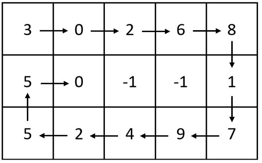

# 2326. Spiral Matrix IV

## Énoncé

On vous donne deux entiers `m` et `n`, qui représentent les dimensions d'une matrice.

On vous donne également la `head` d'une liste chaînée d'entiers.

Générez une matrice `m x n` qui contient les entiers de la liste chaînée présentés dans un ordre **spiralé (dans le sens des aiguilles d'une montre)**, en commençant par le **coin supérieur gauche** de la matrice. S'il reste des espaces vides, remplissez-les avec `-1`.

Retournez la matrice générée.

## Exemple

**Exemple 1:**



**Input:** m = 3, n = 5, head = [3,0,2,6,8,1,7,9,4,2,5,5,0]  
**Output:** [[3,0,2,6,8],[5,0,-1,-1,1],[5,2,4,9,7]]

**Exemple 2:**


**Input:** m = 1, n = 4, head = [0,1,2]  
**Output:** [[0,1,2,-1]]

## Contraintes

`1 <= m, n <= 10^5`  
`1 <= m * n <= 10^5`  
Le nombre de noeds dans la liste est compris dans la plage `[1, m * n]`.  
`0 <= Node.val <= 1000`

## Note personnelle

Le principe de cet exercice est similaire à celui de l'exercice [59. Spiral Matrix II](../0059.%20Spiral%20Matrix%20II/), la différence est qu'ici, nous devons remplir la matrice en utilisant les valeurs stockées dans une liste chaînée.

```cpp
// Directions pour les mouvements en spirale : droite, bas, gauche, haut
vector<vector<int>> dir = {{0, 1}, {1, 0}, {0, -1}, {-1, 0}};

vector<vector<int>> spiralMatrix(int m, int n, ListNode* head) {
  // Initialisation de la matrice avec -1
  vector<vector<int>> ans = vector<vector<int>>(m, vector<int>(n, -1));

  // Position initiale dans la matrice
  int row = 0;
  int col = -1;

  // Indice de direction (0 = droite, 1 = bas, 2 = gauche, 3 = haut)
  int d = 0;

  // Pointeur sur le nœud courant de la liste
  ListNode* curr = head;

  // Remplir la matrice en spirale jusqu'à ce que la liste soit épuisée
  while(curr){
    // Calculer la direction actuelle
    int currD = d % 4;

    // Déplacer vers la prochaine cellule
    row += dir[currD][0];
    col += dir[currD][1];

    // Vérifier les limites de la matrice et les cellules déjà remplies
    if(row < 0 || row == m || col < 0 || col == n || ans[row][col] != -1){
      // Revenir à la position précédente
      row -= dir[currD][0];
      col -= dir[currD][1];

      // Changer de direction
      d++;
      currD = d % 4;

      // Déplacer vers la prochaine cellule dans la nouvelle direction
      row += dir[currD][0];
      col += dir[currD][1];
    }

    // Remplir la cellule courante avec la valeur du nœud
    ans[row][col] = curr->val;
    // Passer au nœud suivant dans la liste
    curr = curr->next;
  }

  return ans;
}
```

- Complexité Temporelle: `O(n * m)`
- Complexité Spatiale: `O(n * m)`


