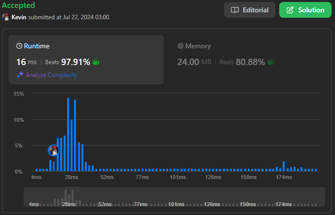

# 2418. Sort the People

## Énoncé

On vous donne un tableau de chaînes de caractères `names`, et un tableau `heights` qui consiste en des entiers positifs **distincts**. Les deux tableaux ont une longueur de `n`.

Pour chaque index `i`, `names[i]` et `heights[i]` représentent le nom et la taille de la `ième` personne.

Retournez `names` trié dans l'ordre **décroissant** selon les tailles des personnes.

## Exemple

**Exemple 1:**  
**Input:** names = ["Mary","John","Emma"], heights = [180,165,170]  
**Output:** ["Mary","Emma","John"]  
**Explication:** Mary est la plus grande, suivie d'Emma et de John.

**Exemple 2:**  
**Input:** names = ["Alice","Bob","Bob"], heights = [155,185,150]  
**Output:** ["Bob","Alice","Bob"]  
**Explication:** Le premier Bob est le plus grand, suivi d'Alice et du deuxième Bob.

## Contraintes

`n == names.length == heights.length`  
`1 <= n <= 10^3`  
`1 <= names[i].length <= 20`  
`1 <= heights[i] <= 10^5`  
`names[i]` consiste en des lettres anglaises majuscules et minuscules.  
Toutes les valeurs de `heights` sont distinctes.

## Note personnelle

### Approche 1: Naive

Cette approche consiste à sélectionner la personne la plus grande à chaque itération en utilisant des boucles imbriquées.

```cpp
vector<string> sortPeople(vector<string>& names, vector<int>& heights) {
  vector<string> ans; // Vecteur pour stocker le résultat trié

  // Boucle sur chaque élément dans le vecteur de noms
  for(int i = 0; i < names.size(); i++){
    int currMax = 0;    // Variable pour stocker la taille maximale actuelle trouvée
    int currIndex = -1; // Index de la personne avec la taille maximale

    // Recherche de la personne la plus grande non encore traitée
    for(int j = 0; j < names.size(); j++){
      if(heights[j] > currMax){
        currMax = heights[j]; // Met à jour la taille maximale trouvée
        currIndex = j;        // Met à jour l'index de la personne la plus grande
      }
    }

    // Ajoute le nom de la personne la plus grande trouvée à la réponse
    ans.push_back(names[currIndex]);
    // Marque cette taille comme traitée en la mettant à -1
    heights[currIndex] = -1;
  }

  return ans; // Retourne le vecteur de noms triés
}
```

- Complexité Temporelle: `O(n^2)`
- Complexité Spatiale: `O(n)`

### Approche 2: Tableau d'Indices Triés

Cette méthode utilise un tableau d'indices trié selon les tailles correspondantes. Les noms sont ensuite réorganisés selon cet ordre.

```cpp
vector<string> sortPeople(vector<string>& names, vector<int>& heights) {
  vector<int> indexs(names.size()); // Vecteur pour stocker les indices des personnes

  // Initialiser le vecteur d'indices avec les valeurs 0 à names.size() - 1
  for(int i = 0; i < names.size(); i++){
    indexs[i] = i;
  }

  // Tri des indices selon les hauteurs en ordre décroissant
  sort(indexs.begin(), indexs.end(), [&heights](int a, int b){
    return heights[a] > heights[b];
  });

  // Vecteur pour stocker les noms triés
  vector<string> ans;

  // Ajouter les noms dans l'ordre des indices triés
  for(int n : indexs){
    ans.push_back(names[n]);
  }

  // Retourner le vecteur des noms triés
  return ans;
}
```

- Complexité Temporelle: `O(n log n)`
- Complexité Spatiale: `O(n)`

### Approche 3: Tableau de Paires

Cette approche crée un tableau de paires, chaque paire contenant la taille et le nom d'une personne. Le tableau est ensuite trié par taille.

```cpp
vector<string> sortPeople(vector<string>& names, vector<int>& heights) {
  // Vecteur pour stocker les paires (taille, nom)
  vector<pair<int, string>> peoples;

  // Remplissage du vecteur de paires avec les tailles et les noms correspondants
  for(int i = 0; i < names.size(); i++){
    peoples.push_back({heights[i], names[i]});
  }

  // Trier le vecteur de paires par taille décroissante
  sort(peoples.begin(), peoples.end(), greater<pair<int, string>>());

  // Réorganiser le vecteur de noms en fonction du tri effectué
  for(int i = 0; i < peoples.size(); i++){
    names[i] = peoples[i].second;
  }

  // Retourner le vecteur des noms triés
  return names;
}
```

- Complexité Temporelle: `O(n log n)`
- Complexité Spatiale: `O(n)`

### Approche 4: HashMap

Cette méthode associe chaque taille à un nom via une `unordered_map`.  
Le tri est effectué sur le tableau `heights`, et les noms triés sont recréés.

```cpp
vector<string> sortPeople(vector<string>& names, vector<int>& heights) {
  // Map pour associer chaque taille à un nom
  unordered_map<int, string> mp;

  // Remplir la map avec les tailles comme clés et les noms comme valeurs
  for(int i = 0; i < names.size(); i++){
    mp[heights[i]] = names[i];
  }

  // Trier les tailles dans l'ordre décroissant
  sort(heights.begin(), heights.end(), greater<int>());

  // Réorganiser le vecteur de noms en fonction du tri des tailles
  for(int i = 0; i < names.size(); i++){
    names[i] = mp[heights[i]];
  }

  return names; // Retourner le vecteur des noms triés
}
```

- Complexité Temporelle: `O(n log n)`
- Complexité Spatiale: `O(n)`

### Approche 5: Map

Semblable à l'approche utilisant une `unordered_map`, mais ici nous utilisons une `map` pour maintenir les éléments triés selon les clés.

```cpp
vector<string> sortPeople(vector<string>& names, vector<int>& heights) {
  // Map pour associer chaque taille à un nom
  map<int, string> mp;

  // Remplir la map avec les tailles comme clés et les noms comme valeurs
  for(int i = 0; i < names.size(); i++){
    mp[heights[i]] = names[i];
  }

  // Réorganiser le vecteur de noms en fonction du tri des tailles
  int i = 0;
  for(auto it = mp.rbegin(); it != mp.rend(); it++){
    names[i++] = it->second;
  }

  return names; // Retourner le vecteur des noms triés
}
```

- Complexité Temporelle: `O(n log n)`
- Complexité Spatiale: `O(n)`

### Comparaison des différentes approches

Les performances des différentes approches sont évaluées comme suit. Les tests ont été réalisés avec 300 jeux de données de tailles variées:

- 100 jeux de taille 100
- 100 jeux de taille 1000
- 100 jeux de taille 10000

Rapport de performance généré avec [Benchmark Algorithm](https://github.com/SlicedPotatoes/BenchmarkAlgorithm).

```
Naive - Mean: 118.626 ms, Min: 48.300 µs, Max: 361.250 ms, Median: 3.591 ms
Tableau d'Indices Triés - Mean: 972.659 µs, Min: 19.200 µs, Max: 3.606 ms, Median: 214.450 µs
Tableau de Paires - Mean: 1.310 ms, Min: 30.400 µs, Max: 4.433 ms, Median: 317.900 µs
HashMap - Mean: 2.052 ms, Min: 53.900 µs, Max: 6.590 ms, Median: 554.550 µs
Map - Mean: 2.082 ms, Min: 48.400 µs, Max: 6.552 ms, Median: 534.650 µs
```

Les jeux de test ont été générés avec la fonction suivante:

```cpp
TC generateRandomData(int size) {
  Input input;
  std::random_device rd;
  std::mt19937 gen(rd());

  // Génération des hauteurs
  std::uniform_int_distribution<> dist(1, 100000);
  std::set<int> uniqueInts;
  while (uniqueInts.size() < size) {
    uniqueInts.insert(dist(gen));
  }
  std::vector<int> heights(uniqueInts.begin(), uniqueInts.end());
  get<1>(input) = heights;

  // Génération des noms
  const std::string chars = "abcdefghijklmnopqrstuvwxyzABCDEFGHIJKLMNOPQRSTUVWXYZ";
  std::vector<std::string> names;
  dist = uniform_int_distribution<>(0, chars.size() - 1);
  for (int i = 0; i < size; i++) {
    std::string str;
    for (int j = rand() % 20; j >= 0; j--) {
      str += chars[dist(gen)];
    }
    names.push_back(str);
  }
  get<0>(input) = names;

  // Récupération du résultat
  std::vector<std::string> result(size);
  std::map<int, std::string> mp;

  for (int i = 0; i < names.size(); i++) {
    mp[heights[i]] = names[i];
  }

  int i = 0;
  for (auto it = mp.rbegin(); it != mp.rend(); it++) {
    result[i++] = it->second;
  }

  return TC(input, result);
}
```



