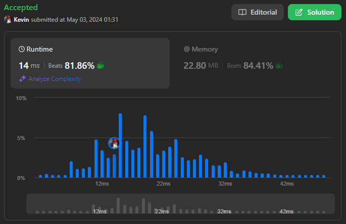
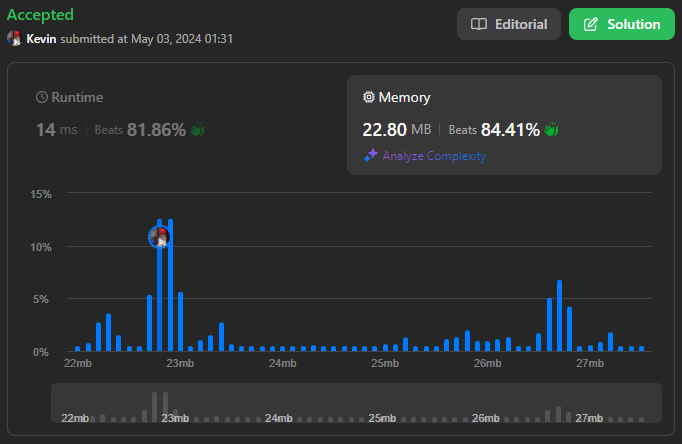

# 2441. Largest Positive Integer That Exists With Its Negative

## Énoncé

Étant donné un tableau d'entiers `nums` qui **ne contient aucun zéro**, trouvez le **plus grand entier positif** `k` tel que `-k` existe également dans le tableau.

Retournez l'entier positif `k`. S'il n'existe pas d'entier valide, retournez `-1`.

## Exemple

**Exemple 1:**  
**Input:** nums = [-1,2,-3,3]  
**Output:** 3  
**Explication:** 3 est le seul `k` valide que nous pouvons trouver dans le tableau.

**Exemple 2:**  
**Input:** nums = [-1,10,6,7,-7,1]  
**Output:** 7  
**Explication:** 1 et 7 ont leurs valeurs négatives correspondantes dans le tableau. 7 a une valeur plus grande.

**Exemple 3:**  
**Input:** nums = [-10,8,6,7,-2,-3]  
**Output:** -1  
**Explication:** l n'y a pas de `k` valide, nous retournons -1.

## Contraintes

`1 <= nums.length <= 1000`  
`-1000 <= nums[i] <= 1000`  
`nums[i] != 0`

## Note personnelle

### Approche 1: Ensemble

L'idée est d'utiliser un ensemble pour vérifier si un élément est présent dans le tableau.

Nous parcourons le tableau et, à chaque itération, nous ajoutons l'élément à l'ensemble. Nous vérifions si son opposé s'y trouve et mettons à jour `ans` en conséquence.

Une optimisation consiste à effectuer la recherche et l'ajout de l'élément dans l'ensemble seulement si la valeur absolue de l'élément est supérieure à `ans`.

```cpp
int findMaxK(vector<int>& nums) {
  int ans = -1; // Initialisation de la variable pour stocker le résultat

  unordered_set<int> set; // Ensemble pour stocker les valeurs rencontrées

  // Parcours des éléments du vecteur
  for(int n : nums){
    // Si la valeur absolue de l'élément courant est plus grande que ans
    if(abs(n) > ans){
      // Ajout de l'élément courant à l'ensemble
      set.insert(n);

      // Vérification si l'opposé de l'élément courant est présent dans l'ensemble
      if(n > 0 && set.contains(-n)){
        ans = n; // Mise à jour de ans
      }
      else if(n < 0 && set.contains(abs(n))){
        ans = abs(n); // Mise à jour de ans
      }
    }
  }

  return ans;
}
```

- Complexité Temporelle: `O(n)`
- Complexité Spatiale: `O(n)`

### Approche 2: Vecteur

L'idée de cette approche est de remplacer l'ensemble par un vecteur de booléens.

Cette approche est possible car les valeurs dans le tableau `nums` sont relativement petites.

```cpp
int findMaxK(vector<int>& nums) {
  // Initialise la variable pour stocker le plus grand nombre `K` trouvé
  int ans = -1;

  // Crée un vecteur de booléens pour suivre les éléments vus, avec un décalage pour gérer les nombres négatifs
  vector<bool> v(2000, false);

  // Parcours des éléments du vecteur `nums`
  for (int n : nums) {
    // Si la valeur absolue de l'élément courant est plus grande que ans
    if (abs(n) > ans) {
      v[n + 1000] = true; // Met à jour la présence de l'élément courant dans le vecteur `v`

      // Si l'indice opposé est présent, mettre à jour ans
      if(v[-n + 1000]){
        ans = abs(n);
      }
    }
  }

  return ans;
}
```

- Complexité Temporelle: `O(n)`
- Complexité Spatiale: `O(1)`

### Approche 3: Trie

L'idée de cette approche est de trier le tableau `nums` par valeurs absolues.

Ensuite, nous parcourons chaque paire consécutive jusqu'à trouver une paire où leurs valeurs absolues sont les mêmes mais avec des signes différents.

En effectuant ce parcours en partant de la fin, nous trouverons la paire d'éléments la plus grande.

```cpp
int findMaxK(vector<int>& nums) {
  // Trie le vecteur par la valeur absolue des éléments, en ordre croissant
  sort(nums.begin(), nums.end(), [](int a, int b) {
    return (abs(a) < abs(b));
  });

  // Pointeurs pour parcourir le vecteur de la fin vers le début
  int i = nums.size() - 1;
  int j = nums.size() - 2;

  // Parcourt le vecteur en arrière pour trouver le plus grand `K` avec `-K` également présent
  while(j >= 0){
    if(abs(nums[i]) == abs(nums[j]) && nums[i] != nums[j]){
      return abs(nums[i]);
    }
    i--;
    j--;
  }

  // Si aucun `K` valide n'a été trouvé, retourner -1
  return -1;
}
```

- Complexité Temporelle: `O(n log n)`
- Complexité Spatiale: `O(1)`

### Approche 4: Tri + Deux Pointeurs

L'idée de cette approche est de trier le tableau `nums` dans l'ordre croissant.

Nous initialisons deux pointeurs `i` et `j` à respectivement `0` et `nums.size() - 1`.

Nous itérons tant que:

- `i < j`.
- `nums[i] < 0` et `nums[j] > 0`

Si pendent l'itération `nums[i] == -nums[j]`, nous avons trouvé la paire la plus grande.

```cpp
int findMaxK(vector<int>& nums) {
  // Trie le vecteur en ordre croissant
  sort(nums.begin(), nums.end());

  // Initialisation des pointeurs pour parcourir le vecteur
  int i = 0;
  int j = nums.size() - 1;

  // Parcourt le vecteur jusqu'à ce que les pointeurs se croisent
  while(i < j){
    // Si l'élément à gauche est positif ou l'élément à droite est négatif, on ne peut pas trouver de `K` valide
    if(nums[i] > 0 || nums[j] < 0){
      return -1;
    }
    // Vérifie si les éléments aux positions `i` et `j` sont des opposés
    if(nums[i] == -nums[j]){
      return nums[j]; // Retourne la valeur absolue qui est le plus grand `K`
    }

    // Avance le pointeur `i` ou recule le pointeur `j` en fonction des valeurs
    if(abs(nums[i]) > nums[j]){
      i++; // Augmente `i` si l'élément à `i` est plus grand en valeur absolue
    }
    else{
      j--; // Diminue `j` si l'élément à `j` est plus grand en valeur absolue
    }
  }

  // Si aucun `K` valide n'est trouvé, retourne -1
  return -1;
}
```

- Complexité Temporelle: `O(n log n)`
- Complexité Spatiale: `O(1)`

### Comparaison des différentes approches

Rapport de performance généré avec [Benchmark Algorithm](https://github.com/SlicedPotatoes/BenchmarkAlgorithm).

Les performances des différentes approches sont évaluées comme suit. Les tests ont été réalisés avec 400 jeux de données de tailles variées:

**100 jeux de données de taille 500**:

```
Approche 1 - Mean: 21.656 µs, Min: 5.600 µs,  Max: 50.200 µs, Median: 20.550 µs
Approche 2 - Mean: 5.966 µs,  Min: 4.000 µs,  Max: 12.000 µs, Median: 5.800 µs
Approche 3 - Mean: 71.032 µs, Min: 68.900 µs, Max: 81.300 µs, Median: 70.900 µs
Approche 4 - Mean: 62.720 µs, Min: 60.800 µs, Max: 65.100 µs, Median: 62.500 µs
```

**100 jeux de données de taille 10^4**:

```
Approche 1 - Mean: 93.781 µs, Min: 71.600 µs, Max: 178.000 µs, Median: 91.000 µs
Approche 2 - Mean: 68.225 µs, Min: 63.500 µs, Max: 139.100 µs, Median: 66.950 µs
Approche 3 - Mean: 1.872 ms,  Min: 1.820 ms,  Max: 2.171 ms,   Median: 1.861 ms
Approche 4 - Mean: 1.678 ms,  Min: 1.626 ms,  Max: 1.948 ms,   Median: 1.672 ms
```

**100 jeux de données de taille 10^5**:

```
Approche 1 - Mean: 683.475 µs, Min: 645.700 µs, Max: 772.100 µs, Median: 679.900 µs
Approche 2 - Mean: 646.549 µs, Min: 616.000 µs, Max: 821.600 µs, Median: 643.150 µs
Approche 3 - Mean: 21.234 ms,  Min: 20.343 ms,  Max: 23.965 ms,  Median: 21.170 ms
Approche 4 - Mean: 19.152 ms,  Min: 18.473 ms,  Max: 24.687 ms,  Median: 19.062 ms
```

**100 jeux de données de taille 10^6**:

```
Approche 1 - Mean: 7.507 ms,   Min: 6.897 ms,   Max: 15.620 ms,  Median: 7.264 ms
Approche 2 - Mean: 7.344 ms,   Min: 6.901 ms,   Max: 8.792 ms,   Median: 7.222 ms
Approche 3 - Mean: 254.341 ms, Min: 244.527 ms, Max: 283.236 ms, Median: 252.922 ms
Approche 4 - Mean: 225.475 ms, Min: 216.261 ms, Max: 283.094 ms, Median: 222.939 ms
```

On remarque que l'approche 2 est la plus performante, optimisée pour ce problème avec ces contraintes spécifiques. Cependant, plus la taille des données augmente, plus l'écart de performance avec l'approche 1 se réduit. L'approche 1 est donc préférable car plus maintenable avec une différence de performance négligeable.

Si l'environnement d'exécution a des contraintes de mémoire élevées, les approches 3 ou 4 seront idéales, car elles privilégient une consommation de mémoire réduite tout en ayant un temps d'exécution raisonnable.

Les jeux de test ont été générés avec la fonction suivante:

```cpp
TC generateRandomData(int size) {
  Input input;
  std::random_device rd;
  std::mt19937 gen(rd());
  std::uniform_int_distribution<> dist(1, 1000);

  // Générer nums
  std::vector<int> nums;
  while (nums.size() < size) {
    int element = dist(gen);
    nums.push_back(element);
    if (dist(gen) % 10 == 0) {
      nums.push_back(-element);
    }
  }
  get<0>(input) = nums;

  // Récupérer le résultat
  int ans = -1;
  std::vector<bool> v(2000, false);
  for (int n : nums) {
    if (std::abs(n) > ans) {
      v[n + 1000] = true;
      if (v[-n + 1000])  {
        ans = std::abs(n);
      }
    }
  }

  return TC(input, ans);
}
```



