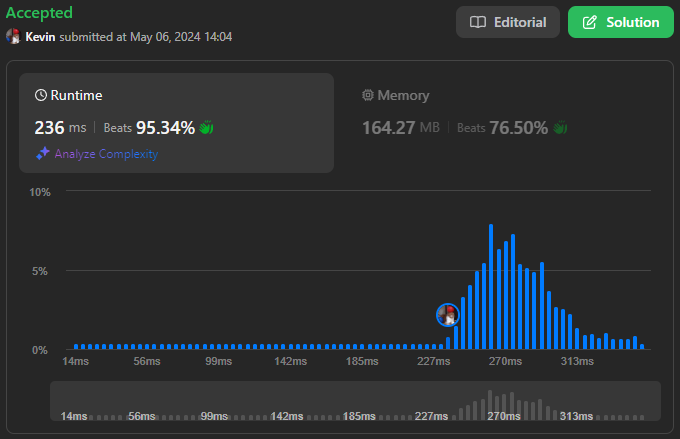
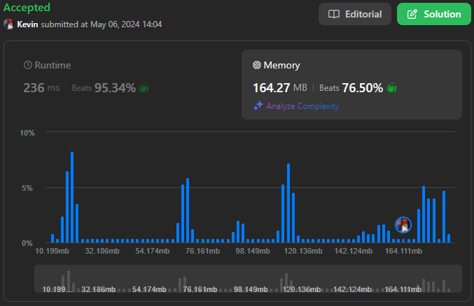

# 2487. Remove Nodes From Linked List

## Énoncé

Vous recevez la `head` d'une liste chaînée.

Supprimez chaque noeud qui a un noeud avec une valeur plus grande n'importe où sur sa droite.

Retournez la `head` de la liste chaînée modifiée.

## Exemple

**Exemple 1:**


**Input:** head = [5,2,13,3,8]  
**Output:** [13,8]  
**Explication:** Les noeuds à supprimer sont 5, 2 et 3.

- Le noeud 13 est à droite du noeud 5.
- Le noeud 13 est à droite du noeud 2.
- Le noeud 8 est à droite du noeud 3.

**Exemple 2:**  
**Input:** head = [1,1,1,1]  
**Output:** [1,1,1,1]  
**Explication:** Chaque noeud a la valeur 1, donc aucun noeud n'est supprimé.

## Contraintes

Le nombre de noeuds dans la liste donnée est dans la plage `[1, 10^5]`.  
`1 <= Node.val <= 10^5`

## Note personnelle

### Approche 1: Récursive

Cette méthode exploite la récursivité pour parcourir la liste chaînée en sens inverse.

```cpp
// Fonction récursive pour traiter la liste chaînée
ListNode* process(ListNode* head){
  // Si c'est le dernier noeud, le retourner
  if(!head->next){
    return head;
  }

  // Appel récursif sur le noeud suivant
  ListNode* currentHead = process(head->next);

  // Si la valeur du noeud courant est supérieure ou égale à celle du noeud suivant
  if(head->val >= currentHead->val){
    // Conserver le lien vers le noeud suivant
    head->next = currentHead;
    return head;
  }

  // Sinon, ne pas inclure le noeud courant dans la nouvelle liste
  return currentHead;
}

ListNode* removeNodes(ListNode* head) {
  return process(head);
}
```

- Complexité Temporelle: `O(n)`
- Complexité Spatiale: `O(n)`

### Approche 2: Itérative

Dans cette approche, nous commençons par inverser la liste d'origine, puis nous construisons la nouvelle liste de manière itérative.

```cpp
// Fonction pour inverser la liste chaînée
ListNode* reverse(ListNode* head){
  ListNode* prev = nullptr;
  ListNode* curr = head;

  // Boucle pour inverser les liens de la liste
  while(curr){
    ListNode* temp = curr->next;
    curr->next = prev;
    prev = curr;
    curr = temp;
  }

  return prev;
}

ListNode* removeNodes(ListNode* head) {
  // Inverser la liste pour traiter les noeuds du plus petit au plus grand
  ListNode* ans = reverse(head);
  ListNode* curr = ans->next;
  ans->next = nullptr;

  // Boucle pour filtrer les noeuds
  while(curr){
    // Si la valeur du noeud courant est supérieure ou égale à celle du noeud de réponse
    if(curr->val >= ans->val){
      // Réinsertion du noeud courant en tête de la nouvelle liste
      ListNode* temp = curr;
      curr = curr->next;
      temp->next = ans;
      ans = temp;
    }
    else{
      // Passer au noeud suivant si la condition n'est pas remplie
      curr = curr->next;
    }
  }

  return ans;
}
```

- Complexité Temporelle: `O(n)`
- Complexité Spatiale: `O(1)`



