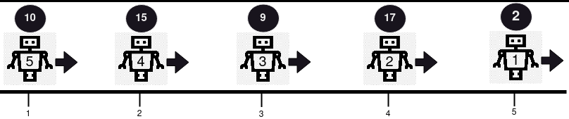
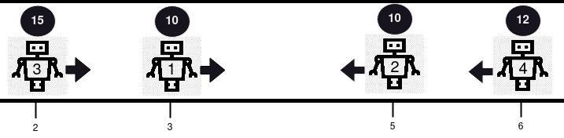
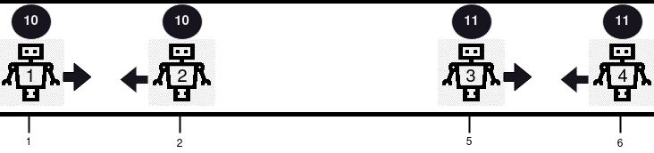
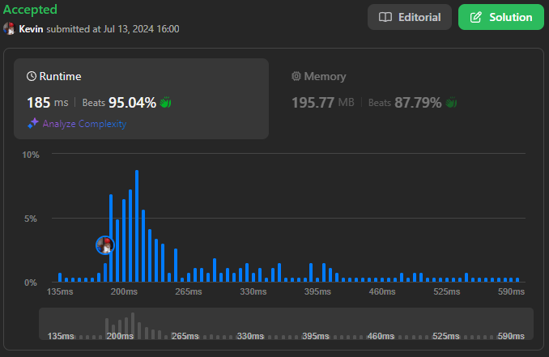
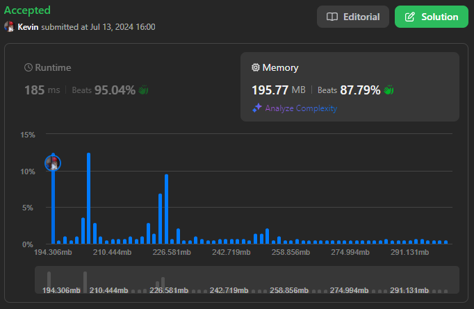

# 2751. Robot Collisions

## Énoncé

Il y a `n` robots **indexés à partir de 1**, chacun ayant une position sur une ligne, une santé et une direction de mouvement.

On vous donne des tableaux d'entiers **indexés à partir de 0** `positions`, `healths`, et une chaîne de caractères `directions` (`directions[i]` est soit **'L'** pour **gauche** soit **'R'** pour **droite**). Tous les entiers dans positions sont **uniques**.

Tous les robots commencent à se déplacer sur la ligne **simultanément** à la **même vitesse** dans les directions données. Si deux robots se retrouvent à la même position en se déplaçant, ils vont **entrer en collision**.

Si deux robots entrent en collision, le robot avec la **santé la plus faible** est **retiré** de la ligne, et la santé de l'autre robot **diminue de un**. Le robot survivant continue dans la **même** direction qu'il suivait. Si les deux robots ont la **même** santé, ils sont tous les deux retirés de la ligne.

Votre tâche est de déterminer la **santé** des robots qui survivent aux collisions, dans le même **ordre** que les robots ont été donnés, c'est-à-dire la santé finale du robot 1 (s'il survit), la santé finale du robot 2 (s'il survit), et ainsi de suite. S'il n'y a aucun survivant, retournez un tableau vide.

Retournez un tableau contenant la santé des robots restants (dans l'ordre dans lequel ils ont été donnés en entrée), après qu'aucune collision supplémentaire ne puisse se produire.

**Remarque**: Les positions peuvent ne pas être triées.

## Exemple

**Exemple 1:**



**Input:** positions = [5,4,3,2,1], healths = [2,17,9,15,10], directions = "RRRRR"  
**Output:** [2,17,9,15,10]  
**Explication:** Aucune collision ne se produit dans cet exemple puisque tous les robots se déplacent dans la même direction. Ainsi, la santé des robots dans l'ordre à partir du premier robot est renvoyée, [2, 17, 9, 15, 10].

**Exemple 2:**



**Input:** positions = [3,5,2,6], healths = [10,10,15,12], directions = "RLRL"  
**Output:** [14]  
**Explication:** Il y a 2 collisions dans cet exemple. Premièrement, le robot 1 et le robot 2 entreront en collision, et comme les deux ont la même santé, ils seront retirés de la ligne. Ensuite, le robot 3 et le robot 4 entreront en collision et comme la santé du robot 4 est plus petite, elle sera supprimée et la santé du robot 3 deviendra 15 - 1 = 14. Seul le robot 3 reste, nous revenons donc [14].

**Exemple 3:**



**Input:** positions = [1,2,5,6], healths = [10,10,11,11], directions = "RLRL"  
**Output:** []  
**Explication:** Le robot 1 et le robot 2 entreront en collision et comme les deux ont la même santé, ils seront tous deux supprimés. Les robots 3 et 4 entreront en collision et comme les deux ont la même santé, ils seront tous deux supprimés. Nous renvoyons donc un tableau vide, [].

## Contraintes

`1 <= positions.length == healths.length == directions.length == n <= 10^5`  
`1 <= positions[i], healths[i] <= 10^9`  
`directions[i] == 'L'` ou `directions[i] == 'R'`  
Toutes les valeurs dans `positions` sont distinctes

## Note personnelle

### Approche 1: Simulation

Dans cette approche, l'idée était de détecter les collisions entre robots à l'instant le plus tot.

Ce processus a été répété jusqu'à ce qu'il n'y ait plus de collisions.

```cpp
// Définition de la structure Robot
struct Robot{
  int index;
  int pos;
  int health;
  char dir;

  // Constructeur pour initialiser les attributs du robot
  Robot(int index, int pos, int health, char dir){
    this->index = index;
    this->pos = pos;
    this->health = health;
    this->dir = dir;
  }
};

class Solution {
public:
  vector<int> survivedRobotsHealths(vector<int>& positions, vector<int>& healths, string directions) {
    vector<Robot*> robots;

    // Création des objets Robot et stockage dans le vecteur robots
    for(int i = 0; i < positions.size(); i++){
      robots.push_back(new Robot(i, positions[i], healths[i], directions[i]));
    }

    // Boucle principale pour gérer les collisions
    while(robots.size() != 0){
      // Tri des robots par position
      sort(robots.begin(), robots.end(), [](Robot* a, Robot* b){
        return a->pos < b->pos;
      });

      vector<pair<Robot*, Robot*>> colisionsAtSameTime;
      int timeColisions = INT_MAX;

      // Détection des collisions
      for(int i = 1; i < robots.size(); i++){
        Robot* curr = robots[i];
        Robot* last = robots[i - 1];

        if(last->dir == 'R' && curr->dir == 'L'){
          int tC = curr->pos - last->pos;
          if(tC % 2 == 1){
            tC++;
          }
          tC /= 2;

          if(tC == timeColisions){
            colisionsAtSameTime.push_back({last, curr});
          }
          else if(tC < timeColisions){
            colisionsAtSameTime = {};
            colisionsAtSameTime.push_back({last, curr});
            timeColisions = tC;
          }
        }
        else{
          last = curr;
        }
      }

      // Si aucune collision, sortir de la boucle
      if(colisionsAtSameTime.size() == 0){
        break;
      }

      // Gestion des collisions
      for(auto &colision: colisionsAtSameTime){
        if(colision.first->health == colision.second->health){
          colision.first->health = 0;
          colision.second->health = 0;
        }
        else if(colision.first->health > colision.second->health){
          colision.first->health--;
          colision.second->health = 0;
        }
        else{
          colision.first->health = 0;
          colision.second->health--;
        }
      }

      // Suppression des robots détruits
      int j = robots.size() - 1;
      for(int i = robots.size() - 1; i >= 0; i--){
        if(robots[i]->health == 0){
          swap(robots[i], robots[j--]);
        }
      }
      while(robots.size() >= 1 && robots.back()->health == 0){
        robots.pop_back();
      }
    }

    // Trier les robots par index pour obtenir la réponse dans l'ordre correct
    sort(robots.begin(), robots.end(), [](Robot* a, Robot* b){
      return a->index < b->index;
    });

    // Extraction des santés des robots survivants
    vector<int> ans;
    for(Robot* r: robots){
      ans.push_back(r->health);
    }

    return ans;
  }
};
```

- Complexité Temporelle: `O(n^2 log n)`
- Complexité Spatiale: `O(n)`

Cette approche n'était pas suffisamment performante pour passer tous les tests.
Cependant avec quelques modifications, cette approche pourrait être performante dans le cas où les robots ont des vitesses différentes (la technique de la pile ne fonctionne pas dans ce contexte).

### Approche 2: Utilisation d'une Pile

Cette approche est similaire à celle de l'exercice [735. Asteroid Collision](../0735.%20Asteroid%20Collision/)

Les robots sont traités progressivement en parcourant la liste triée par position. Ceux se déplaçant vers la droite sont ajoutés directement à une pile. Lorsqu'un robot se déplaçant vers la gauche est rencontré, on remonte la pile en retirant les robots se déplaçant vers la droite avec moins de santé. Le robot courant est ajouté à la pile s'il survit à toutes les collisions.

```cpp
// Définition de la structure Robot
struct Robot{
  int index;
  int pos;
  int health;
  char dir;

  // Constructeur pour initialiser les attributs du robot
  Robot(int index, int pos, int health, char dir){
    this->index = index;
    this->pos = pos;
    this->health = health;
    this->dir = dir;
  }
};

class Solution {
public:
  vector<int> survivedRobotsHealths(vector<int>& positions, vector<int>& healths, string directions) {
    vector<Robot*> robots;

    // Création des objets Robot et stockage dans le vecteur robots
    for(int i = 0; i < positions.size(); i++){
      robots.push_back(new Robot(i, positions[i], healths[i], directions[i]));
    }

    // Tri des robots par position actuelle
    sort(robots.begin(), robots.end(), [](Robot* a, Robot* b){
      return a->pos < b->pos;
    });

    // Gestion des collisions
    vector<Robot*> stack;
    for(Robot* r: robots){
      // Si le robot se déplace vers la droite, on l'ajoute à la pile
      if(r->dir == 'R'){
        stack.push_back(r);
      }
      // Si le robot se déplace vers la gauche
      else{
        // Tant qu'il y a des robots dans la pile se déplaçant vers la droite avec moins de santé, on les retire de la pile et réduit la santé du robot actuel
        while(!stack.empty() && stack.back()->dir == 'R' && stack.back()->health < r->health){
          stack.pop_back();
          r->health--;
        }
        // Si la pile est vide ou que le dernier robot dans la pile se déplace vers la gauche, on ajoute le robot actuel à la pile
        if(stack.empty() || stack.back()->dir == 'L'){
          stack.push_back(r);
        }
        // Si le dernier robot dans la pile a la même santé que le robot actuel, on retire le dernier robot de la pile
        else if(stack.back()->health == r->health){
          stack.pop_back();
        }
        // Sinon, on réduit la santé du dernier robot dans la pile
        else{
          stack.back()->health--;
        }
      }
    }

    // Tri des robots survivants par leur index d'origine
    sort(stack.begin(), stack.end(), [](Robot* a, Robot* b){
      return a->index < b->index;
    });

    // Création du vecteur de sortie contenant les santés des robots survivants
    vector<int> ans;
    for(Robot* r: stack){
      ans.push_back(r->health);
    }

    // Nettoyage de la mémoire en libérant les objets Robot alloués dynamiquement
    for(Robot* r: robots) {
      delete r;
    }

    return ans;
  }
};
```

- Complexité Temporelle: `O(n log n)`
- Complexité Spatiale: `O(n)`

### Optimisation

Plutôt que de créer un tableau de robots, une amélioration consiste à utiliser un tableau d'indices, évitant ainsi la copie des attributs de chaque robot dans un nouvel objet.

```cpp
vector<int> survivedRobotsHealths(vector<int>& p, vector<int>& h, string d) {
  // Création d'un vecteur d'indices
  vector<int> indexs(p.size());
  for(int i = 0; i < p.size(); i++){
    indexs[i] = i;
  }

  // Tri des indices en fonction des positions actuelles des robots
  sort(indexs.begin(), indexs.end(), [&p](int a, int b){
    return p[a] < p[b];
  });

  // Gestion des collisions
  vector<int> stack;
  for(int r: indexs){
    // Si le robot se déplace vers la droite, on l'ajoute à la pile
    if(d[r] == 'R'){
      stack.push_back(r);
    }
    // Si le robot se déplace vers la gauche
    else{
      // Tant qu'il y a des robots dans la pile se déplaçant vers la droite avec moins de santé, on les retire de la pile et réduit la santé du robot actuel
      while(!stack.empty() && d[stack.back()] == 'R' && h[stack.back()] < h[r]){
        stack.pop_back();
        h[r]--;
      }

      // Si la pile est vide ou que le dernier robot dans la pile se déplace vers la gauche, on ajoute le robot actuel à la pile
      if(stack.empty() || d[stack.back()] == 'L'){
        stack.push_back(r);
      }
      // Si le dernier robot dans la pile a la même santé que le robot actuel, on retire le dernier robot de la pile
      else if(h[stack.back()] == h[r]){
        stack.pop_back();
      }
      // Sinon, on réduit la santé du dernier robot dans la pile
      else{
        h[stack.back()]--;
      }
    }
  }

  // Tri des indices des robots survivants pour obtenir les résultats dans l'ordre des indices d'origine
  sort(stack.begin(), stack.end());

  // Création du vecteur de sortie contenant les santés des robots survivants
  vector<int> ans;
  for(int r: stack){
    ans.push_back(h[r]);
  }
  return ans;
}
```

- Complexité Temporelle: `O(n log n)`
- Complexité Spatiale: `O(n)`



