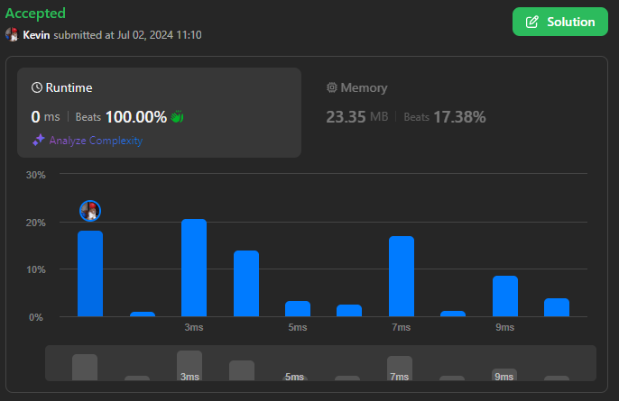
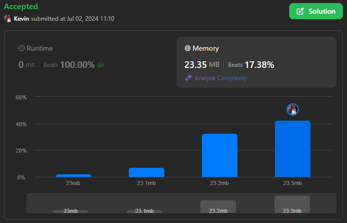

# 2798. Number of Employees Who Met the Target

## Énoncé

Il y a `n` employés dans une entreprise, numérotés de `0 to n - 1`. Chaque employé `i` a travaillé pendant `hours[i]` heures dans l'entreprise.

L'entreprise exige que chaque employé travaille **au moins** `target` heures.

On vous donne un tableau **indexé à partir de 0** de nombres entiers non négatifs `hours` de longueur `n` et un entier non négatif `target`.

Retournez l'entier représentant le nombre d'employés ayant travaillé au moins `target` heures.

## Exemple

**Exemple 1:**  
**Input:** hours = [0,1,2,3,4], target = 2  
**Output:** 3  
**Explication:** La société souhaite que chaque employé travaille au moins 2 heures.

- L'employé 0 a travaillé pendant 0 heure et n'a pas atteint l'objectif.
- L'employé 1 a travaillé pendant 1 heure et n'a pas atteint l'objectif.
- L'employé 2 a travaillé pendant 2 heures et a atteint l'objectif.
- L'employé 3 a travaillé pendant 3 heures et a atteint l'objectif.
- L'employé 4 a travaillé pendant 4 heures et a atteint l'objectif.

Il y a 3 employés qui ont atteint l'objectif.

**Exemple 2:**  
**Input:** hours = [5,1,4,2,2], target = 6  
**Output:** 0  
**Explication:** L'entreprise souhaite que chaque employé travaille au moins 6 heures.
Il y a 0 employé qui a atteint l’objectif.

## Contraintes

`1 <= n == hours.length <= 50`  
`0 <= hours[i], target <= 10^5`

## Note personnelle

Cet exercice est assez simple et direct. Il s'agit principalement d'une itération sur chaque élément du tableau avec une condition de vérification.

```cpp
int numberOfEmployeesWhoMetTarget(vector<int>& hours, int target) {
  int ans = 0; // Initialise le compteur à 0

  // Parcourt chaque nombre d'heures dans le vecteur
  for(int n : hours){
    // Vérifie si le nombre d'heures est supérieur ou égal à la cible
    if(n >= target){
      ans++; // Incrémente le compteur
    }
  }

  return ans; // Retourne le nombre d'employés ayant atteint la cible
}
```

- Complexité Temporelle: `O(n)`.
- Complexité Spatiale: `O(1)`.



