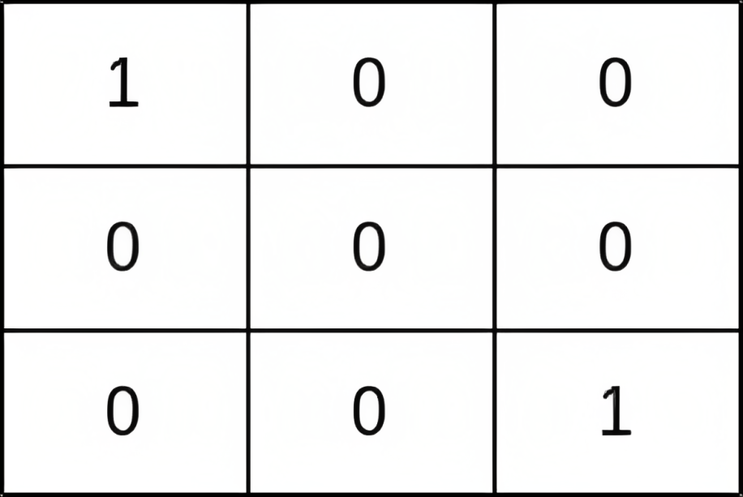
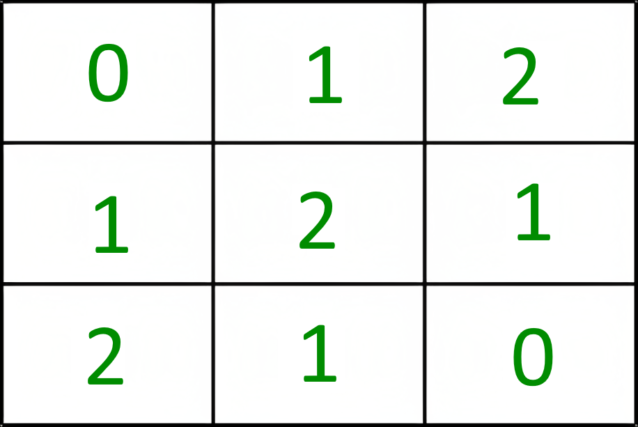
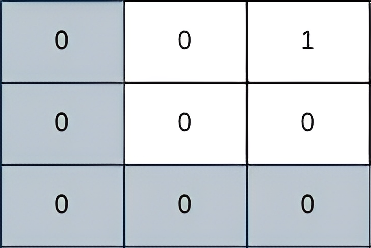
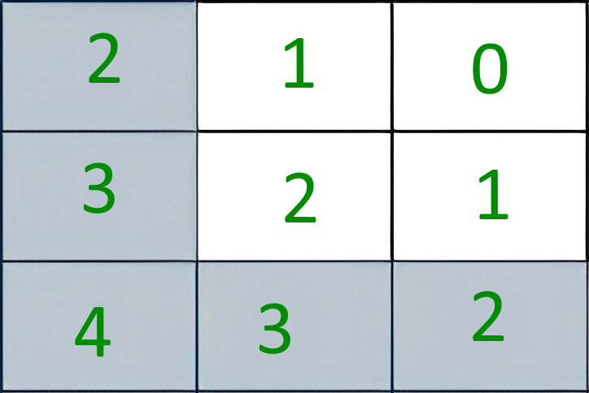
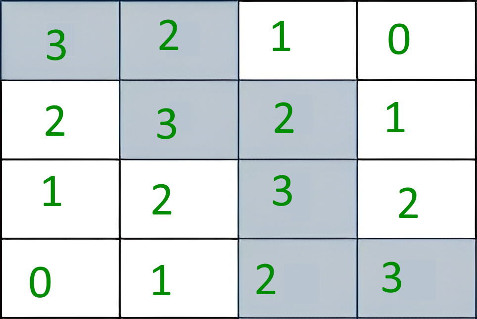

# 2812. Find the Safest Path in a Grid

## Énoncé

Vous disposez d'une matrice 2D **indexée à partir de 0** `grid` de taille `n x n`, où `(r, c)` représente:

- Une cellule contenant un voleur si `grid[r][c] = 1`
- Une cellule vide si `grid[r][c] = 0`

Vous êtes initialement positionné à la cellule `(0, 0)`. Lors d'un mouvement, vous pouvez vous déplacer vers n'importe quelle cellule adjacente dans la grille, y compris les cellules contenant des voleurs.

Le **facteur de sécurité** d'un chemin sur la grille est défini comme la **distance de Manhattan minimale** entre n'importe quelle cellule du chemin et n'importe quel voleur dans la grille.

Retournez le **facteur de sécurité maximal** de tous les chemins menant à la cellule `(n - 1, n - 1)`.

La **distance de Manhattan** entre deux cellules `(a, b)` et `(x, y)` est égale à `|a - x| + |b - y|`.

## Exemple

Pour chaque exemple, la premiere image représente la grille recu par le programme, la seconde représente le facteur de sécurité pour chaque case.

**Exemple 1:**

 

**Input:** grid = [[1,0,0],[0,0,0],[0,0,1]]  
**Output:** 0  
**Explication:** Tous les chemins de (0, 0) à (n - 1, n - 1) passent par les voleurs dans les cellules (0, 0) et (n - 1, n - 1).

**Exemple 2:**

 

**Input:** grid = [[0,0,1],[0,0,0],[0,0,0]]  
**Output:** 2  
**Explication:** Le chemin représenté sur l'image ci-dessus a un facteur de sécurité de 2

**Exemple 3:**

 

**Input:** grid = [[0,0,0,1],[0,0,0,0],[0,0,0,0],[1,0,0,0]]  
**Output:** 2  
**Explication:** Le chemin représenté sur l'image ci-dessus a un facteur de sécurité de 2 since:

## Contraintes

`1 <= grid.length == n <= 400`  
`grid[i].length == n`  
`grid[i][j]` est `0` ou `1`  
Il y a au moins un voleur dans la `grid`

## Note personnelle

Mon approche se décompose en deux étapes principales avant d’obtenir le résultat:

**Première étape**: Pré-calcul des facteurs de sécurité pour chaque case de la grille.  
Ce pré-calcul nécessite deux passages sur la grille.

```cpp
vector<vector<int>> arr(n, vector<int>(n, 1000)); // Initialiser la matrice

// Première passe : calculer les distances minimales des obstacles (valeur 1)
for (int i = 0; i < n; i++) {
  for (int j = 0; j < n; j++) {
    if (grid[i][j] == 1) {
      arr[i][j] = 0;
      continue;
    }
    int m = arr[i][j];

    // Vérifier les voisins au-dessus et à gauche
    if (i != 0) {
      m = min(m, arr[i - 1][j]);
    }
    if (j != 0) {
      m = min(m, arr[i][j - 1]);
    }

    arr[i][j] = m + 1;
  }
}

// Deuxième passe : raffiner les distances en considérant les autres directions
for (int i = n - 1; i >= 0; i--) {
  for (int j = n - 1; j >= 0; j--) {
    if (grid[i][j] == 1) {
      continue;
    }
    int m = arr[i][j];

    // Vérifier les voisins dans les quatre directions
    for (int d = 0; d < 4; d++) {
      int y = i + dy[d];
      int x = j + dx[d];

      if (y >= 0 && y < n && x >= 0 && x < n) {
        m = min(m, arr[y][x]);
      }
    }

    arr[i][j] = m + 1;
  }
}
```

**Deuxième étape**: Utilisation d’une version modifiée de l'algorithme de Dijkstra pour trouver le chemin le plus sécurisé.

```cpp
// Fonction d'aide pour calculer le facteur de sécurité maximal
int helper(vector<vector<int>> &arr) {
  // Priority queue utilisant notre comparateur personnalisé
  priority_queue<Node, vector<Node>, Compare> pq;
  pq.push(Node(0, 0, arr[0][0]));
  arr[0][0] = -1; // Marquer comme visité

  // Initialiser la valeur minimale au maximum possible
  int minValue = INT_MAX;

  while (!pq.empty()) {
    Node curr = pq.top();
    pq.pop();

    // Mettre à jour la valeur minimale rencontrée
    minValue = min(minValue, curr.value);

    // Si nous avons atteint le coin bas-droit, nous avons fini
    if (curr.y == n - 1 && curr.x == n - 1) {
      break;
    }

    // Explorer les voisins
    for (int d = 0; d < 4; d++) {
      int y = curr.y + dy[d];
      int x = curr.x + dx[d];

      // Vérifier si le voisin est valide et non visité
      if (y >= 0 && y < n && x >= 0 && x < n && arr[y][x] != -1) {
        pq.push(Node(y, x, arr[y][x]));
        arr[y][x] = -1; // Marquer comme visité
      }
    }
  }

  return minValue; // Retourner la valeur minimale trouvée sur le chemin
}
```

L'implémentation complète se trouve [ici](./main.cpp)

- Complexité temporelle: `O(n^2 log n^2)`
- Complexité spatiale: `O(n^2)`


