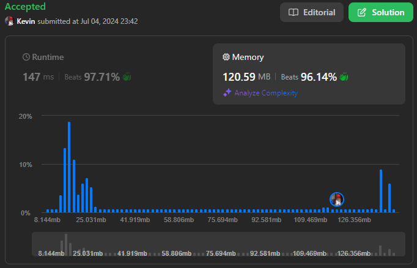

# 2816. Double a Number Represented as a Linked List

## Énoncé

On vous donne la `head` d'une liste chaînée **non vide** représentant un entier non négatif sans zéros non significatifs.

Retournez la `head` de la liste chaînée après l'avoir **doublée**.

## Exemple

**Exemple 1:**


**Input:** head = [1,8,9]  
**Output:** [3,7,8]  
**Explication:** La liste chaînée donnée représente le nombre 189. Par conséquent, la liste chaînée renvoyée représente le nombre 189 \* 2 = 378.

**Exemple 2:**


**Input:** head = [9,9,9]  
**Output:** [1,9,9,8]  
**Explication:** La liste chaînée donnée représente le nombre 999. Par conséquent, la liste chaînée renvoyée représente le nombre 999 \* 2 = 1998.

## Contraintes

Le nombre de nœuds dans la liste est compris entre `[1, 10^4]`.
`0 <= Node.val <= 9`  
L'entrée est générée de telle sorte que la liste représente un nombre qui n'a pas de zéros non significatifs, à l'exception du nombre `0` lui-même.

## Note personnelle

### Approche 1: Récursive

L'utilisation de la récursivité permet de commencer par la fin, en passant également un pointeur booléen pour suivre l'état de la retenue.

```cpp
// Fonction récursive pour doubler chaque élément de la liste
ListNode* process(ListNode* head, bool &carry){
  // Cas de base : si la tête de liste est nulle, retourner nullptr
  if(!head){
    return nullptr;
  }

  // Appel récursif pour traiter les éléments suivants de la liste
  process(head->next, carry);

  // Calcul de la nouvelle valeur pour le nœud actuel
  int newValue = (head->val * 2) + carry;

  // Mettre à jour la valeur du nœud actuel avec le résultat mod 10
  head->val = newValue % 10;
  // Mettre à jour la retenue pour le nœud suivant
  carry = newValue >= 10;

  // Retourner la tête de liste mise à jour
  return head;
}

ListNode* doubleIt(ListNode* head) {
  // Initialiser la retenue à false (pas de retenue au départ)
  bool carry = false;

  // Appeler la fonction récursive pour traiter la liste
  head = process(head, carry);

  // Si un carry est restant à la fin du traitement de la liste, ajouter un nouveau nœud avec la valeur 1 au début de la liste
  if(carry){
    return new ListNode(1, head);
  }

  // Retourner la tête de liste mise à jour
  return head;
}
```

- Complexité Temporelle: `O(n)`.
- Complexité Spatiale: `O(n)`.

### Approche 2: Itérative Stack

L'idée est d'utiliser une pile, simulant la pile d'appels de l'approche récursive.

```cpp
ListNode* doubleIt(ListNode* head) {
  stack<ListNode*> s; // Utilisation d'une pile pour inverser l'ordre des nœuds
  ListNode* curr = head;

  // Parcours de la liste et empilement des nœuds dans la pile
  while(curr){
    s.push(curr);
    curr = curr->next;
  }

  bool carry = false;

  // Traitement des nœuds en dépilant de la pile
  while(!s.empty()){
    curr = s.top();
    s.pop();

    // Doublage de la valeur du nœud actuel et ajout de la retenue
    curr->val = curr->val * 2 + carry;

    // Mise à jour de la retenue pour le prochain nœud
    carry = curr->val >= 10;
    curr->val %= 10;
  }

  // Si une retenue est restante après avoir traité tous les nœuds, ajouter un nouveau nœud avec la valeur 1
  if(carry){
    return new ListNode(1, curr);
  }

  return curr; // Retourne la tête de liste mise à jour
}
```

- Complexité Temporelle: `O(n)`.
- Complexité Spatiale: `O(n)`.

### Approche 3: Itérative Reverse

L'idée est d'inverser la liste, doubler ses éléments, puis la rétablir dans son ordre d'origine.

```cpp
// Fonction pour inverser une liste chaînée
ListNode* reverse(ListNode* head){
  ListNode* prev = nullptr;
  ListNode* curr = head;

  while(curr){
    ListNode* temp = curr->next;  // Sauvegarde du prochain nœud
    curr->next = prev;            // Inversion de la direction du lien
    prev = curr;                  // Mettre à jour 'prev' avec le nœud actuel
    curr = temp;                  // Mettre à jour 'curr' avec le prochain nœud
  }

  return prev; // Retourne la nouvelle tête de liste inversée
}

// Fonction principale pour doubler chaque élément de la liste chaînée
ListNode* doubleIt(ListNode* head) {
  head = reverse(head); // Inverse la liste chaînée pour faciliter le traitement

  ListNode* curr = head;
  bool carry = false;

  // Parcours de la liste pour doubler chaque valeur
  while(curr){
    curr->val = curr->val * 2 + carry; // Double la valeur du nœud actuel et ajoute la retenue

    carry = curr->val >= 10; // Met à jour la retenue si la valeur dépasse 9
    curr->val %= 10;

    curr = curr->next; // Déplace le pointeur vers le prochain nœud
  }

  head = reverse(head); // Réinverse la liste chaînée pour restaurer l'ordre d'origine

  // Si il y a une retenue après le traitement, ajoute un nouveau nœud avec la valeur 1
  if(carry){
    return new ListNode(1, head);
  }

  return head; // Retourne la tête de liste mise à jour
}
```

- Complexité Temporelle: `O(n)`.
- Complexité Spatiale: `O(1)`.

### Optimisation Approche 3

Une optimisation de l'approche 3 consiste à doubler les éléments lors de la seconde inversion, évitant ainsi une itération supplémentaire sur la liste.

```cpp
ListNode* doubleIt(ListNode* head) {
  // Phase 1: Inversion de la liste chaînée
  ListNode* prev = nullptr;
  ListNode* curr = head;

  while(curr){
    ListNode* temp = curr->next;  // Sauvegarde du prochain nœud
    curr->next = prev;            // Inversion de la direction du lien
    prev = curr;                  // Mettre à jour 'prev' avec le nœud actuel
    curr = temp;                  // Mettre à jour 'curr' avec le prochain nœud
  }

  head = prev; // La nouvelle tête de liste est le dernier nœud de l'ancienne liste

  // Phase 2: Doublement des valeurs et ré-inversion de la liste
  prev = nullptr;
  curr = head;
  bool carry = false;

  while(curr){
    // Doublage de la valeur du nœud actuel et gestion de la retenue
    curr->val = curr->val * 2 + carry;
    carry = curr->val >= 10; // Mise à jour de la retenue si la valeur dépasse 9
    curr->val %= 10;

    // Ré-inversion de la liste pour restaurer l'ordre d'origine
    ListNode * temp = curr->next;
    curr->next = prev;
    prev = curr;
    curr = temp;
  }

  head = prev; // Rétablit la tête de liste après la ré-inversion finale

  // Si une retenue est restant après le traitement, ajoute un nouveau nœud avec la valeur 1
  if(carry){
    return new ListNode(1, head);
  }

  // Retourne la tête de liste mise à jour
  return head;
}
```

- Complexité Temporelle: `O(n)`.
- Complexité Spatiale: `O(1)`.

### Comparaison des différentes méthodes

- **Approche 1: Récursive**: C'est probablement la solution la plus intuitive pour ce problème, notamment pour ceux familiarisés avec la récursion. Elle est simple et concise.
- **Approche 2: Itérative Stack**: Pour ceux qui préfèrent éviter la récursion ou sont plus à l'aise avec les piles, cette approche est la plus simple à mettre en œuvre.
- **Approche 3: Itérative Reverse**: C'est la méthode la plus optimale pour résoudre ce problème, bien que la récursivité puisse sembler plus optimale au premier abord, elle parcourt effectivement la liste deux fois (une fois pour créer la pile d'appels récursifs et une fois pour dépiler et calculer le résultat). Le fais qu'elle n'utilise pas d'espace suplémentaire la rend donc meilleure que les autres.



