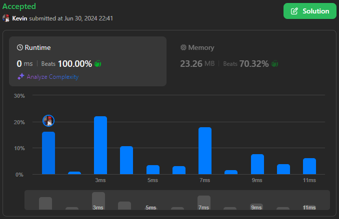
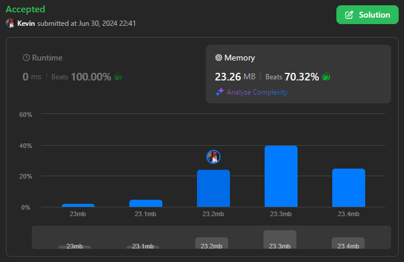

# 2824. Count Pairs Whose Sum is Less than Target

## Énoncé

Étant donné un tableau d'entiers **indexé à partir de 0** `nums` de longueur `n` et un entier `target`, retourne le nombre de paires `(i, j)` où `0 <= i < j < n` et `nums[i] + nums[j] < target`.

## Exemple

**Exemple 1:**  
**Input:** nums = [-1,1,2,3,1], target = 2  
**Output:** 3  
**Explication:**  
Il y a 3 paires d'indices qui satisfont les conditions énoncées:

- (0, 1) puisque 0 < 1 et nums[0] + nums[1] = 0 < target
- (0, 2) puisque 0 < 2 et nums[0] + nums[2] = 1 < target
- (0, 4) puisque 0 < 4 et nums[0] + nums[4] = 0 < target

Notez que (0, 3) n'est pas compté car nums[0] + nums[3] n'est pas strictement inférieur à target.

**Exemple 2:**  
**Input:** nums = [-6,2,5,-2,-7,-1,3], target = -2  
**Output:** 10  
**Explication:**  
Il y a 10 paires d'indices qui satisfont les conditions énoncées:

- (0, 1) puisque 0 < 1 et nums[0] + nums[1] = -4 < target
- (0, 3) puisque 0 < 3 et nums[0] + nums[3] = -8 < target
- (0, 4) puisque 0 < 4 et nums[0] + nums[4] = -13 < target
- (0, 5) puisque 0 < 5 et nums[0] + nums[5] = -7 < target
- (0, 6) puisque 0 < 6 et nums[0] + nums[6] = -3 < target
- (1, 4) puisque 1 < 4 et nums[1] + nums[4] = -5 < target
- (3, 4) puisque 3 < 4 et nums[3] + nums[4] = -9 < target
- (3, 5) puisque 3 < 5 et nums[3] + nums[5] = -3 < target
- (4, 5) puisque 4 < 5 et nums[4] + nums[5] = -8 < target
- (4, 6) puisque 4 < 6 et nums[4] + nums[6] = -4 < target

## Contraintes

`1 <= nums.length == n <= 50`  
`-50 <= nums[i], target <= 50`

## Note personnelle

### Approche Naïve

Étant donné les contraintes généreuses du problème, une approche naïve peut réussir à valider les jeux de test sans provoquer de timeout.

L'idée est de parcourir chaque paire et de vérifier si leur somme est strictement inférieure à `target`.

```cpp
int countPairs(vector<int>& nums, int target) {
  // Initialise le compteur de paires
  int ans = 0;

  // Parcourt chaque élément du vecteur
  for(int i = 0; i < nums.size(); i++){
    // Pour chaque élément, parcourt les éléments suivants pour former des paires
    for(int j = i + 1; j < nums.size(); j++){
      // Vérifie si la somme de la paire est inférieure à la valeur cible
      if(nums[i] + nums[j] < target){
        // Incrémente le compteur de paires valides
        ans++;
      }
    }
  }

  // Retourne le nombre total de paires valides
  return ans;
}
```

- Complexité Temporelle: `O(n^2)`.
- Complexité Spatiale: `O(1)`.

### Approche Sort + Two Pointers

Le prérequis de cette approche est que le tableau soit trié.  
L'idée est que si une paire entre deux extrêmes (valeurs petite et grande) est valide, alors toutes les valeurs en dessous de la valeur la plus grande forment une paire valide.

Liste des variables utilisées et leur utilisation:

- `left`: représente l'élément le plus petit que l'on traite actuellement, initialisé à `0`.
- `right`: représente l'élément le plus grand que l'on traite actuellement, initialisé à `nums.size() - 1`.
- `ans`: représente le nombre de paires valides.

On itère tant que `left` est strictement inférieur à `right`. À chaque itération, on compare la somme de `nums[left]` et `nums[right]`:

- Si cette somme est strictement inférieure à `target`, on ajoute la différence de `right` et `left` à `ans`, et on incrémente `left` de `1`.
- Si cette somme est supérieure ou égale à `target`, on décrémente `right`.

```cpp
int countPairs(vector<int>& nums, int target) {^
  // Trie le vecteur
  sort(nums.begin(), nums.end());

  // Initialise les pointeurs gauche et droit
  int left = 0;
  int right = nums.size() - 1;

  // Initialise le compteur de paires
  int ans = 0;

  // Boucle tant que le pointeur gauche est inférieur au pointeur droit
  while(left < right){
    // Si la somme des éléments pointés est inférieure à 'target'
    if(nums[left] + nums[right] < target){
      // Toutes les paires entre 'left' et 'right' (exclus) sont valides
      ans += right - left;
      // Incrémente le pointeur gauche pour tester la prochaine paire
      left++;
    }
    else{
      // Décrémente le pointeur droit pour tester une paire avec une somme plus petite
      right--;
    }
  }

  // Retourne le nombre total de paires valides
  return ans;
}
```

- Complexité Temporelle: `O(n log n)`.
- Complexité Spatiale: `O(1)`.

### Approche Count + PrefixSum

L'idée derrière cette approche est de compter les occurrences de chaque élément, puis de calculer la somme préfixée de ces fréquences.

#### 1 - Initialisation:

Je commence par initialiser un vecteur d'entiers `arr` de taille 101 (pour les valeurs allant de -50 à 50), ce qui permet de compter les occurrences de chaque élément de `nums`.
J'initialise également une variable `ans` qui sera notre valeur de retour.

#### 2 - Comptage des occurrences:

Je parcours chaque élément dans `nums` et j'ajoute 50 à ce nombre pour le rendre positif. Ensuite, j'augmente la valeur à l'index correspondant dans `arr`.

#### 3 - Calcul des sommes cumulées:

Le tableau `arr` est modifié pour que chaque position contienne la somme de tous les éléments précédents, ce qui permet de savoir combien de nombres sont inférieurs ou égaux à une certaine valeur.  
Par exemple, si `arr[20]` a pour valeur 5, cela signifie qu'il y a 5 nombres dans `nums` qui sont inférieurs ou égaux à -30 (20 - 50 = -30).

#### 4 - Comptage des paires:

Je parcours chaque élément `n` dans `nums` et je calcule une valeur `_target` qui, si additionnée à `n`, donne comme résultat `target - 1`.

- Si `_target` est trop petite (inférieure à -50), elle est ignorée.
- Si `_target` est trop grande (supérieure à 50), j'ajoute le nombre maximal possible de valeurs à `ans`.
- Sinon, j'ajoute le nombre de valeurs inférieures ou égales à `_target` à `ans`.
- Le résultat est ajusté si `_target` est supérieure ou égale à `n` pour éviter de compter cette valeur deux fois.

#### 5 - Résultat final:

Chaque paire est comptée deux fois (une fois pour chaque élément de la paire), donc `ans` est divisé par 2 pour obtenir le nombre correct de paires.

```cpp
int countPairs(vector<int>& nums, int target) {
  // Tableau pour stocker les sommes préfixées, initialisé à 0
  vector<int> prefixSum(101, 0);

  // Remplir le tableau des sommes préfixées avec le comptage des occurrences
  for(int n : nums){
    prefixSum[n + 50]++;
  }

  // Calculer les sommes préfixées cumulatives
  for(int i = 1; i < prefixSum.size(); i++){
    prefixSum[i] += prefixSum[i - 1];
  }

  // Initialise le compteur de paires
  int ans = 0;

  // Pour chaque nombre dans le vecteur
  for(int n : nums){
    // Calculer la cible ajustée
    int _target = target - n - 1;

    // Si la cible ajustée est inférieure à -50, elle est hors limites, donc continuer
    if(_target < -50){
      continue;
    }

    // Si la cible ajustée est supérieure à 50, toutes les paires possibles sont valides
    if(_target > 50){
      ans += prefixSum[100] - 1; // -1 pour exclure le n
      continue;
    }

    // Si la cible ajustée est supérieure ou égale à 'n', ajuster le compteur pour exclure 'n'
    if(_target >= n){
      ans--;
    }

    // Ajouter le nombre de paires valides jusqu'à la cible ajustée
    ans += prefixSum[_target + 50];
  }

  // Diviser par 2 car chaque paire est comptée deux fois
  return ans / 2;
}
```

- Complexité Temporelle: `O(n)`.
- Complexité Spatiale: `O(1)`.

### Choix de l'approche selon le contexte

L'approche naïve peut être utilisée pour des tableaux de petite taille. Elle a l'avantage d'être simple à implémenter et à comprendre, donc plus facile à maintenir. Cependant, elle n'est pas adaptée pour les tableaux de taille moyenne ou grande.

L'approche Sort + Two Pointers est la plus polyvalente. Elle est adaptée pour toute taille de tableau avec tout type de valeur pour les éléments.

L'approche Count + PrefixSum a un défaut majeur: elle utilise un tableau dont la taille dépend de l'écart entre la valeur maximale et minimale des éléments. En raison de cette caractéristique, elle est adaptée seulement pour les tableaux où cet écart n'est pas très élevé. Cependant, dans un contexte favorable, c'est la plus performante, surtout pour des tableaux de grande taille.



