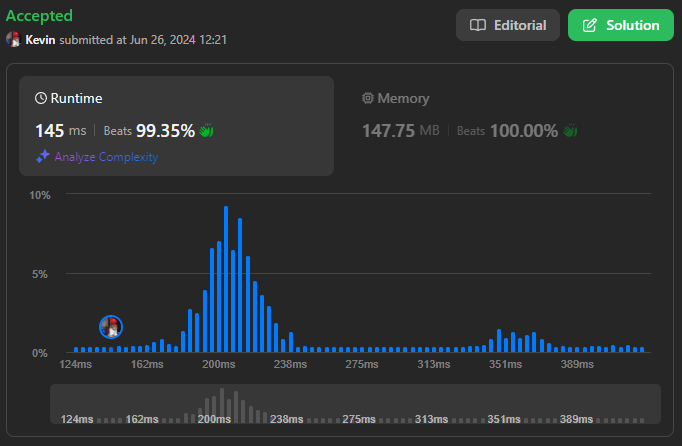
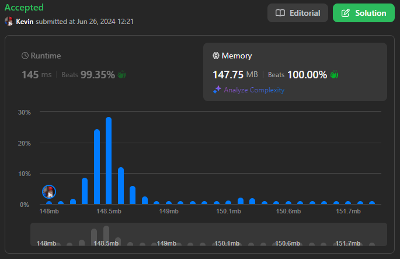

# 2958. Length of Longest Subarray With at Most K Frequency

## Énoncé

Vous recevez un tableau d'entiers `nums` et un entier `k`.

La **fréquence** d'un élément `x` est le nombre de fois qu'il apparaît dans un tableau.

Un tableau est appelé **good** si la fréquence de chaque élément dans ce tableau est **inférieure ou égale** à `k`.

Retournez la longueur du **plus long sous-tableau good** de `nums`.

Un **sous-tableau** st une séquence contiguë non vide d'éléments à l'intérieur d'un tableau.

## Exemple

**Exemple 1:**  
**Input:** nums = [1,2,3,1,2,3,1,2], k = 2  
**Output:** 6  
**Explication:**  
Le plus long sous-tableau **good** possible est [1,2,3,1,2,3] puisque les valeurs 1, 2 et 3 apparaissent au maximum deux fois dans ce sous-tableau.  
Notez que les sous-tableaux [2,3,1,2,3,1] et [3,1,2,3,1,2] sont également **good**.  
Il peut être démontré qu'il n'y a pas de sous-tableaux **good** de longueur supérieure à 6.

**Exemple 2:**  
**Input:** nums = [1,2,1,2,1,2,1,2], k = 1  
**Output:** 2  
**Explication:**  
Le plus long sous-tableau **good** possible est [1,2] puisque les valeurs 1 et 2 apparaissent au maximum une fois dans ce sous-tableau.  
Notez que le sous-tableau [2,1] est également **good**.  
Il peut être démontré qu'il n'y a pas de sous-tableaux **good** de longueur supérieure à 2.

**Exemple 3:**  
**Input:** nums = [5,5,5,5,5,5,5], k = 4  
**Output:** 4  
**Explication:**  
Le plus long sous-tableau **good** possible est [5,5,5,5] puisque la valeur 5 apparaît 4 fois dans ce sous-tableau.
Il peut être démontré qu'il n'y a pas de sous-tableaux **good** de longueur supérieure à 4.

## Contraintes

`1 <= nums.length <= 10^5`  
`1 <= nums[i] <= 10^9`  
`1 <= k <= nums.length`

## Note personnelle

Pour résoudre ce problème, j'ai opté pour une approche utilisant une fenêtre glissante et une HashMap.

L'idée principale est qu'à la fin de chaque itération, le sous-tableau commençant à `left` et se terminant à `right` doit être composé d'éléments ayant une fréquence inférieure ou égale à `k`.

La HashMap permet de maintenir un compteur pour chaque élément unique. À chaque itération, les actions suivantes sont effectuée:

- Incrémenter le compteur de l'élément à la position `right`.
- Tant que le compteur de cet élément est supérieur à `k`, décrémenter le compteur de l'élément à la position `left` et réduire la fenêtre en déplaçant `left` vers la droite.

```cpp
int maxSubarrayLength(vector<int>& nums, int k) {
  // Dictionnaire pour compter les occurrences des éléments
  unordered_map<int, int> mp;

  // Longueur maximale du sous-tableau avec les contraintes spécifiées
  int ans = 0;

  // Pointeur gauche de la fenêtre glissante
  int left = 0;

  // Parcours de la fenêtre avec le pointeur droit
  for(int right = 0; right < nums.size(); right++){
    // Incrémenter le compteur de l'élément actuel
    mp[nums[right]]++;

    // Réduire la taille de la fenêtre tant que l'élément actuel dépasse k occurrences
    while(mp[nums[right]] > k){
      mp[nums[left++]]--;
    }

    // Mettre à jour la longueur maximale trouvée
    ans = max(ans, right - left);
  }

  // Retourner la longueur maximale
  return ans + 1;
}
```

Une optimisation consiste à utiliser un pointeur vers l'élément de la HashMap dans la fenêtre glissante.

L'implémentation de `unordered_map` en c++ utilise un tableau de listes chaînées pour gérer les collisions. En utilisant un pointeur, on évite le coût de recherche à chaque itération de la boucle `while`, ce qui permet de gagner du temps d'exécution.

```cpp
int maxSubarrayLength(vector<int> &nums, int k) {
  // Dictionnaire pour compter les occurrences des éléments
  unordered_map<int, int> mp;

  // Longueur maximale du sous-tableau avec les contraintes spécifiées
  int ans = 0;

  // Pointeur gauche de la fenêtre glissante
  int left = 0;

  // Parcours de la fenêtre avec le pointeur droit
  for (int right = 0; right < nums.size(); right++) {
    // Trouver l'élément actuel dans la map
    auto it = mp.find(nums[right]);

    if (it == mp.end()) {
      // Si l'élément n'est pas trouvé, l'ajouter avec une occurrence de 1
      it = mp.insert({nums[right], 1}).first;
    }
    else {
      // Si l'élément est déjà présent, augmenter son compteur
      it->second++;
    }

    // Réduire la taille de la fenêtre si la condition n'est pas validé
    while (it->second > k) {
      mp[nums[left++]]--;
    }

    // Mettre à jour la longueur maximale trouvée
    ans = max(ans, right - left);
  }

  return ans + 1;
}
```

Cette approche, avec et sans optimisation, a une complexité temporelle et spatiale de `O(n)`.



