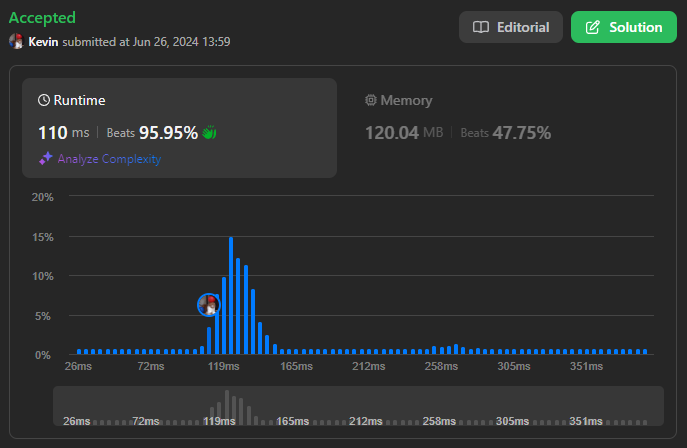
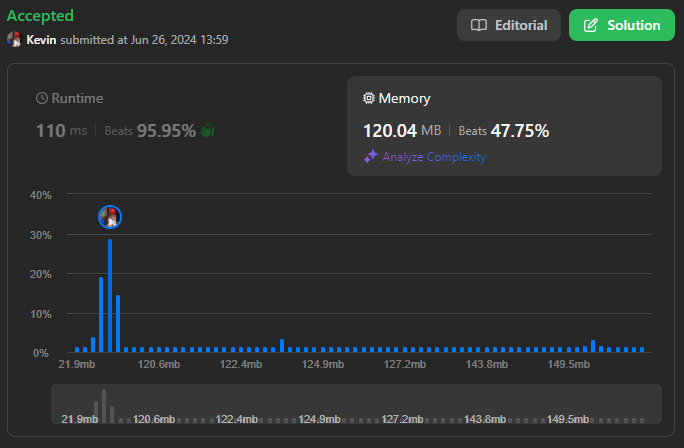

# 2962. Count Subarrays Where Max Element Appears at Least K Times

## Énoncé

Vous avez un tableau d'entiers `nums` et un entier **positif** `k`.

Retournez le nombre de sous-tableaux où l'élément **maximum** de `nums` apparaît au moins `k` fois dans ce sous-tableau.

Un **sous-tableau** est une séquence continue d'éléments dans un tableau.

## Exemple

**Exemple 1:**  
**Input:** nums = [1,3,2,3,3], k = 2  
**Output:** 6  
**Explication:** Les sous-tableaux qui contiennent l'élément 3 au moins 2 fois sont: [1,3,2,3], [1,3,2,3,3], [3,2,3], [3,2,3,3], [2,3,3] et [3,3].

**Exemple 2:**  
**Input:** nums = [1,4,2,1], k = 3  
**Output:** 0  
**Explication:** Aucun sous-tableau ne contient l'élément 4 au moins 3 fois.

## Contraintes

`1 <= nums.length <= 10^5`  
`1 <= nums[i] <= 10^6`  
`1 <= k <= 10^5`

## Note personnelle

Pour résoudre ce problème, j'utilise une approche basée sur une fenêtre glissante. L'idée est qu'à chaque itération, nous maintenons une fenêtre où la fréquence de l'élément maximum dans `nums` est inférieure à `k`.

Tout d'abord, je trouve l'élément maximum dans `nums`, que je stocke dans `maxElement` en parcourant une fois le tableau.

Ensuite, j'initialise les variables nécessaires pour la fenêtre glissante:

- `ans` qui compte le nombre de sous-tableaux où `maxElement` apparaît au moins `k` fois.
- `curr` qui représente la fréquence de `maxElement` dans la fenêtre actuelle.
- `left` et `right` les pointeurs gauche et droit de la fenêtre glissante respectivement.

À chaque itération, je fais ce qui suit:

- Si l'élément à la position `right` est égal à `maxElement`, j'incrémente sa fréquence `curr`.
- Tant que la fréquence `curr` dépasse `k`, je décrémente `curr` lorsque l'élément à la position `left` est égal à `maxElement`, et j'ajoute a `ans` le nombre de sous-tableaux valides: `nums.size() - right`.

### Détail de la formule

Pour expliquer le fonctionnement à l'aide d'un exemple:
Si `nums` = [2, 2, 2, 1, 2] et `k` = 3.

Le premier sous-tableau satisfaisant la condition est lorsque `left = 0` et `right = 2`. Tous les autres sous-tableaux qui commencent avec `left = 0` et vont jusqu'à `right = nums.size() - 1` satisfont également la condition, donc `ans += 3`.

Ensuite, avec `left = 1` et `right = 3`, dans cette fenêtre `curr` est inférieur à `k`, donc on continue.

Avec `left = 1` et `right = 4`, nous obtenons un sous-tableau où `curr == k`. Étant donné que `right` est à la fin du tableau, j'ajoute `1` à `ans`.

Ainsi, la réponse pour cet exemple est `4`.

### Implémentation

```cpp
long long countSubarrays(vector<int>& nums, int k) {
  // Trouver l'élément maximum dans le vecteur nums
  int maxElement = -1;
  for(int n : nums){
    maxElement = max(n, maxElement);
  }

  long long ans = 0;
  int left = 0;

  int curr = 0;

  for(int right = 0; right < nums.size(); right++){
    if(nums[right] == maxElement){
      curr++; // Compte le nombre d'occurrences de maxElement dans la fenêtre actuelle
    }

    // Tant qu'on a au moins k occurrences de maxElement
    while(curr >= k){
      if(nums[left++] == maxElement){
        curr--; // Réduire le nombre d'occurrences de maxElement
      }
      // Ajouter le nombre de sous-tableaux valides
      ans += nums.size() - right;
    }
  }

  return ans;
}
```

Cette approche présente une complexité temporelle de `O(n)` et une complexité spatiale de `O(1)`.



