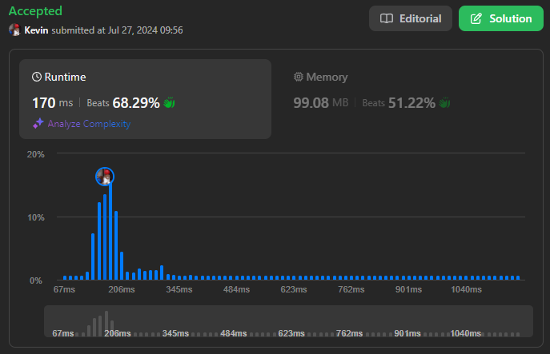
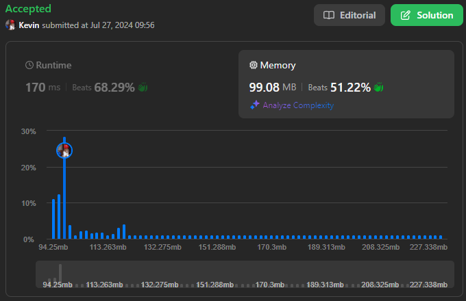

# 2976. Minimum Cost to Convert String I

## Énoncé

Vous avez deux chaînes de caractères **indexées à partir de 0** `source` et `target`, toutes deux de longueur `n` et composées de lettres minuscules de l'alphabet anglais. Vous avez également deux tableaux de caractères **indexés à partir de 0** `original` et `changed`, ainsi qu'un tableau d'entiers `cost`, où `cost[i]` représente le coût de changement du caractère `original[i]` en caractère `changed[i]`.

Vous commencez avec la chaîne `source`. Lors d'une opération, vous pouvez choisir un caractère `x` de la chaîne et le changer en caractère `y` à un coût de `z` si existe un indice `j` tel que `cost[j] == z`, `original[j] == x`, et `changed[j] == y`.

Retournez le **coût minimum** pour convertir la chaîne `source` en la chaîne `target` en utilisant **n'importe quel** nombre d'opérations. S'il est impossible de convertir `source` en `target`, retournez `-1`.

**Note** il peut exister des indices `i`, `j` tels que `original[j] == original[i]` et `changed[j] == changed[i]`.

## Exemple

**Exemple 1:**  
**Input:** source = "abcd", target = "acbe", original = ["a","b","c","c","e","d"], changed = ["b","c","b","e","b","e"], cost = [2,5,5,1,2,20]  
**Output:** 28  
**Explication:**

```
Pour convertir la chaîne "abcd" en "acbe":

- Changez la valeur à l'indice 1 de 'b' en 'c' pour un coût de 5.
- Changez la valeur à l'indice 2 de 'c' en 'e' pour un coût de 1.
- Changez la valeur à l'indice 2 de 'e' en 'b' pour un coût de 2.
- Changez la valeur à l'indice 3 de 'd' en 'e' pour un coût de 20.

Le coût total encouru est de 5 + 1 + 2 + 20 = 28.
```

**Exemple 2:**  
**Input:** source = "aaaa", target = "bbbb", original = ["a","c"], changed = ["c","b"], cost = [1,2]  
**Output:** 12  
**Explication:** Pour changer le caractère 'a' en 'b' changez le caractère 'a' en 'c' pour un coût de 1, suivi du changement du caractère 'c' en 'b' pour un coût de 2, le coût total pour charger 'a' en 'b' est de 1 + 2 = 3. Pour toutes les occurrences de 'a' en 'b', le coût total est 3 \* 4 = 12.

**Exemple 3:**  
**Input:** source = "abcd", target = "abce", original = ["a"], changed = ["e"], cost = [10000]  
**Output:** -1  
**Explication:** Il est impossible de convertir source en target car la valeur à l'indice 3 ne peut pas être changée de 'd' en 'e'.

## Contraintes

`1 <= source.length == target.length <= 10^5`  
`source`, `target` se compose de lettres minuscules anglaises.  
`1 <= cost.length == original.length == changed.length <= 2000`  
`original[i]`, `changed[i]` sont des lettres anglaises minuscules.  
`1 <= cost[i] <= 10^6`  
`original[i] != changed[i]`

## Note personnelle

Pour résoudre le problème de transformation de caractères, nous modélisons les transformations comme un **graphe orienté pondéré**, où chaque arête représente un coût de transformation. L'objectif est de trouver le chemin de coût minimal pour appliquer une transformation.

### Approche 1: Dijkstra + Memoization

Dans cette approche, nous représentons les données avec un vecteur de `HashMap` nommé `graph`. Si `graph[source][destination]` existe, cela indique qu'il y a une arête entre `source` et `destination` avec un coût associé pour la transformation.

Pour éviter les calculs redondants, nous utilisons une `HashMap` nommée `memo` qui stocke les coûts minimums entre chaque paire `source` et `destination`.

```cpp
// Fonction pour trouver le plus court chemin avec l'algorithme de Dijkstra
long long dijkstra(vector<unordered_map<int, int>> &graph, int source, int dest, unordered_map<int, long long> &memo){
  int key = source * 26 + dest; // Génération d'une clé unique pour la mémorisation

  // Vérification si le chemin est déjà calculé
  if(memo.find(key) != memo.end()){
    return memo[key];
  }

  // Priority queue pour gérer les nœuds à explorer, triée par la distance actuelle
  priority_queue<pair<long long, int>, vector<pair<long long, int>>, greater<pair<long long, int>>> pq;
  pq.push({0, source});

  unordered_set<int> seen; // Ensemble pour garder une trace des nœuds déjà explorés

  while(!pq.empty()){
    long long currD = pq.top().first; // Distance actuelle du nœud source
    int curr = pq.top().second;       // Nœud actuel
    pq.pop();

    // Si le nœud de destination est atteint
    if(curr == dest){
      memo[key] = currD; // Mémorisation de la distance
      return currD;      // Retourner la distance
    }

    seen.insert(curr); // Marquer le nœud comme exploré

    int currKey = curr * 26 + dest; // Clé pour vérifier les chemins mémorisés
    // Si le chemin depuis le nœud actuel est mémorisé
    if(memo.find(currKey) != memo.end()){
      // On ajoute le chemin a la priority queue
      pq.push({currD + memo[currKey], dest});
    }
    // Sinon
    else{
      // Exploration des noeuds voisins
      for(auto &child : graph[curr]){
        if(seen.find(child.first) == seen.end()){
          pq.push({currD + child.second, child.first});
        }
      }
    }
  }

  // Chemin inaccessible
  memo[key] = -1;
  return -1;
}

long long minimumCost(string source, string target, vector<char>& original, vector<char>& changed, vector<int>& cost) {
  vector<unordered_map<int, int>> graph(26); // Graph pour stocker les coûts de transformation entre les caractères

  // Construction du graph
  for(int i = 0; i < cost.size(); i++){
    int source = original[i] - 'a';
    int dest = changed[i] - 'a';
    int c = cost[i];

    auto it = graph[source].find(dest);

    if(it == graph[source].end()){
      graph[source][dest] = c; // Ajouter un nouveau chemin avec le coût
    }
    else{
      it->second = min(it->second, c); // Mettre à jour le coût si un chemin moins cher est trouvé
    }
  }

  long long ans = 0;
  unordered_map<int, long long> memo; // Mémorisation des chemins calculés

  // Calcul du coût pour chaque paire de caractères de 'source' et 'target'
  for(int i = 0; i < source.size(); i++){
    if(source[i] != target[i]){
      long long result = dijkstra(graph, source[i] - 'a', target[i] - 'a', memo);

      if(result == -1){
        return -1; // Retourner -1 si une transformation est impossible
      }

      ans += result; // Ajouter le coût au total
    }
  }

  return ans;
}
```

- Complexité Temporelle: `O(E + n * (V + E) log V)`
- Complexité Spatiale: `O(V^2)`

où `V` est le nombre de nœuds (ici, `V` est 26 pour les lettres de l'alphabet), `E` est la taille du tableau `cost` et `n` est la longueur de la chaîne `source`.

### Approche 2: Floyd Warshall

L'algorithme de **Floyd Warshall** est utilisé pour déterminer les distances des plus courts chemins entre toutes les paires de sommets dans un **graphe orienté pondéré**.

```cpp
long long minimumCost(string source, string target, vector<char>& original, vector<char>& changed, vector<int>& cost) {
  vector<vector<long long>> dist(26, vector<long long>(26, INT_MAX));

  // Initialiser la distance de chaque lettre à elle-même à 0
  for(int i = 0; i < 26; i++){
    dist[i][i] = 0;
  }

  // Mettre à jour les distances directes selon les transformations données
  for(int i = 0; i < cost.size(); i++){
    int source = original[i] - 'a';
    int dest = changed[i] - 'a';
    int c = cost[i];

    dist[source][dest] = min(dist[source][dest], (long long) c);
  }

  // Appliquer l'algorithme de Floyd-Warshall pour trouver les plus courts chemins entre toutes les paires de nœuds
  for(int k = 0; k < 26; k++){
    for(int i = 0; i < 26; i++){
      for(int j = 0; j < 26; j++){
        dist[i][j] = min(dist[i][j], dist[i][k] + dist[k][j]);
      }
    }
  }

  long long ans = 0;

  // Calculer le coût total pour transformer chaque caractère de `source` en `target`
  for(int i = 0; i < source.size(); i++){
    int s = source[i] - 'a';
    int d = target[i] - 'a';

    int result = dist[s][d];

    // Si une transformation est impossible, retourner -1
    if(result == INT_MAX){
      return -1;
    }

    ans += result;
  }

  return ans;
}
```

- Complexité Temporelle: `O(E + n + V^3)`
- Complexité Spatiale: `O(V^2)`

où `V` est le nombre de nœuds (ici, `V` est 26 pour les lettres de l'alphabet), `E` est la taille du tableau `cost` et `n` est la longueur de la chaîne `source`.

### Comparaison des différentes approches

Rapport de performance généré avec [Benchmark Algorithm](https://github.com/SlicedPotatoes/BenchmarkAlgorithm).

Les performances des différentes approches sont évaluées comme suit. Les tests ont été réalisés avec 400 jeux de données de tailles variées:

`sizeA` est la longueur de la chaine `source` et `sizeB` est la taille du tableau `cost`.

**100 jeux de données ou sizeA = 10^4 et sizeB = 1000**:

```
Approche 1 - Mean: 61.411 ms,  Min: 40.537 ms,  Max: 84.034 ms, Median: 60.797 ms,  Total: 6.141 s
Approche 2 - Mean: 705.175 µs, Min: 550.200 µs, Max: 1.363 ms,  Median: 623.550 µs, Total: 70.518 ms
```

**100 jeux de données ou sizeA = 10^6 et sizeB = 1000**:

```
Approche 1 - Mean: 198.487 ms, Min: 175.544 ms, Max: 246.279 ms, Median: 195.552 ms, Total: 19.849 s
Approche 2 - Mean: 15.520 ms,  Min: 11.971 ms,  Max: 28.421 ms,  Median: 12.798 ms,  Total: 1.552 s
```

**100 jeux de données ou sizeA = 10^4 et sizeB = 10^6**:

```
Approche 1 - Mean: 151.548 ms, Min: 138.886 ms, Max: 193.907 ms, Median: 148.575 ms, Total: 15.155 s
Approche 2 - Mean: 26.369 ms,  Min: 24.880 ms,  Max: 52.922 ms,  Median: 25.628 ms,  Total: 2.637 s
```

**100 jeux de données ou sizeA = 10^6 et sizeB = 10^6**:

```
Approche 1 - Mean: 318.246 ms, Min: 296.147 ms, Max: 428.499 ms, Median: 314.013 ms, Total: 31.825 s
Approche 2 - Mean: 40.892 ms,  Min: 36.547 ms,  Max: 58.928 ms,  Median: 38.972 ms,  Total: 4.089 s
```

Les résultats montrent que l'approche **Floyd Warshall** est généralement plus efficace que l'approche **Dijkstra avec mémorisation**,
en particulier pour des tailles élevées de `sizeA` et `sizeB`. Cela est dû à la complexité fixe de l'algorithme de Floyd Warshall pour le pré-calcul des plus courts chemins, suivie d'une récupération rapide des résultats comparée à l'exécution répétée de l'algorithme de Dijkstra.

Si on explore d'autres scénarios, par exemple pour un grand nombre de sommet `V`, alors l'algorithme de Dijkstra sera plus efficace.

En résumé, le choix d'une approche dépend grandement de la taille du graphe, pour un grand nombre de sommet l'approche Dijkstra sera préférable, pour un nombre de sommets modérés Floyd Warshall sera plus performant.

Les jeux de test ont été générés avec la fonction suivante:

```cpp
TC generateRandomData(int sizeA, int sizeB) {
  Input input;

  std::random_device rd;
  std::mt19937 gen(rd());

  std::string c = "abcdefghijklmnopqrstuvwxyz";

  // Générer Source & Target
  std::uniform_int_distribution<> charGen(0, c.size() - 1);
  std::uniform_int_distribution<> intGen(0, 1000000);

  std::string source;
  std::string target;

  for (int i = 0; i < sizeA; i++) {
    source.push_back(c[charGen(gen)]);
    target.push_back(c[charGen(gen)]);
  }

  // Générer Graph
  std::vector<char> original;
  std::vector<char> changed;
  std::vector<int> cost;

  for (int i = 0; i < sizeB; i++) {
    original.push_back(c[charGen(gen)]);
    changed.push_back(c[charGen(gen)]);
    cost.push_back(intGen(gen));
  }

  // Récupérer le résultat
  vector<vector<long long>> dist(26, vector<long long>(26, INT_MAX));

  for (int i = 0; i < 26; i++) {
    dist[i][i] = 0;
  }

  for (int i = 0; i < cost.size(); i++) {
    int source = original[i] - 'a';
    int dest = changed[i] - 'a';
    int c = cost[i];

    dist[source][dest] = min(dist[source][dest], (long long)c);
  }

  for (int k = 0; k < 26; k++) {
    for (int i = 0; i < 26; i++) {
      for (int j = 0; j < 26; j++) {
        dist[i][j] = min(dist[i][j], dist[i][k] + dist[k][j]);
      }
    }
  }

  long long ans = 0;

  for (int i = 0; i < source.size(); i++) {
    int s = source[i] - 'a';
    int d = target[i] - 'a';

    int result = dist[s][d];

    if (result == INT_MAX) {
      ans = -1;
      break;
    }

    ans += result;
  }

  // Renvoyer le TestCase
  get<0>(input) = source;
  get<1>(input) = target;
  get<2>(input) = original;
  get<3>(input) = changed;
  get<4>(input) = cost;

  return TC(input, ans);
}
```



