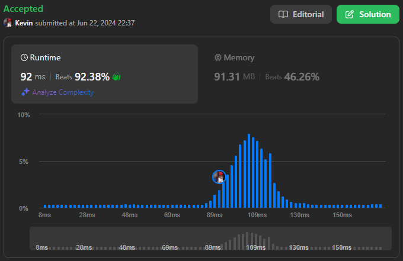

# 2997. Minimum Number of Operations to Make Array XOR Equal to K

## Énoncé

Vous disposez d'un tableau d'entiers `nums` **indexé à partir de 0** et d'un entier positif `k`.
Vous pouvez effectuer l'opération suivante sur le tableau un nombre **quelconque** de fois:

Choisir **n'importe** quel élément du tableau et **inverser** un bit dans sa **représentation binaire**. Inverser un bit signifie changer un `0` en `1` ou vice versa.

Retournez le nombre **minimum** d'opérations nécessaires pour que le `XOR` binaire de **tous** les éléments du tableau final soit égal à `k`.
**Notez** que vous pouvez inverser les bits de zéro de tête dans la représentation binaire des éléments. Par exemple, pour le nombre `(101)2`, vous pouvez inverser le quatrième bit et obtenir `(1101)2`.

## Exemple

**Exemple 1:**  
**Input:** nums = [2,1,3,4], k = 1  
**Output:** 2  
**Explication:**  
Nous pouvons effectuer les opérations suivantes:

- Choisir l'élément `2` qui est `3 == (011)2`, nous inverser le premier bit et obtenons `(010)2 == 2`. `nums` devient [2,1,2,4].
- Choisir l'élément `0` qui est `2 == (010)2`, nous inverser le troisième bit et obtenons `(110)2 == 6`. `nums` devient [6,1,2,4].

Le XOR des éléments du tableau final est (6 XOR 1 XOR 2 XOR 4) == 1 == k.
Il peut être démontré que nous ne pouvons pas obtenir le XOR égal à k en moins de 2 opérations.

**Exemple 2:**  
**Input:** nums = [2,0,2,0], k = 0  
**Output:** 0  
**Explication:** Le XOR des éléments du tableau est (2 XOR 0 XOR 2 XOR 0) == 0 == k. Donc aucune opération n'est nécessaire.

## Contraintes

`1 <= nums.length <= 10^5`  
`0 <= nums[i] <= 10^6`  
`0 <= k <= 10^6`

## Note personnelle

Pour obtenir que le XOR des éléments de `nums` soit égal à `k`, il suffit de calculer le XOR du tableau actuel et de compter les différences dans la représentation binaire de `k` et du résultat obtenu précédemment. Pour chaque bit à l'index `i` différent, en modifiant n'importe quel élément du tableau pour ajuster le bit à l'index `i` on peut obtenir un tableau où le XOR est égal à `k`.

```cpp
int minOperations(vector<int> &nums, int k) {
  // Calculer le XOR de tous les éléments dans nums
  int x = nums[0];
  for (int i = 1; i < nums.size(); i++) {
    x ^= nums[i];
  }

  // Initialiser le compteur d'opérations minimales
  int ans = 0;

  // Parcourir chaque bit dans la représentation binaire de k et x
  for (int i = 0; i < 32; i++) {
    // Vérifier si les bits courants de k et x diffèrent
    if ((k & 1) != (x & 1)) {
      ans++;
    }

    // Décaler les bits de k et x vers la droite pour examiner le bit suivant
    k >>= 1;
    x >>= 1;
  }

  return ans;
}
```

Cette approche a une complexité temporelle de `O(n)` et une complexité spatiale de `O(1)`.



