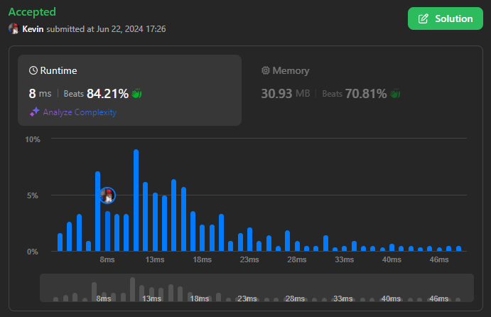
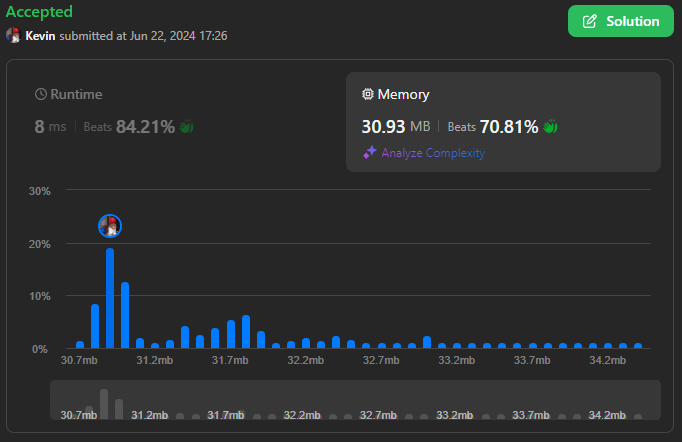

# 3011. Find if Array Can Be Sorted

## Énoncé

On vous donne un tableau d'entiers **positifs** indexé à partir de **0**, `nums`.

Lors d'une **opération**, vous pouvez échanger deux éléments **adjacents** s'ils ont le **même** nombre de bits à 1.  
Vous êtes autorisé à effectuer cette opération un **nombre quelconque** de fois (**y compris zéro**).

Retournez `true` si vous pouvez trier le tableau, sinon retournez `false`.

## Exemple

**Exemple 1:**  
**Input:** nums = [8,4,2,30,15]  
**Output:** true  
**Explication:**  
Regardons la représentation binaire de chaque élément. Les nombres 2, 4 et 8 ont un seul bit défini avec les représentations binaires "10", "100" et "1000" respectivement. Les nombres 15 et 30 ont quatre bits définis chacun avec les représentations binaires "1111" et "11110".

Nous pouvons trier le tableau en utilisant 4 opérations:

- Échanger nums[0] avec nums[1]. Cette opération est valide car 8 et 4 ont chacun un seul bit défini. Le tableau devient [4,8,2,30,15].
- Échanger nums[1] avec nums[2]. Cette opération est valide car 8 et 2 ont chacun un seul bit défini. Le tableau devient [4,2,8,30,15].
- Échanger nums[0] avec nums[1]. Cette opération est valide car 4 et 2 ont chacun un seul bit défini. Le tableau devient [2,4,8,30,15].
- Échanger nums[3] avec nums[4]. Cette opération est valide car 30 et 15 ont chacun quatre bits définis. Le tableau devient [2,4,8,15,30].

Le tableau est maintenant trié, donc nous retournons true.

Notez qu'il peut exister d'autres séquences d'opérations qui trient également le tableau.

**Exemple 2:**  
**Input:** nums = [1,2,3,4,5]  
**Output:** true  
**Explication:** Le tableau est déjà trié, nous retournons true.

**Exemple 3:**  
**Input:** nums = [3,16,8,4,2]  
**Output:** false  
**Explication:** Les nombres 2, 4, 8 et 16 ont 1 bit défini chacun, tandis que le nombre 3 a deux bits définis. Étant donné que 3 est supérieur à 2 mais qu'ils n'ont pas le même nombre de bits définis, ils ne peuvent pas être échangés.

## Contraintes

`1 <= nums.length <= 100`  
`1 <= nums[i] <= 2^8`

## Note personnelle

Pour commencer, simplifions l'énoncé : il est stipulé que l'on peut effectuer des déplacements uniquement entre des nombres adjacents ayant le même nombre de bits définis. Ainsi, pour une plage de nombres ayant le même nombre de bits définis, on peut les déplacer librement.

En partant de ce principe, ma première approche consiste à identifier ces plages et à les trier. Ensuite, je parcours le tableau pour vérifier s'il est trié.

```cpp
bool canSortArray(vector<int>& nums) {
  // Initialisation avec le nombre de bits dans le premier élément
  int curr = __builtin_popcount(nums[0]);
  int start = 0; // Indice de début du sous-tableau à trier

  // Parcours du tableau
  for(int i = 0; i < nums.size(); i++){
    int nbBits = __builtin_popcount(nums[i]); // Nombre de bits à 1 dans l'élément courant

    // Si le nombre de bits à 1 change
    if(nbBits != curr){
      sort(nums.begin() + start, nums.begin() + i); // Trie du sous-tableau
      start = i; // Met à jour l'indice de début pour le prochain sous-tableau
      curr = nbBits; // Met à jour le nombre de bits à 1 courant
    }
  }

  sort(nums.begin() + start, nums.end()); // Trie le dernier sous-tableau restant

  // Vérifie si le tableau trié respecte l'ordre croissant
  curr = nums[0];
  for(int n : nums){
    if(n >= curr){
      curr = n;
      continue;
    }
    return false; // Si l'élément n'est pas dans l'ordre croissant, retourne false
  }

  return true; // Si le tableau respecte l'ordre croissant, retourne true
}
```

Cette approche a une complexité temporelle de `O(n log n)` et une complexité spatiale de `O(1)`.

Ma deuxième approche consiste à ne pas trier le tableau mais à créer un tableau de plages pour chaque sous-tableau de `nums`. Chaque plage est représentée par son minimum et son maximum. Une fois ce tableau créé, je vérifie s'il est trié.

```cpp
bool canSortArray(vector<int>& nums) {
  int curr = __builtin_popcount(nums[0]); // Nombre de bits à 1 dans le premier élément
  int minCurr = nums[0]; // Minimum actuel dans le groupe courant
  int maxCurr = nums[0]; // Maximum actuel dans le groupe courant

  vector<int> arr; // Vecteur pour stocker les valeurs minimales et maximales de chaque groupe

  // Parcours du tableau
  for(int i = 0; i < nums.size(); i++){
    int nbBits = __builtin_popcount(nums[i]); // Nombre de bits à 1 dans l'élément courant

    // Si le nombre de bits à 1 change
    if(nbBits != curr){
      curr = nbBits; // Met à jour le nombre de bits à 1 courant

      arr.push_back(minCurr); // Ajoute le minimum du groupe précédent à arr
      arr.push_back(maxCurr); // Ajoute le maximum du groupe précédent à arr

      minCurr = nums[i]; // Initialise le minimum pour le nouveau groupe
      maxCurr = nums[i]; // Initialise le maximum pour le nouveau groupe
    }
    // Si le nombre de bits à 1 est le même que précédemment
    else{
      minCurr = min(nums[i], minCurr); // Met à jour le minimum du groupe courant
      maxCurr = max(nums[i], maxCurr); // Met à jour le maximum du groupe courant
    }
  }

  arr.push_back(minCurr); // Ajoute le minimum du dernier groupe à arr
  arr.push_back(maxCurr); // Ajoute le maximum du dernier groupe à arr

  // Vérifie si arr est trié dans l'ordre croissant
  curr = arr[0];
  for(int n : arr){
    if(n >= curr){
      curr = n;
      continue;
    }
    return false; // Si l'élément n'est pas dans l'ordre croissant, retourne false
  }

  return true; // Si arr respecte l'ordre croissant, retourne true
}
```

Cette approche a une complexité temporelle de `O(n)` et une complexité spatiale de `O(n)`.

Cette approche est plus performante que la précédente en therme de complexité temporelle, mais elle peu etre encore plus optimisé.

Pour améliorer cette approche, une idée consiste à se débarrasser du tableau `arr` en conservant une trace du maximum précédent. Cela permet de gagner en complexité spatiale et d'éliminer la boucle de vérification à la fin.

```cpp
bool canSortArray(vector<int>& nums) {
  int curr = __builtin_popcount(nums[0]); // Nombre de bits à 1 dans le premier élément

  int prevMax = -1; // Maximum précédent initialisé à une valeur invalide
  int minCurr = nums[0]; // Minimum actuel dans le groupe courant
  int maxCurr = nums[0]; // Maximum actuel dans le groupe courant

  // Parcours du tableau
  for(int i = 0; i < nums.size(); i++){
    int nbBits = __builtin_popcount(nums[i]); // Nombre de bits à 1 dans l'élément courant

    // Si le nombre de bits à 1 change
    if(nbBits != curr){
      curr = nbBits; // Met à jour le nombre de bits à 1 courant

      // Vérifie si la plage actuelle est composée de nombres supérieurs à la plage précédente.
      if(minCurr < prevMax){
        return false;
      }

      prevMax = maxCurr; // Met à jour le maximum précédent
      minCurr = nums[i]; // Initialise le minimum pour le nouveau groupe
      maxCurr = nums[i]; // Initialise le maximum pour le nouveau groupe
    }
    // Si le nombre de bits à 1 est le même que précédemment
    else{
      minCurr = min(nums[i], minCurr); // Met à jour le minimum du groupe courant
      maxCurr = max(nums[i], maxCurr); // Met à jour le maximum du groupe courant
    }
  }

  // Retourne true si la dernière plage est composée de nombres supérieurs à la plage précédente; sinon, retourne false.
  return prevMax < minCurr;
}
```

Cette approche conserve une complexité temporelle de `O(n)` et a une complexité spatiale constante `O(1)`.



